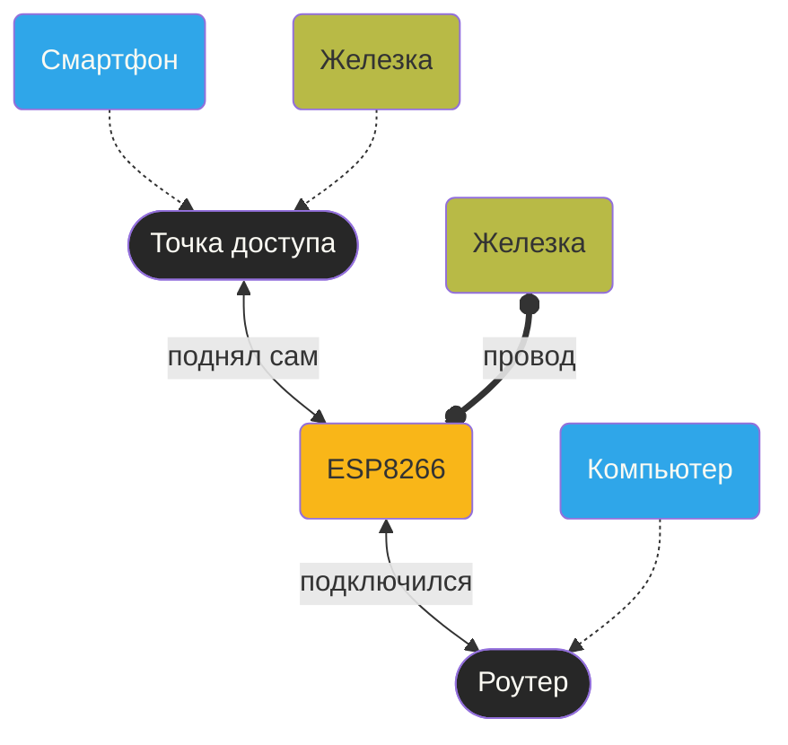

Youtube-запись от `2025-10-10`: https://youtu.be/FGJM_CE4zG0

# Реанимация ESP8266 — можно даже без C

> [!TIP]
> ESP8266 — WiFi-старичок
> * делают с 2014 года
> * скромный набор «железных» протоколов: SPI, I$^2$S, UART
> * АЦП есть
> * GPIO есть

#### Что значит «умеет WiFi»?


- Создаёт свою сеть — подключайся кто может
- Подключается к внешней сети — и ходит куда скажешь
- Пробрасывает изнутри наружу — два в одном

> **Общая идея всех подключений**
> Делаем без провода то же, что раньше можно было сделать только через провод

#### В первую очередь ESP8266 — это модем
Входим через терминал:
```bash
screen -U /dev/ttyUSB0 115200
```
Видим мусор и `ready` — всё OK.

##### Всё управление через UART и AT-команды

>[!IMPORTANT]
>«Железки на проводе» тоже используют AT-команды
>* Если мы захотим с помощью стандартно настроенного ESP8266 подключить к WiFi какую-то бессетевую систему (например, AVR-микроконтроллер), то ей предстоит посылать именно AT-команды через UART.
>* Это как настройка модема для выхода в Интернет.

* `AT` (*Attention*) — набор команд для управления системами через [[UART]]
* [Официальная документация по AT-командам](https://docs.espressif.com/projects/esp-at/en/release-v2.2.0.0_esp8266/AT_Command_Set/index.html) — там все ESP-микроконтроллеры вперемешку
* Отправить AT-команду —A `Enter → Ctrl-J`
	* ###### Контроллер
		* AT пнуть, жив ли
		* AT+GMR узнать детали
	* **WiFi:**
		* AT+CWMODE? узнать wifi-режим
		* AT+CWMODE=3 установить «прозрачный» режим «точка доступа в Интернет»
		* AT+CWMODE=1 установить режим модема (им можно управлять через AT)
		* AT+CWLAP список доступных сетей
		* AT+CWJAP="MyWiFi","password" подключиться к WiFi-сети
		* AT+CWAUTOCONN=1 включить автоподключение к WiFi при запуске
		* AT+CWSAP? узнать параметры своей точки доступа
		* AT+CIFSR узнать свой IP
	* **TCP/IP:**
		* AT+PING="google.com"
		* AT+CIPSTATUS проверить актуальные соединения
		* AT+CIPSSLSIZE=4096 увеличить буфер для SSL-соединения
		
* echo -ne "GET / HTTP/1.0\r\nHost: sobakapav.com\r\nConnection: close\r\n\r\n" | wc -c
	посчитать длину запроса

> [!WARNING]
> Всегда `Ctrl+J` после каждого `Enter`

##### Дёргаем внешнюю сеть
##### В локальной сети можно жить с HTTP
```
AT+CIPSTART="TCP","192.168.0.110",5678
AT+CIPSEND=39
GET / HTTP/1.0
Host: 192.168.0.110
```

##### Снаружи сейчас всё на HTTPS
```
AT+CIPSTART="TCP","sobakapav.com",80
AT+CIPSEND=58
GET / HTTP/1.1
Host: sobakapav.com
Connection: close
```

##### Получим JSON
```
AT+CIPSTART="TCP","ip-api.com",80
AT+CIPSEND=59
GET /json HTTP/1.1
Host: ip-api.com
Connection: close
```


##### Замедлим то, что работает слишком быстро
```
AT+CIPMODE=1
AT+CIPSTART="TCP","ifconfig.me",80
AT+CIPSEND
GET /ip HTTP/1.1
Host: ifconfig.me
Connection: close
```
Так себе результат. Но иногда и срабатывает.


#### Но есть куда и датчик подключить
- [ESP-IDF](https://docs.espressif.com/projects/esp-idf/en/latest/esp32/) — официальная документация (и там **нет** ESP8266)
- Потребуется [ESP8266_NONOS_SDK](https://github.com/espressif/ESP8266_NONOS_SDK)
- После этого можно кросс-компилировать на C и заливать прошивку, как обычно
##### Что нам скажет esptool?
`et chip_id` расскажет всё про чип
`et read_mac` покажет MAC-адрес
`et flash_id` кое-что про flash-память

#### Ещё можно учиться «программировать без компиляции»
##### MicroPython — REPL + WebREPL

`mp` — алиас для запуска (всё уже настроено)

Проверим, где мы:
```python
import sys
sys.implementation
```

Проверим, что соединение есть:
```python
sta = network.WLAN(network.STA_IF)
sta.ifconfig()
```

Вытащим что-нибудь из сети:
```python
import urequests
r = urequests.get("http://wttr.in/Haifa?format=3")
print(r.text)
r.close()
```

> [!WARNING]
> Тут меньше памяти, почти никуда не подключишься
 - Например, до https://api.chucknorris.io/jokes/random не достучаться

##### Lua — только по проводу

Конфигуратор прошивок: https://nodemcu-build.com

Полезные модули: file, gpio, net, node, tmr, uart, wifi, http, mqtt, i2c, spi, pwm, adc, sjson

По умолчанию собирают именно для ESP8266.
float тяжелей, integer быстрей.

Справочник по Lua: https://nodemcu.readthedocs.io/en/release/lua-developer-faq/

Вход в интерактивный кодинг:
```bash
screen /dev/ttyUSB0 115200
```

Проверка памяти:
```lua
print(node.heap())
```

Узнать IP:
```lua
print("IP:", wifi.sta.getip())
```

Что-нибудь взять из сети:
```lua
conn = net.createConnection(net.TCP, 0)
conn:on("receive", print)
conn:connect(80, "api.quotable.io")
conn:send("GET /random HTTP/1.1\r\nHost: api.quotable.io\r\nConnection: close\r\n\r\n")
```

#### Или организовать доступ через WiFi к чёрным UART-ящикам


