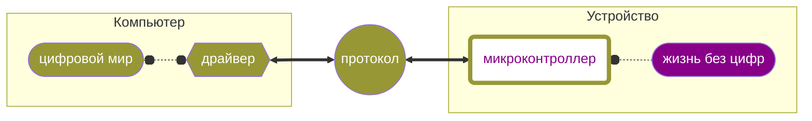

Youtube-запись лекции от ```2025-03-14```: https://youtu.be/XxHtIcfYNqM

# Роль побитовых операций в программах на C

## 30 = 16 + 8 + 4 + 2 = 00011110

- Бинарную систему диктует электричество — но не строго
- Много где хитро наприменяли

<aside>


Вопрос **данных**, а не вычислений

</aside>

<aside>


Чаще всего двоичное число — это не число «в лоб», а **что-то другое**

</aside>

## А при чём тут драйверы, наша цель и мечта?



<aside>


Цифровой мир **очень** абстрагировался от ноликов и единичек

</aside>

<aside>


А остальные — не очень

</aside>

## База побитовых операций в C

`a & b`

`a | b`

`a ^ b`

`~a`

`a << n`

`a >> n`

## Какие абстракции можно собрать из нулей и единичек?

<aside>


Побитовые операции происходят **не то чтобы с битами**

</aside>

### Числа

<aside>


Ну все же знакомы с бинарной арифметикой?

</aside>

- Двоичный вывод числа

```c
#include <stdio.h>

void print_binary(int x) {
    for (int i = 7; i >= 0; i--) {
        printf("%d", (x >> i) & 1);
    }
    printf("\n");
}

int main() {
    int a = 5, b = 3;
    printf("a = "); print_binary(a);
    printf("b = "); print_binary(b);
    printf("a & b = "); print_binary(a & b);
}
```

- Обмен значений без временной переменной

```c
int a = 5, b = 7;
a = a ^ b;
b = a ^ b;
a = a ^ b;
printf("a = %d, b = %d\n", a, b);
```

- Является ли число степенью двойки?

```c
#include <stdio.h>
int is_power_of_two(int n) {
    return (n > 0) && ((n & (n - 1)) == 0);
}
```

### Флаги

```c
#define FLAG_ENABLE  (1 << 0)  // 00000001
#define FLAG_ERROR   (1 << 1)  // 00000010

uint8_t flags = 0;
flags |= FLAG_ENABLE;  // Установить бит
flags &= ~FLAG_ERROR;  // Сбросить бит
```

- Установить конкретный бит

```c
int x = 5;  // 00000101
x = x | (1 << 3);  // Устанавливаем бит 3
printf("%d\n", x);  // 13 (00001101)
```

- Проверить, установлен ли конкретный бит — `&`

```c
int x = 42;  // 00101010
int mask = 0x08;  // 00001000 или (1 << 3)
if (x & mask) {
    printf("Бит 3 установлен!\n");
}
```

- Инвертировать конкретный бит — `^`

```c
int x = 5;  // 00000101
x = x ^ (1 << 2);  // Переключаем бит 2
printf("%d\n", x);  // 1 (00000001)
```

- Сбросить конкретный бит — `& ~`

```c
int x = 13;  // 00001101
x = x & ~(1 << 3);  // Обнуляем бит 3
printf("%d\n", x);  // 5 (00000101)
```

### Маски

- Применить маску — `&`
- Проверить установленность — сравнить с маской

```c
int flags = 0b10101010;
int mask = 0b00001100;

if ((flags & mask) == mask) {
    printf("Оба бита установлены!\n");
}
```

- Объединить флаги в маску — и потом проверять

```c
#define READ  (1 << 0)  // 0001
#define WRITE (1 << 1)  // 0010
#define EXEC  (1 << 2)  // 0100

int permissions = READ | EXEC;  // 0001 | 0100 = 0101

if (permissions & READ) printf("Можно читать\n");
if (permissions & WRITE) printf("Можно писать\n");
if (permissions & EXEC) printf("Можно исполнять\n");
```

- Конкретно для сетей

```c
#include <stdio.h>

int main() {
    int ip = 0b11000000101010000000000100000010;  // 192.168.1.2
    int netmask = 0b11111111111111111111111100000000;  // /24 (255.255.255.0)
    int network = ip & netmask;

    printf("Сетевой адрес: %08X\n", network);
}
```

### Кодирование

<aside>


Интуитивно понятно, когда есть документация

</aside>

### Битовые поля

- Сразу говорим, сколько **бит** берём под поле

```c
struct Flags {
    uint8_t ready : 1;
    uint8_t error : 1;
    uint8_t : 5;
    uint8_t active : 1;
};
```

- На разных процессорах разное поведение
- Не все процессоры и умеют-то
- Нельзя сделать указатель на отдельное поле внутри структуры
- Феномены: выравнивание, big/little endian
- Чтобы работать с полем как единым объектом, нужен `union` (ну или просто массив внутри структуры)

```c
#include <stdio.h>
#include <stdint.h>

union Byte {
    struct {
        uint8_t bit0 : 1;
        uint8_t bit1 : 1;
        uint8_t bit2 : 1;
        uint8_t bit3 : 1;
        uint8_t bit4 : 1;
        uint8_t bit5 : 1;
        uint8_t bit6 : 1;
        uint8_t bit7 : 1;
    } bits;
    uint8_t byte;  // Полный байт
};

int main() {
    union Byte b;
    b.byte = 0xAA;  // 10101010

    printf("Бит 0: %d\n", b.bits.bit0);
    printf("Бит 1: %d\n", b.bits.bit1);
    printf("Целый байт: 0x%X\n", b.byte);

    return 0;
}
```

- Логические операции с полем как единым объектом — ну можно, конечно: `*(uint8_t*)&field = 0xFF` — но некомфортно

### Union

- Оборачиваем битовое поле

```c
#include <stdio.h>

union Status {
    struct {
        unsigned int ready  : 1;
        unsigned int error  : 1;
        unsigned int active : 1;
        unsigned int mode   : 2;
        unsigned int unused : 3;
    };
    unsigned char value;  // Полный байт
};

int main() {
    union Status status = { .value = 0 };

    status.ready = 1;
    status.error = 0;
    status.active = 1;
    status.mode = 2;

    printf("Статус: 0x%X\n", status.value);
}
```

### Протоколы

- Когда что какой бит значит (часто в байте)
- I2C, SPI, UART, USB,…

### Регистры

- Ячейки памяти внутри процессора/микроконтроллера
- Ещё быстрей оперативной
- Управляют в т. ч. периферией (да много чем)
- Установил, сбросил, прочитал

```c
#define GPIO_REG  *(volatile uint32_t*)0x3FF44004

void set_pin_high() {
    GPIO_REG |= (1 << 5);  // 5-й бит в 1
}
```

### …и многое другое

- битовая упаковка/разделение `#FF0000`
- контрольная сумма
- побитовая адресация
- логические шины
- …
