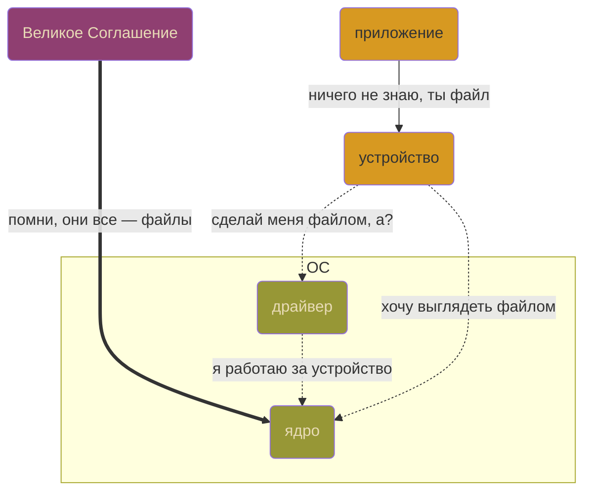
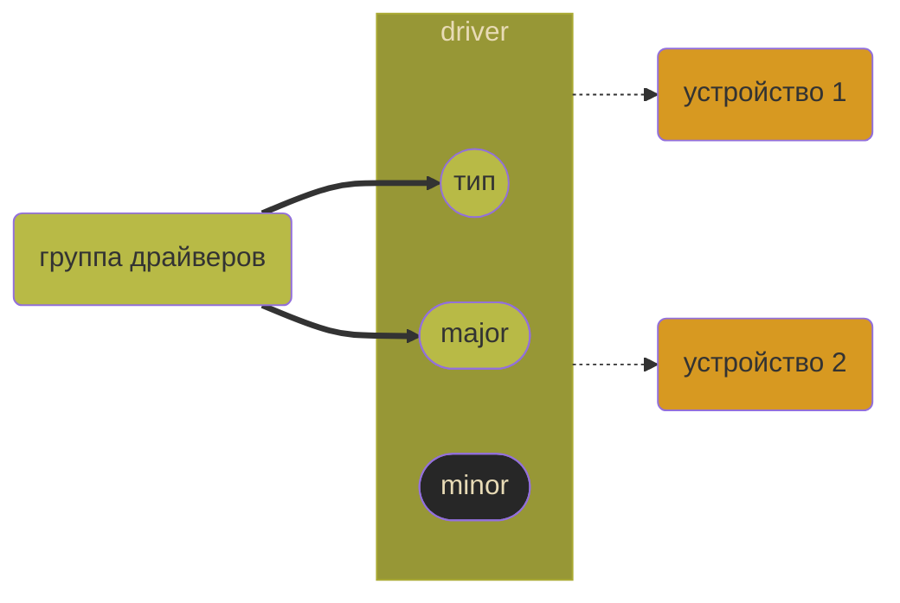

Youtube-запись стрима от `2025-04-11`: https://youtu.be/Ct_BD3KODCI

# Превращаем модуль ядра в драйвер

## Записано как устройство, а ведёт себя как файл



- Указатель пространства пользователя `FILE *` указывает на структуру пространства ядра `struct file`
- Если приложение что-то делает с `FILE *` — значит, **потенциально** оно может это делать и с устройством
- Этот потенциал и должен реализовать драйвер

Запишем в ядре как **драйвер**

Оснастим внешней функциональностью (API) **файла**
`open()` • `close()` • `read()` • `write()` …

## Создадим образ светлого будущего

Что устройства знают про свои драйверы?

`ls -l /dev/`

`ls -l /dev/ | grep "^c"`

`cat /proc/devices`



- [x]  Опишем группу для драйвера
- [x]  Припишем драйвер к группе и региону номеров
- [x]  Сделаем так, чтобы драйвер мог обслуживать хоть какие-то устройства
- [x]  Создадим устройство и поставим его на обслуживание к драйверу
- [x]  Проверим, что система признала нашу конструкцию

**Всё!** Теперь можно развивать драйвер (функциональность + инфраструктура)

### Начнём с модуля-пустышки

```c
#include <linux/init.h>
#include <linux/module.h>

static int __init silent_init(void) { return 0; }
static void __exit silent_exit(void) { }

module_init(silent_init);
module_exit(silent_exit);

MODULE_LICENSE("GPL");
```

### Опишем группу для драйвера

- **Символьные устройства**
    
    
    Шаг за шагом без возврата
    
    `c_________` символьные устройства
    
    ```mermaid
     %%{init: { 'logLevel': 'debug', 'theme': 'default' , 'themeVariables': {
                  'cScale0': '#272727', 'cScaleLabel0': '#ffffff',
                  'cScale1': '#FABD2F',
                  'cScale2': '#3FA7FF', 'cScaleLabel2': '#ffffff'
           } } }%%
           
    timeline
        section Прошлое
    	    -2 : уже никогда
    	    -1 : уже никогда
    	  section Настоящее
    	    сейчас : вижу один раз
    	  section Будущее
    	    +1 : увижу потом
    	    +2 : увижу потом
    ```
    
- **Блочные устройства**
    
    
    Туда-сюда во все стороны
    
    `b_________` блочные устройства
    
    ```mermaid
    
    sequenceDiagram
    		autonumber
    		box Назад
        participant ещё назад as –2
        participant назад as –1
        end
        participant сейчас
        box Вперёд
        participant вперёд as +1
        participant ещё вперёд as +2
        end
        сейчас -->> вперёд : Загляну-ка в будущее
        вперёд -->> ещё назад : А потом прыгну в прошлое
        ещё назад -->> назад : Хоп!
        назад -->> вперёд : Хоп!
        вперёд -->> сейчас : Хоп!
    		сейчас -->> назад : Хоп!
    		назад -->> ещё вперёд : Да тут и нет прошлого и будущего, всё доступно сразу
    ```
    
- major-нумерации для `c` и для `b` не зависят друг от друга

https://www.kernel.org/doc/Documentation/admin-guide/devices.txt стандартное распределение номеров по именам устройств

Символьное • major пусть даст система • minor от 0 и N раз

### Припишем драйвер к группе и региону номеров

- Для драйвера можно получить даже диапазон minor-номеров, не один
    
    ```c
    #define DEVICE_FIRST 0
    #define DEVICE_COUNT 3
    #define DGROUP_NAME "my_driver_group_cdev"
    ```
    
- Раз мы создаём группу, то надо бы помнить её номер
    
    ```c
    static int major = 0;
    ```
    
    Всегда сможем узнать полный номер устройства под драйвером: `MKDEV(major, minor)`
    
    А для первого устройства в регионе ещё проще: `MKDEV(major, DEVICE_FIRST)`
    
- Теперь можно и регион создать
    
    ```c
    #include <linux/types.h>
    ...
    	// внутри определения функции инициации
    	int result = 0;
    	...
    	printk(KERN_INFO "Trying to register char device region\n");
    	dev_t dev = 0;
    	result = alloc_chrdev_region(&dev, DEVICE_FIRST, DEVICE_COUNT, DGROUP_NAME);
    	major = MAJOR(dev);
    ```
    
- Никогда не доверяй операциям в ядре!
    
    ```c
    	if (result < 0) {
        unregister_chrdev_region(MKDEV(major, DEVICE_FIRST), DEVICE_COUNT);
        printk(KERN_INFO "Can not register char device region\n");
        goto err;
      }
    
      printk(KERN_INFO "Char device region created: %d:%d...%d\n", major, DEVICE_FIRST, DEVICE_COUNT);
      ...
    
    err:
    	return result;
    ```
    
    > Привыкаем к `goto`, здесь так принято (и Дейкстре тоже норм)
    > 
- Выделили память — надо и освободить
    
    ```c
    	// внутри определения функции выхода
    	unregister_chrdev_region(MKDEV(major, DEVICE_FIRST), DEVICE_COUNT);
      printk(KERN_INFO "Char device region %d:%d...%d destroyed\n", major, DEVICE_FIRST, DEVICE_COUNT);
    ```
    

Можно проверять, работает ли выделение диапазонов

### Сделаем так, чтобы драйвер мог обслуживать хоть какие-то устройства

Есть обязательная структура кода, практически фреймворк


Коды ошибок отрицательны


- **Создадим структуру, чтобы из кода управлять нашим символьным устройством**
    
    
    ```c
    #include <linux/cdev.h>
    ...
    static struct cdev my_dev;
    ```
    
    > Драйвер ≠ структура
    > 
    
    <aside>
    
    
    Будем честны:
    конечно, это **объект**
    
    </aside>
    
    ```mermaid
    flowchart
    dev_t(номер)
    my_dev(устройство)
    func(действия)
    other(...)
    dev_t:::param -.-> my_dev:::dev
    func:::param -.-> my_dev
    other:::param -.-> my_dev
    
    classDef param fill:#3FA7FF,color:#fff;
    classDef dev fill:#ffffff;
    ```
    
- **Заполним новую структуру данными (местами только обещаниями данных)**
    - Заготовка для набора указателей на функции + кое-что по мелочи
        
        <aside>
        
        
        Сигнатуры функций прибиты гвоздями
        
        </aside>
        
        ```bash
        vim -R /lib/modules/$(uname -r)/build/include/linux/fs.h +2022
        ```
        
        ```c
        #include <linux/fs.h>
        ...
        static int cdrv_open(struct inode *n, struct file *f);
        static int cdrv_release(struct inode *n, struct file *f);
        static ssize_t cdrv_read(struct file * f, char __user * buffer, size_t counter, loff_t * ppos);
        ...
        static const struct file_operations cdrv_fops = {
          .owner   = THIS_MODULE,
          .open    = cdrv_open,
          .release = cdrv_release,
          .read    = cdrv_read,
        };
        ```
        
    - Инициируем структуру — пусть только с заготовкой поведения
        
        ```c
        cdev_init(&my_dev, &cdrv_fops);  // хоть тут ничего не нужно проверять, уф
        my_dev.owner = THIS_MODULE;
        ```
        
- **Определим реальное поведение устройств под драйвером**
    - `open()` — открыть устройство, оно же файл
        
        ```c
        #define EOK 0
        static int device_open = 0;
        ...
        static int cdrv_open(struct inode *n, struct file *f) {
          if (device_open) return -EBUSY;
          device_open++;
          return EOK;
        }
        ```
        
    - `release()` — закрыть устройство, оно же файл
        
        ```c
        static int cdrv_release(struct inode *n, struct file *f) {
          device_open--;
          return EOK;
        }
        ```
        
    - `read()` — прочитать данные из устройства, оно же файл
        
        ```c
        #include <linux/string.h>
        #include <linux/uaccess.h>
        ...
        static ssize_t cdrv_read(struct file * fp, char __user * buf, size_t count, loff_t * ppos) {
        	const char * reply = "The same answer again and again.\n";
        	size_t len = strlen(reply);
        
        	if (*ppos >= len) return 0;  // EOF	
        	if (count > len - *ppos) count = len - *ppos;
        
        	if (copy_to_user(buf, reply, len)) return -EINVAL;
        
        	*ppos += count;
        	return count;
        }
        ```
        
        <aside>
        
        
        Сюда явно стоит вернуться
        
        </aside>
        
- **Сообщим ядру, что вызовы на этот номер нужно переадресовывать в эту структуру**
    
    ```c
      result = cdev_add(&my_dev, dev, DEVICE_COUNT);
    ```
    
    - Никогда не доверяй ядру!
        
        ```c
        if (result < 0) {
        	unregister_chrdev_region(MKDEV(major, DEVICE_FIRST), DEVICE_COUNT);
          printk(KERN_INFO "Cannot add char device\n");
          goto err;
        }
        ```
        
- **Не забудем удалить структуру при отключении драйвера**
    
    ```c
    cdev_del(&my_dev);
    ```
    

### Создадим устройство и поставим его на обслуживание к драйверу

- Здесь «устройство» — это **имя** устройства в системе
- Что творится в реальном мире — далёкий следующий вопрос

Устройство — это не всегда железка!

```bash
sudo mknod -m0666 /dev/cd c 508 0
```

### Проверим, что система признала нашу конструкцию

`ldd ./util` какие динамические библиотеки использует приложение

`strace ./util` какие системные вызовы и в какой последовательности выполняет приложение

`which cat` узнаем, где лежит системная утилита — на неё и напустим `ldd` и `strace`

`cat /dev/cd` увидим вывод из устройства; это сделал драйвер

## Теперь можно думать о работе собственно драйвера

Полезные функции

`copy_to_user()`

`copy_from_user()`

`get_random_bytes()`

`kmalloc()`

…плюс много более сложных

Идеи для разминки

- Заметки: запомни, потом спрошу
- Возведение числа в квадрат
- Извлечение корня (тут сложней)
- Рандомайзер или бросок монеты
- Простой калькулятор
- Переворачивалка текста

Функциональность

- Хотя бы `write()`
- Может, ещё какие системные вызовы?
- **Связь с реальным железом**
- Может, сделаем блочным?
- Использование возможностей ядра

Инфраструктура

А несколько? А одновременно? А 100500? А с общим ресурсом? А безопасность? А чтобы работал в другой системе? А…


Чистим код

Например, кое-какие заголовочные файлы можно уже не подгружать.

Можно использовать более современные приёмы именно в коде.

Стоит развивать логирование, статистику и прочие инструменты.


**Изучение опыта сообщества:** лайфхаков, приёмов, типовых решений и т. п.
