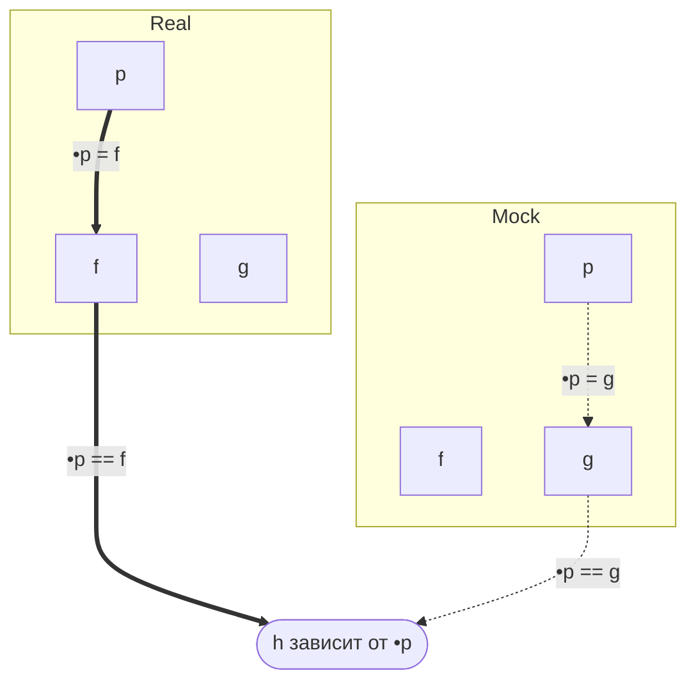
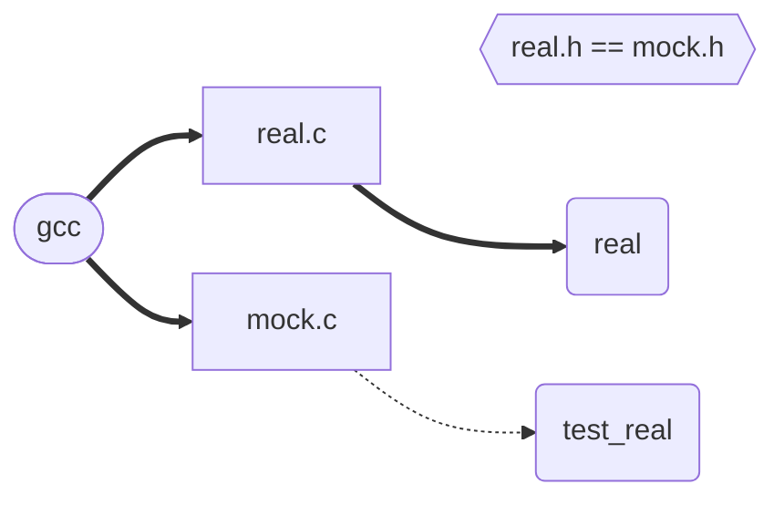

> [Youtube-запись лекции](https://youtu.be/vjS_GfdQ-wU) ```2024-12-20```

# Продвинутые техники и конкретные приёмы работы в <check.h>

* https://libcheck.github.io/check/doc/check_html/check_toc.html#SEC_Contents
* https://www.throwtheswitch.org/

### Лайфхаки с сообщениями

- Сравнение, привязанное к типам, «на сдачу» проверяет принадлежность к типу (приведение типов может нас обмануть)
- Но тогда у нас нет сообщения об ошибке! Хнык.

```c
// Проверить, будет ли работать
ck_assert_str_eq(a, b) || ck_assert_msg(0, "Это сообщение выводится только в случае ошибки");
printf("%s", "А так можно организовать параллельный лог с отчётом об успехах");
```

- Можно использовать шаблоны

```c
ck_assert_msg(0, "%d %d %d — ёлочка, %s!", 1, 2, 3, "уходи");
```

### Проблема определённости значений

- Вместо типа используем указатель на него — `ck_assert_pstr_eq(&a, &b)`
- Если проверяем именно `NULL`, используем `ck_assert_ptr_null(&a)`
- `NULL` — ссылка на ничто; пользуемся этим

### Простые циклы

- Внимание на имена — синхронные с тест-функциями (иначе хаос)
- `_i` объявлять не надо, это делает `<check.h>`
- Можно добавлять в тесты только срез массива
- Массивов может быть сколько угодно, важна только `_i` — а вот она одна
- Массивы можно использовать повторно (нпр., один входящий массив на кейс или даже на Suite)

```c
static int case_function_in[3] = {0, -1, 7};
static int case_function_out[3] = {5, 2, 0};
START_TEST(test_case_function) {
	...
	int in = case_function_in[_i];
	int out = function(in);
	...
	ck_assert_int_eq(out, case_function_out[_i]) || ck_assert_msg(0, "Функция превращает %d в %d", case_function_in[_i], case_function_out[_i]);
} END_TEST

...
tcase_add_loop_test(tcase, test_case_function, 0, 2);
...
```

### Циклы из строк

```c
static char * case_len_in[3] = {"one", "two", "three", NULL, ""};
static 
```

- Строки произвольной длины, это удобно
- Можно ставить `NULL` — потому что это массив указателей
- Можно ставить пустую строку

### Доверенные функции

- tКак тестировать сложные sтипы данных?
- Доверенная функция может быть частью тестируемого модуля — нпр., функция сравнения
- Становится важен порядок тестированияt

### Детализация требований

- Пишем «с конца», начиная с `ck_assert_message()`

### Покрытие тестами

- Если успеем разобраться в прямом эфире

### Автогенерация тестов

- Программа `checkmk`
- https://manpages.ubuntu.com/manpages/focal/en/man1/checkmk.1.html

### Тестирование планового выхода

- `tcase_add_exit_test()` вместо `tcase_add_test()`
- Проверяет выход по `exit()`
- Требуется режим `CK_FORK`

## Мок-функции

**Чувствительно**
Платежи, отправка сообщений

**Медленно**
Запросы на сервер, тяжёлые расчёты

**Редко**
Ошибки системы, нетипичные даты

**Непредсказуемо**
Зависимость от времени или погоды


По умолчанию в `<check.h>` нет работы с моками. Надо придумывать.


### Подмена через указатель



### Подмена при компиляции


