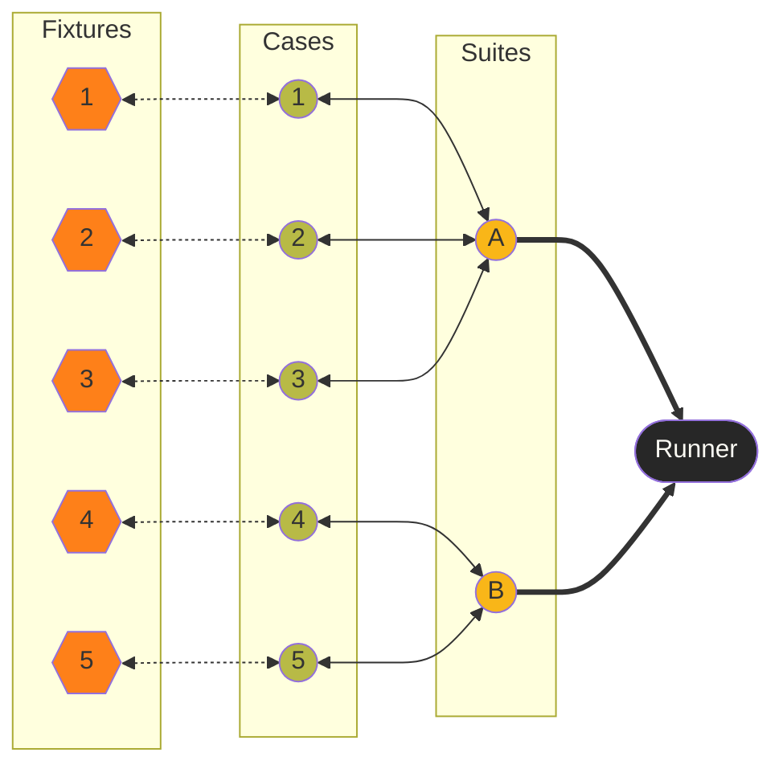
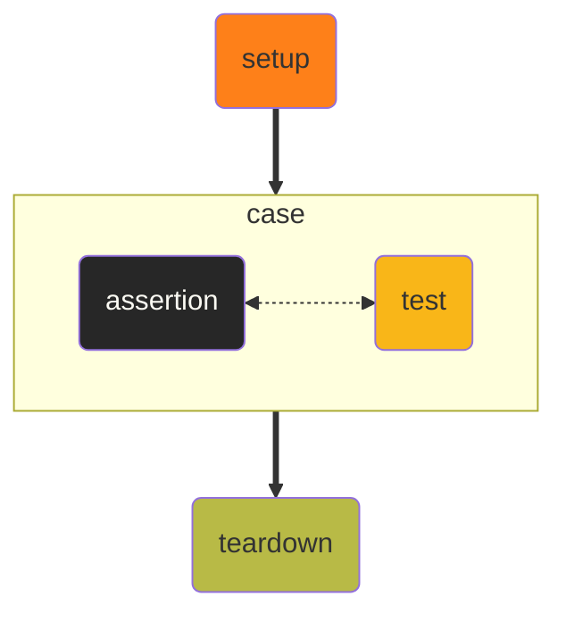
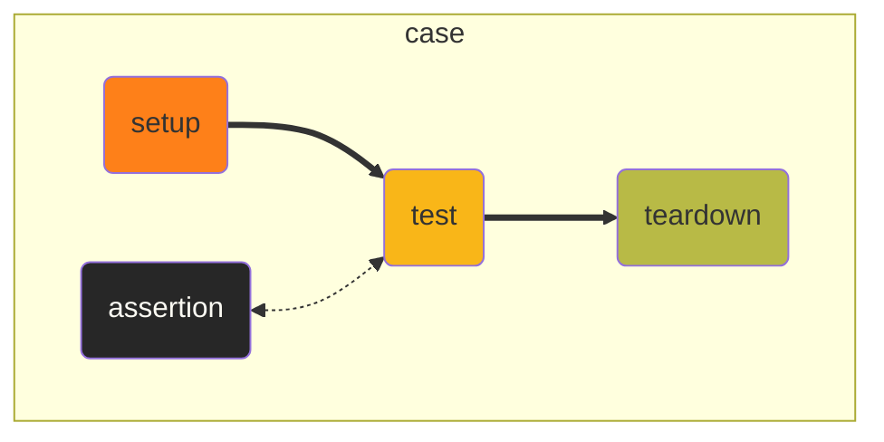

# Библиотека <check.h>: как и зачем хранить тестовые данные во внешних файлах

Youtube-запись от `2025-08-29`: https://youtu.be/8Dk4LqKWrg0

## …на чём мы остановились?

[`<check.h>`](https://libcheck.github.io/check/) — framework для unit-тестирования C-программ

**framework** — есть правила построения системы тестов

**unit** — тестирует отдельные кусочки кода

**C** — только на «обычных» (плюс-минус `POSIX`) компьютерах


Модель тестирования — **xUnit**


> *Ну вот ещё одно умное слово. Радость-то с него какая? К какому месту вообще его прикладывать? ОК, теперь я его знаю — и зачем? Ыыы…*
> 

## Идеи старые, слова новые. Чтобы отличать код от кода.



**fixture** — аргументы

**case** — функция

**suite** — модуль

**runner** — точка входа


У фреймворков всегда свои термины. **Это ключ.**


## — Мам, давай купим фикстуру!
— У нас дома уже есть фикстура.

Фикстура дома:

```c
#undef SIZE
#define SIZE 4

static char * is_digits_only_in[SIZE] = {"abyrvalg", "", "\n\t", "2128506"};
static bool is_digits_only_out[SIZE] = {false, false, false, true};

START_TEST(_is_digits_only) {
	bool result = is_digits_only(is_digits_only_in[_i]);
	bool expect = is_digits_only_out[_i];
	
	ck_assert_int_eq(result, expect);
} END_TEST;

CHECKPLUS_LOOP_CASE(is_digits_only, SIZE);
```

```c
#define CHECKPLUS_LOOP_CASE(name, size)        \
  void create_tcase_##name(Suite *suite) {     \
    TCase *tc = tcase_create(" " #name " ");   \
    tcase_set_tags(tc, #name);                 \
    tcase_add_loop_test(tc, _##name, 0, size); \
    suite_add_tcase(suite, tc);                \
  }
```

## Ещё немного xUnit

- Обычно **fixture** нужна для настройки среды, а не только переменных
- Но **где** `вкл/выкл` эту среду?

`unchecked`



`checked`




Оба варианта **одновременно**

- **Fixture** через `static`: `setup()/teardown()` явно снаружи кейса
- То есть для всех запусков один набор данных
- Элемент набора — через `_i` (да, всегда одно и то же имя переменной)

## Данные в коде — это ай-яй-яй!

- Действительно неприлично (но можно пренебречь, мало ли неприличного)
- Новый набор — правишь код минимум в трёх местах: `SIZE`, `*_in`, `*_out`
- Ошибок не избежать

## **Положим же данные во внешний файл**


Проблемы


Как-то много сразу, сюрприз!


> …и ещё нас подкарауливает **многопоточность**
> 

**Каждому кейсу — свой файл**

- Где `setup()` кейса будет искать свой файл? Ему нужен путь

**Каждому кейсу — своя процедура открытия/закрытия файла**

- Когда вызывать `setup()` и `teardown()`? И какие? И как их создать для кейса?

**Каждому кейсу — свой набор данных в файле**

- Типы данных тоже будут отличаться — как о них узнает кейс?
- И при этом структуры файлов одинаковые — чтобы унифицировать чтение

---

$$
Ручка — бумажка — время — магия
$$

---

## За что зацепиться?

- Нам точно придётся открыть файл
- И бегать по нему курсором

А что если нам сделать **расширенный курсор по файлу**?

- Он сможет нам отдавать i-ю строку из файла, что типично для курсора
- Но он же сможет и открывать свой файл
- И закрывать
- И перемещаться
- А раз нам не нужна сырая строка, пусть он знает и формат строки
- И пусть он формат строки тоже берёт из «своего» файла
    
    ```bash
    %d %s %c %d %e
    0 3728492 a 0 1.282845e5
    18 blabla c 1 -3.141295e-10
    ```
    

- Нам же останется только отдавать ему команды
- Места, откуда отдавать, мы знаем: `setup()` — `test` — `teardown()`
- Закрывать файл нужно, даже если тест упал
- Значит, **unchecked fixture**
- Значит, курсор — глобальная переменная
- А, ещё придётся данные из строки превращать в переменные
- По шаблону, который курсор нам даст:
    
    ```c
    sscanf(crs.line, crs.template,
    			&n, str, &sym, &r, &dbl);
    ```
    

## Дальше — дело техники и нюансов

- Фокус с привязкой имени функции к её внутренним данным — **например, к имени файла** — мы уже знаем
- `CK_NOFORK` — несколько курсоров в одном файле, даже расширенных, до добра не доведут; плюс там напрашивается **Singleton**
- `SIZE` остаётся и управляет количеством значимых строк — и это значит, что ниже этих строк мы можем писать комментарии и инструкции, удобно
- Можем выделить несколько строк под метаданные, не только первую. Но если только первую — удобно считать эти строки.
