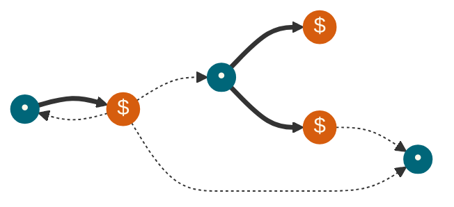

Youtube-запись от `2026-04-03`: https://youtu.be/Vfl8BZm01PY

# DBus — шина, Bluetooth дарящая

## Много процессов — много общения

### Базар-вокзал


### `call` Индивидуальный запрос


### `signal` Всем ~~людям~~ программам доброй воли


## Нужна почта: адреса + подписка


## `busctl` — утилита взаимодействия с шиной

Список сервисов:
```bash
busctl --system list
```

Дерево объектов конкретного сервиса:
```bash
busctl --system tree org.bluez
```

Исследование (интроспекция) конкретного объекта:
```bash
busctl --system introspect org.bluez /org/bluez/hci0
```

Прочитать свойство:
```bash
busctl --system get-property org.bluez /org/bluez/hci0 org.bluez.Adapter1 Powered
```

Установить свойство (осторожно!):
```bash
busctl --system set-property org.bluez /org/bluez/hci0 org.bluez.Adapter1 Powered b true
```

События на шине:
```bash
sudo busctl --system monitor org.bluez
```

Вызов метода:
```bash
busctl --system call org.bluez /org/bluez/hci0 org.bluez.Adapter1 StartDiscovery
```

Информация о запомненных устройствах:
```bash
sudo ls -la "/var/lib/bluetooth/2C:CF:67:99:CC:B8"
```


## Иллюзия «Шина что-то знает»

#### `introspect` — рассказывает про объект *то, что сообщит сервис*
```bash
busctl --system call \
  org.bluez \
  /org/bluez/hci0 \
  org.freedesktop.DBus.Introspectable \
  Introspect
```

#### `list` — список известных *шине* имён сервисов
```bash
busctl --system call \
  org.freedesktop.DBus \
  /org/freedesktop/DBus \
  org.freedesktop.DBus \
  ListNames
```

#### `get-property`, `set-property` — чтение/запись свойств
```bash
busctl --system call \
  org.bluez \
  /org/bluez/hci0 \
  org.freedesktop.DBus.Properties \
  GetAll \
  s org.bluez.Adapter1
```


#### `tree` — (традиционно) дерево объектов сервиса
```bash
busctl --system call \
  org.bluez \
  / \
  org.freedesktop.DBus.ObjectManager \
  GetManagedObjects
```


## Уходим в C (но можно и в другие языки)

Понадобится библиотека [Glib](https://docs.gtk.org/glib/):
```bash
sudo apt install libglib2.0-dev
```


## Дополнительно почитать
- https://man.sr.ht/~hdasch/gl-bluetooth/dbus-bluetooth.md
- https://opencoursehub.cs.sfu.ca/bfraser/grav-cms/cmpt433/links/files/2025-student-howtos/BlueZ_D-Bus_API_in_C.pdf
