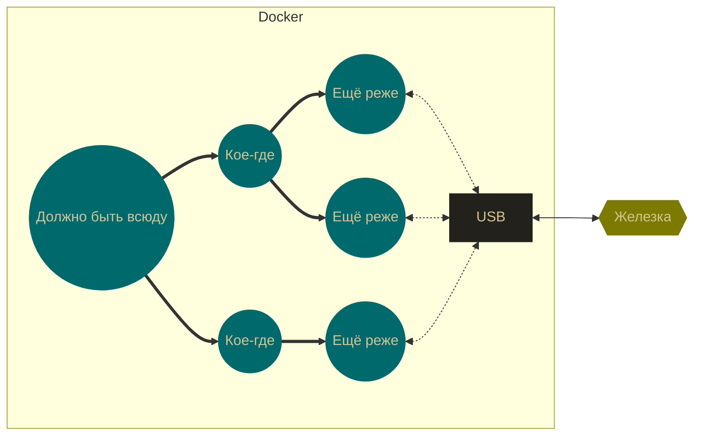
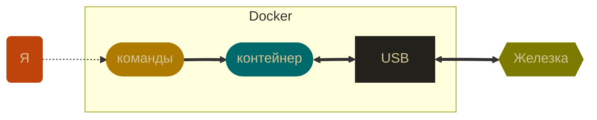
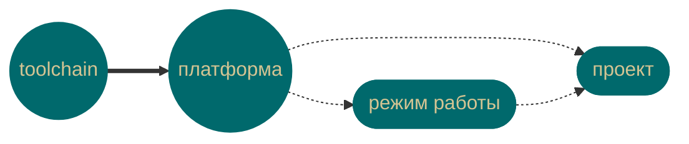

Youtube-запись от `2025-12-19`: https://youtu.be/E3TSUvToqCI

# Как, не задумываясь, писать embedded-код для любой железки?
`Дано:` ~20 микроконтроллеров + 38 плат + ~10 микрокомпьютеров


`Требуется:` подключать к USB и писать код, не отвлекаясь на DevOps

`В чём проблема:` *toolchain — SDK — компилятор — отладчик — прошивка — debugger — лучше-бы-вы-взяли-STM32 — UART — IDE — плагины — под-BLE-своя-библиотека — терминал — провод — это-другой-shell — ОС — CMake — Espressif-не-даёт-datasheet — …*

> [!WARNING]
> A-a-a-a-a-a!!!

`Решение:` один набор команд — разные реализации

> [!TIP]
> Переизобретём IDE

## Один набор команд
С набором команд всё просто — это `Makefile`
```bash
make build
gcc -O2 -Wall -Wextra -Werror -std=c11 main.c -o main.run
```
**`make`** `new` — `build` — `flash` — `debug` — `config` — `info` — `monitor` — `clean` — `rebuild` — `dump` — `check` — `size` — …

> Или можно bash-скриптами, если `make` надоел
 
 ## А как сделать разные реализации?
~~Неправильный вопрос.~~ Правильный :LiFileQuestion: как их структурировать?
> [!NOTE]
> У нас же есть Docker!
> И главная фишка докера — слои


> [!CAUTION]
> Надо как-то придумать систему слоёв
> А потом распихивать по ней наши утилиты


### Кое-что уже придумано до нас


> [!WARNING]
> И теперь — сиди себе распихивай утилиты
> Не то чтобы это рутинная работа, о нет

#### `toolchain` • система сборки бинарных файлов под архитектуру
> [!TIP]
> Полностью виртуальная штука
> Архитектура же.

Имя :LiBotMessageSquare: `<архитектрура>-<производитель>-<ОС>-<abi>/<среда>`

> [!WARNING]
> А давайте Dockerfile тоже будем генерить?
> А то что-то скучно стало и слишком просто


#### `platform` • приземление `toolchain` на  устройство или класс
Как-то же надо залить прошивку на нашу плату.
И смотреть на вывод платы.
И мало ли что ещё.

Имя `<экосистема>-<семейство>`

> [!IMPORTANT]
> Уже можно интерактивно подключаться
> Но «можно» не всегда значит «нужно»


#### `profile` • режимы работы с конкретной платформой
> [!TIP]
> Ключевой вопрос: что вы собираетесь делать прямо сейчас?
> Писать код, отлаживать, прошивать, анализировать бинарники,…

`dev` — `debug` — `flash` — `ci` — `release` — `analysis` — …


#### `project` • конкретика проекта
> [!WARNING]
> Делать под это контейнер — лишнее
> Достаточно слоя `COPY` или даже монтирования `value`
> Хотя…
