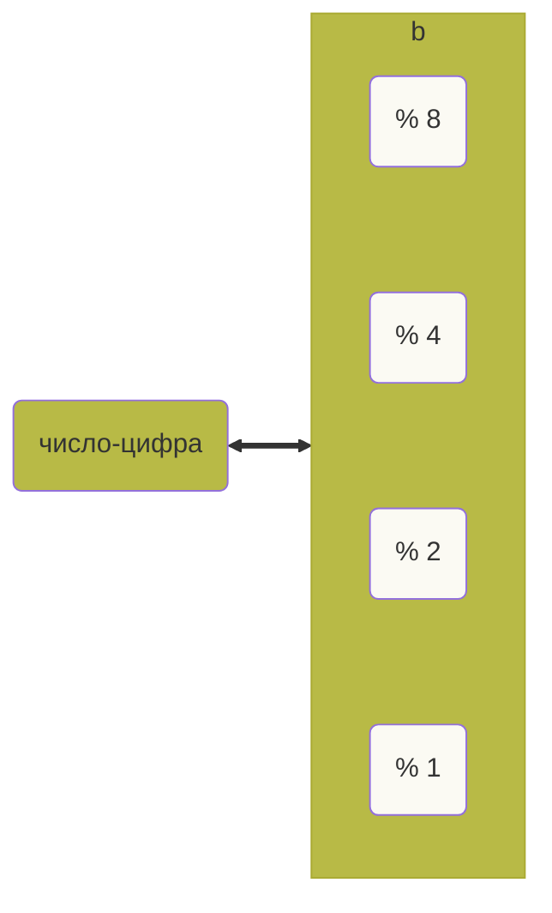

# Разбираем алгорифм Double Dabble своими руками

Youtube-запись от `2025-08-22`: https://youtu.be/UOZffQWHNWo

### Важный неважный disclaimer

Признаю, «алгори**ф**м» — не по правилам. А толку.

**Хотим** превращать двоичные в десятичные


Но **не можем** себе позволить деление

`111001010110001110101011110101010111101010100001010010001111111010001011101010101001`

### Малопонятные ссылочки про алгорифм Double Dabble

- [https://vgsemenov.wordpress.com/2011/11/08/алгоритмы-двоично-десятичного-преоб/](https://vgsemenov.wordpress.com/2011/11/08/%D0%B0%D0%BB%D0%B3%D0%BE%D1%80%D0%B8%D1%82%D0%BC%D1%8B-%D0%B4%D0%B2%D0%BE%D0%B8%D1%87%D0%BD%D0%BE-%D0%B4%D0%B5%D1%81%D1%8F%D1%82%D0%B8%D1%87%D0%BD%D0%BE%D0%B3%D0%BE-%D0%BF%D1%80%D0%B5%D0%BE%D0%B1/)
- https://gamedev.ru/flame/forum/?id=256805
- https://olduino.wordpress.com/wp-content/uploads/2015/03/why-does-double-dabble-work.pdf

### Ну а как же шайтан-машина?

Хорошо, разберём алгоритм **Double Dabble (Shift-and-add-3)** подробно.

---

## **Суть задачи**

У нас есть число в **двоичном виде**, и нужно преобразовать его в **BCD** (Binary Coded Decimal), чтобы можно было легко отобразить, например, на семисегментном индикаторе.

---

## **Основная идея**

Алгоритм основан на **последовательных сдвигах** и **коррекции каждого полубайта (тетраде)**:

1. Создаём массив для результата в BCD (несколько тетрад по 4 бита).
2. Последовательно **сдвигаем двоичное число влево**, добавляя его биты к этому массиву.
3. Каждый раз после сдвига:
    - проверяем каждую тетраду (цифру BCD);
    - если в ней получилось значение ≥ 5, прибавляем 3.
    - это гарантирует, что после всех сдвигов каждая тетрада будет содержать правильную десятичную цифру.

---

## **Пошаговый алгоритм**

Пусть у нас есть 8-битное число N = 0b10110101 (181₁₀), и мы хотим его перевести в BCD.

1. Создаём регистр BCD, например, на 3 тетрады (12 бит), изначально все нули:

```
[0000][0000][0000]
```

1. (слева — старшие разряды, справа — младшие).
2. Берём первый бит числа (слева направо) и сдвигаем в BCD.
    
    После каждого сдвига:
    
    - если в тетраде ≥ 5 → прибавить 3.
3. Повторяем шаги, пока не перенесём все биты.

---

## **Мини-пример**

Возьмём число 13 (1101₂).

- Начало: BCD = 0000 0000, двоичное = 1101.
- Сдвиг 1: переносим 1 → BCD = 0000 0001.
- Сдвиг 2: переносим 1 → BCD = 0000 0011 (значение 3, <5 — ничего не делаем).
- Сдвиг 3: переносим 0 → BCD = 0000 0110 (значение 6 ≥ 5, прибавляем 3 → 9).
- Сдвиг 4: переносим 1 → BCD = 0001 0011.
    
    Это = “13” в BCD (0001 = 1, 0011 = 3).
    

Готово!

---

## **Особенности**

- Каждый шаг использует только **сдвиг и сложение**, что удобно для аппаратной реализации (в микроконтроллерах, ПЛИС и т.п.).
- Стоимость алгоритма: O(n), где n — количество бит исходного числа.
- Работает для чисел любой длины (надо лишь подготовить достаточное количество тетрад).

---

Хочешь, я напишу для тебя **реализацию Double Dabble на C** (под твои микроконтроллерные проекты)?

## Давайте разбираться руками

### Binary-coded Decimal — BCD



1. Взять первую цифру Д-числа.
2. Положить в тетраду в БД-числе.
3. **Сдвинуть БД-число влево.**
4. **В каждой тетраде если > 5 — прибавить 3.**
5. **Дописать к БД-числу следующую цифру Д-числа.**
6. **Опять разбить БД-число на тетрады.**
7. Повторить.

`10` → `0001` `0000`

`23` → `0010` `0011`

`75` → `0111` `0101`

`735` → `0111 0011 0101`

### Внимательно смотрим на цифры

0 → 0000

1 → 0001

2 → 0010

3 → 0011

4 → 0100

5 → 0101

6 → 0110

7 → 0111

8 → 1000

9 → 1001

### А если удвоить?

`0` →  `0` → `0000` `0000`

`1` →  `2` → `0000` `0010`

`2` →  `4` → `0000` `0100`

`3` →  `6` → `0000` `0110`

`4` →  `8` → `0000` `1000`

`5` → `10` → `0001` `0000`

`6` → `12` → `0001` `0100`

`7` → `14` → `0001` `0100`

`8` → `16` → `0001` `0110`

`9` → `18` → `0001` `1000`
