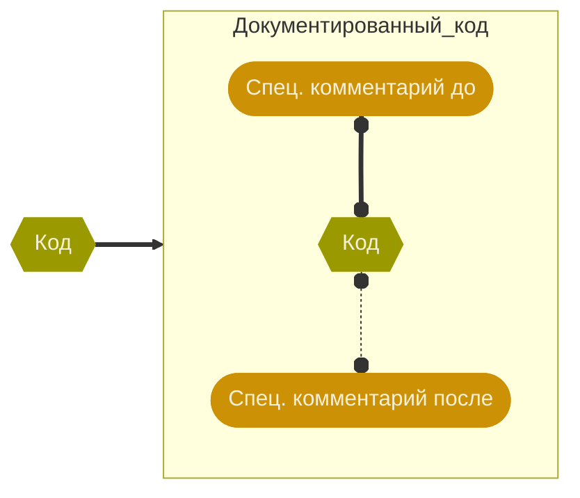
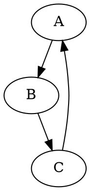

# `Doxygen` • Пишем документацию до кода
> [!WARNING]
> Вообще-то это модно.
> Буквы `AI` для кого на всех заборах написаны?

##### Устанавливаем `Doxygen`
Достаточно установки стандартного пакета:
```bash
sudo apt install doxygen -y
```
Так будет не самая последняя версия:
```bash
doxygen --version
```
Как сделать руками, или последнюю версию, или для других операционных систем — написано в [официальной документации](https://www.doxygen.nl/manual/index.html).

##### Проводим первый эксперимент
Просто запустим:
```bash
doxygen
```
Ой, много букв. Пойдём шаг за шагом.
###### 1 • Создадим файл конфигурации — без него не хочет работать
```bash
doxygen -g
```
Ууу, какой большой. Надо разбираться.
 - [ ] Разобраться в `Doxyfile` и настроить под свои задачи
###### 2 • Запустим заново — теперь можно
```bash
doxygen
```
Снова много букв. Что-то сделал. Что?
```
html/
latex/
```
Точно не нужен `latex/`.
- [ ] Запретить генерацию LaTeX-формата
- [ ] Складывать документацию в каталог `doc/`

###### 3 • Посмотрим, что получилось
```
cd html
lynx index.html
```
Формально что-то есть, но по сути ничего.
- [ ] Как увидеть что-нибудь осмысленное по проекту?
- [ ] Настроить `My Project` и другие служебные поля
- [ ] Поднять веб-сервер для просмотра документации (`dynsections.js`) ненавязчиво намекает


##### Поднастроим накопившиеся хотелки
###### Поднимаем веб-сервер для просмотра документации
```bash
python -m http.server 8000
```
И дальше в браузере открываем `192.168.0.101:8000` (IP свой).
Если браузер на локальной машине — можно `localhost:8000`
###### Видим первое осмысленное по проекту
1. В меню: `Related Pages → proppy`
2. Кажется, мы видим `README.md`?

###### Пора копаться в `Doxyfile`
Идём по файлу, смотрим, настраиваем.
`PROJECT_NAME`
`PROJECT_BRIEF`
`OUTPUT_DIRECTORY`
`OPTIMIZE_OUTPUT_FOR_C`
`RECURSIVE`
`GENERATE_LATEX`
Названия очевидны и снабжены гигантскими пояснениями.

Всё чистим, перезапускаем.
```bash
rm -rf html
rm -rf latex
doxygen
```
Получаем больше — и сообщений в консоли, и всякого в браузере.

> [!TIP]
> Самое время сделать поудобней
> - [ ] Добавляем `docs` в `Makefile`
> - [ ] Убираем `docs/*` из `git`

Появляются новые хотелки.
- [ ] На главной странице хочется хоть что-то видеть
- [ ] Давайте не выпендриваться с английским языком
- [ ] Стиль надо привести в чувство
- [ ] Схемки и другие картиночки — Халк хотеть!
- [ ] Как увидеть конкретные вещи?
- [ ] Как использовать README.md?

##### Смотрим на весь проект сразу
###### Список файлов и прочих штук (даже не документированных)
`EXTRACT_ALL = YES`
> [!INFO]
> А как их документировать?


До и после отличаются `<`:
```c
/** Привет, я комментарий до функции */
void make_something(
	int p /**< А я — комментарий после параметра*/
);
```
Конечно, есть разметка и на другие вкусы.
Пробелы и первая после них `*` в начале строки игнорируются.
> [!CAUTION]
> Не всё можно комментировать после.
> И даже до. Как прокомментировать файл _до_?

Если нельзя до и после, то можно где угодно.
Только надо сказать, что ты комментируешь — знаками `@` или `\`:
```c
/** @file types.h
  * \brief Объявления специфических типов программы
  *
  * Тут что хотим, то и пишем про файл types.h
  * В хозяйстве всё пригодится.
  */
```
> [!INFO]
> Это можно писать даже вне самого файла.
> Хоть специальный заголовочный файл заведите под такие описания. Непонятно, зачем, но можно.

Комментируем пару файлов, запускаем `doxygen`, любуемся изменениями в списке файлов (`Files → File List`)

Заходим в какой-нибудь файл, понимаем, какое непаханное поле.

###### Список вообще всего, что у нас есть
`Files → Globals`
- [ ] Упомянуты и объявление, и реализация функции — где комментировать?
- [ ] Макроопределения комментировать так же, как и всё остальное?

`Data Structures`
- [ ] В списке тоже есть короткие пояснения — как в списке файлов
- [ ] Может быть, русифицировать названия разделов?
- [ ] Что увидим, если будем документировать больше?
- [ ] Как нам из комментариев ссылаться в другие части документации?

`command.c`
- [ ] Как рядом с полями структуры тоже что-то писать? Как в списке файлов.

##### Разнообразим и структурируем комментарии
> [!INFO]
> Полно специальных команд — и они удобны
> - https://www.doxygen.nl/manual/commands.html
> - Многие дублируют параметры из `Doxyfile`
> - Многие обозначают объект комментирования в случае, если комментарий стоит в стороне от этого объекта

###### Метаданные
`@author`
`@brief`

###### Для других списков
`@bug`
`@todo`

###### Функции — это нам важно
`@param`
`@return`
`@test`

###### Обратите внимание на этот текст 
`@attention`
`@raisewarning`
`@important`
`@warning`

###### Немного форматирования
`@arg` `@li`
`@b`
`@c`
`@e`
Ну или `Markdown`. Для списков чуть другой: `-`, `-#` и `- [ ]`

###### Человеческие языки
`\~english` `\~russian` … `\~`

###### Схемы на любой вкус
`@dot` … `@enddot`
Технология [Graphviz](https://graphviz.org), язык [DOT](https://graphviz.org/doc/info/lang.html). Минимальный пример:


##### Извлекаем пользу по ходу разработки
> [!INFO]
> Documentation First.
> Каких только first не бывает. Чем документация хуже.

1. Структурируем набор файлов и поясняем, зачем они.
2. Продумываем и описываем структуры данных и API заранее.
3. Ситуативно записываем задачи (да, не самый модный подход).
4. Продумываем функции.
5. Отслеживаем зависимости.
6. Рисуем поясняющие схемки.

