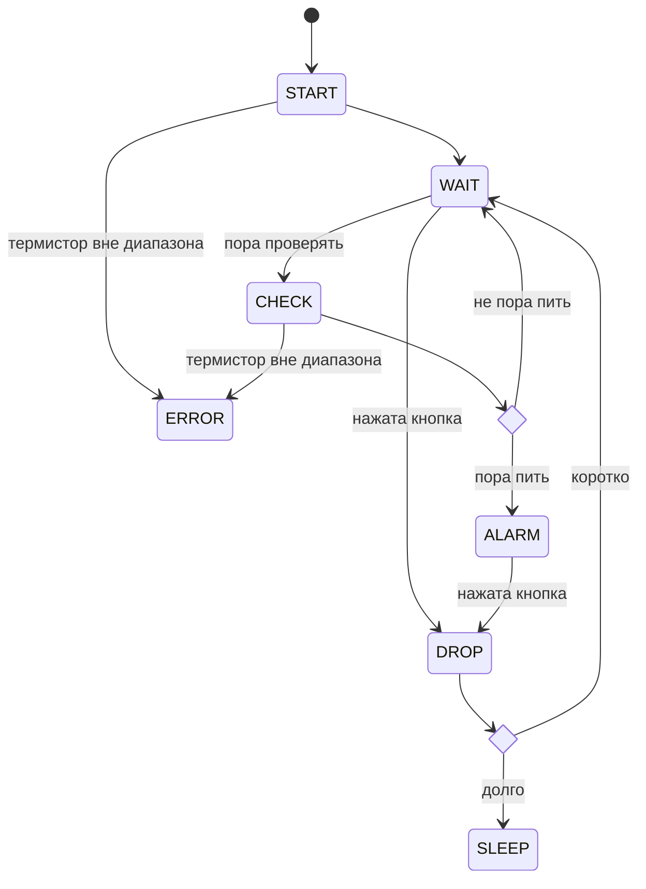

# Зачем нам в микроконтроллере прерывания
Разбираем на примере проекта «Автопоилка».

Youtube-запись от `2025-08-08`: https://youtu.be/YqGhqmHQQSs

## Электроника

### I/O-таблица

| **№** | **Пин** | **I/O** | **Прерывание** | **Код линии** | **Задача** |
| --- | --- | --- | --- | --- | --- |
| 1 | PB5 | — |  |  | RESET |
| 2 | PB3 | OUT |  | LED_R | Красный светодиод |
| 3 | PB4 | OUT |  | LED_G | Зелёный светодиод |
| 4 | GND | — |  |  | Земля |
| 5 | PB0 | OUT |  | BZZ | Звук |
| 6 | PB1 | IN | по спаду | BTN | Кнопка |
| 7 | PB2 | IN |  | THERM | Температура |
| 8 | VCC | — |  |  | Питание |

### Схема


- Использованы пять пинов из шести доступных
- `PB5` использовать не рекомендуется — придётся перенастраивать фьюзы, это опасно
- Кнопка работает через прерывание по спаду — поэтому она на `PB1` (единственный поддерживает такое прерывание)

## Глобальные настройки микропроцессора

### **Internal 128 kHz RC Oscillator** (Low Frequency RC)

- Нам не нужны слишком большая скорость работы и мгновенная реакция. Значит, частоту процессора можно поставить поменьше. Заметно меньше. Делается это через фьюзы (перемычки) — грубо говоря, «физические» настройки микроконтроллера.
- **Тут опасно.** Замедление может привести к тому, что программатор потеряет связь с чипом. Проверьте, что программатор понимает ключ `-B 300` для avrdude и выставляет частоту 2000 Hz:
    
    ```bash
    avrdude -c usbasp -p t13 -B 300 -v
    
    ...
    
    avrdude: set SCK frequency to 2000 Hz
    avrdude: AVR device initialized and ready to accept instructions
    avrdude: device signature = 0x1e9007 (probably t13)
    ```
    
- Вот настройка через фьюзы для программатора USBasp:
    
    ```bash
    avrdude -c usbasp -p t13 -U lfuse:w:0x63:m
    ```
    
    Итог: `CKSEL` = 0011 (Low Frequency RC) и `CKDIV8` = 0 (дополнительный делитель на 8).
    
    Делать один раз при настройке проекта.
    
- **С этого момента avrdude всегда запускать с ключом `-B 300`**
- Прочитать значение всех фьюзов (для контроля результата):
    
    ```bash
    avrdude -c usbasp -p t13 -B 300 -U lfuse:r:-:h -U hfuse:r:-:h
    ```
    
    Вывод (частично):
    
    ```bash
    avrdude: reading lfuse memory ...
    avrdude: writing output file <stdout>
    0x63
    avrdude: reading hfuse memory ...
    avrdude: writing output file <stdout>
    0xff
    ```
    
    0x63 — это как раз то, что и должно стоять для замедления частоты.
    

- Ухудшается: частота опросов, ШИМ, протоколы, качество работы АЦП. Всё некритично конкретно для этого проекта.

- Улучшается: нагрев микросхемы, загрузка процессора, энергопотребление (все параметры — меньше). А вот это важно.
- Таким образом, мы переключили базовую частоту на 128 кГц. И потом ещё раз разделили на восемь. Итого `F_CPU = 128000 / 8 = 16000` — важно для Makefile!

### Стек и SRAM

- Памяти очень мало. А она понадобится для флагов и таблицы значений термистора.

## Блоки микропроцессора

### Таймер

### Прерывание по внешнему сигналу

### Сторожевой таймер

### АЦП

## Настройка и использование регистров

### Привязка меток функциональности к конкретным пинам

```c
#define BZZ   (PB0)
#define BTN   (PB1)
#define THERM (PB2)
#define LED_A (PB3)
#define LED_B (PB4)
```

- Лучше использовать ники, а не конкретные адреса. Это позволит переключать оборудование на другие пины, не меняя упоминание этих пинов в коде.
- Скобки — хороший тон в макросах.

### Таймер

- Общая рамка настройки таймера для учёта времени:
    
    ```c
    TCCR0A = 0;              // отключить все режимы ШИМ
    TCCR0B = (1 << CS02)     // Предделитель 1024: clk/1024
            | (0 << CS01)    // получаем частоту таймера примерно 15,6 Гц
            | (1 << CS00);   // то есть 1 мин = 938 тактов таймера
                             // 1 час = 220 переполнений таймера
    ```
    
- Подберём предделитель, позволяющий удобно считать минуты:


Очевидно, предделитель 8 даёт наименьшую погрешность *для минут*:

```bash
TCCR0B = (0 << CS02) | (1 << CS01) | (0 << CS00);
```

- Включить прерывание по переполнению (выход за 255) таймера:
    
    ```c
    TIMSK0 = (1 << TOIE0);
    ```
    
- Обработчик:
    
    ```c
    ISR(TIM0_OVF_vect) {
        // Код, вызываемый при каждом переполнении таймера
    }
    ```
    
- Включить прерывания (это уже в коде `main()`):
    
    ```c
    sei();  // включить прерывания
    ```
    
- Но можно и улучшить: использовать прерывание не по переполнению, а по достижению порога. Тогда число тиков в секунде легко сделать целым. А все остальные счётчики выражать через секунды. Пороговое значение для такой секунды — 249 тактов (8 прерываний в секунду). Для минуты это же значение даёт 480 прерываний в секунду.
- Тогда код инициации таймера такой:
    
    ```bash
    #define OCR0A_THRESHOLD 249
    ...
    TCNT0 = 0;                // стартовое значение
    OCR0A = OCR0A_THRESHOLD;  // порог прерывания
    
    TCCR0A = (1 << WGM01);     // CTC (WGM01=1, WGM00=0)
    TCCR0B = 0;                // пока стоп
    
    TIMSK0 = (1 << OCIE0A);    // прерывание по совпадению A
    
    // Предделитель = 8: CS01=1 (CS02=0, CS00=0)
    TCCR0B = (1 << CS01);
    
    // (опционально) сбросить возможный флаг совпадения
    TIFR0  |= (1 << OCF0A);
    ```
    
- Функция срабатывания по прерыванию:

```bash

```

### Температура

- Термистор (датчик ****температуры, терморезистор) **NTC 10K**; сопротивление ****при ****25 °C, R25 = `10K Ω` , коэффициент Бета B25/85 = `3950K` ±1%
    
    http://ventmodul.ru/wp-content/uploads/2018/01/%D0%A2%D0%B0%D0%B1%D0%BB%D0%B8%D1%86%D0%B0-%D1%81%D0%BE%D0%BF%D1%80%D0%BE%D1%82%D0%B8%D0%B2%D0%BB%D0%B5%D0%BD%D0%B8%D0%B9-NTC10K-3950.pdf
    
- Парный резистор — 10К
- Переводим `PB2` в `IN` и в аналоговый режим:
    
    ```c
    DDRB   &= ~(1 << PB2);  // сделать PB2 входом
    PORTB  &= ~(1 << PB2);  // не подтягивать к VCC, иначе будет мешать а-входу
    ```
    
- Включаем АЦП на `ADC1` (соответствует `PB2`):
    
    ```c
    ADMUX = (0 << REFS0)     // опорное напряжение = Vcc
          | (1 << MUX0);     // выбрать ADC1
          
    ADCSRA |=  (1 << ADEN)                   // включить АЦП
             | (1 << ADPS1) | (1 << ADPS0);  // предделитель 8 → для 1.2 МГц: частота АЦП = 150 кГц
    ```
    
- Считываем значение:
    
    ```c
        ADCSRA |= (1 << ADSC);         // начать преобразование
        while (ADCSRA & (1 << ADSC));  // ждать завершения
        uint16_t val = ADC;            // прочитать результат (10 бит)
    ```
    

### Звук

- По низкоуровневой логике ничем не отличается от светодиода. Работает на `PB0`.

### Кнопка

- Настраиваем `PB1` на вход:
    
    ```c
    DDRB  &= ~(1 << PB1);  // вход
    PORTB &= ~(1 << PB1);  // явно отключаем внутреннюю подтяжку
    ```
    
- Проверяем нажатость:
    
    ```c
    unsigned char pressed = !(PINB & (1 << PB1));
    ```
    
- Включаем прерывание:
    
    ```c
    GIMSK |= (1 << INT0);    // включить прерывание INT0
    
    MCUCR |= (1 << ISC01);   // срабатывать по спаду
    MCUCR &= ~(1 << ISC00);  // 00 — низкий уровень, 10 — спад, 11 — фронт
    ```
    
    Потом обязательно глобально в коде:
    
    ```c
    sei();
    ```
    
- Обработка прерывания:
    
    ```c
    volatile uint8_t button_pressed = 0;  // чтобы компилятор не оптимизировал
    
    ISR(INT0_vect) {
        if (!(PINB & (1 << PB0))) {  // был нажат именно PB0
            button_pressed = 1;      // устанавливаем флаг
        }
    }
    ```
    

### Светодиод (A + B)

- Настраиваем `PB3` и `PB4` как выходы + гасим:
    
    ```c
    DDRB  |= (1 << PB3) | (1 << PB4);   // выходы
    PORTB |= (1 << PB3) | (1 << PB4);  // гасим — ставим в 1
    ```
    
- Переключаем с одного на другой:
    
    ```c
    PORTB |=  (1 << PB3);
    PORTB &= ~(1 << PB4);
    ```
    
- Переключаем оба значения (обычно это то же самое):
    
    ```c
    PORTB ^= (1 << PB3) | (1 << PB4);
    ```
    

## Конечный автомат



### Общая архитектура

- В каждом цикле конечного автомата: обработка флагов → действия внутри состояния → обновление состояния.
- Дополнительные фазы автомата: инициация (до цикла), сброс переменных при смене состояния (нужно помнить предыдущее?), фаза сна (с пробуждением по прерыванию).
- Ну и можно отдельно отрабатывать вход-выход в каждое состояние.
- Флаги — это, вообще говоря, независимое измерение. Физический смысл — «входные символы», подготовленное к обработке знание о состоянии внешнего мира. В математике обновления автомата эти «входные символы» учитываются вполне легально.
- Таймеры стоит конвертировать во флаги. Этому действию место внутри функции обработки прерывания.
- Структура функции обработки прерывания: обновление счётчиков — установка флагов в соответствии с новыми значениями счётчиков.

### Флаги

### Счётчики

## Toolchain

### Программатор

- Все программаторы, поддерживаемые avrdude:
    
    ```bash
    avrdude -c ?
    ```
    
- Самый типовой — usbasp
- 

## Обработка, расчёты и прочие алгорифмы

### Аккуратные расчёты температуры

- Чтобы усреднить результаты наблюдений: делаем N замеров подряд, суммируем по ходу измерений, потом делим на N. Это самый простой подход. Массив не нужен.
- Ещё лучше скользящая фильтрация по окну: в кольцевой массив добавляем очередное значение, потом расчёт по этому массиву. Кольцевой массив делаем так: увеличиваем индекс, когда вышли из максимума — сбрасываем в ноль. Работает с задержкой (инерция).
- И ещё лучше — медиана. По тому же кольцевому массиву. Хорошо гасит выбросы.

### Точный расчёт сигнала «Пора» при переменной температуре

- Нужно что-то вроде «накопления баллов» за каждую минуту. Если жарко — баллов больше, если холодно — меньше.

### Подавление дребезга кнопки

- Через счётчик длительности нажатия (непрерывное состояние «нажато» → +1 к счётчику). Можно прицепить к прерыванию, считающему все счётчики.

### Длительность нажатия кнопки

- Считаем моменты нажатия и отпускания (без дребезга). И смотрим на разницу. Сами моменты — счётчики внутри прерывания по переполнению. Можно при нажатии обнулять.

### Повесить кнопку на прерывание по фронту/спаду

- Это позволяет пин `PB1`
- Дребезг и длительность всё равно нужно обрабатывать отдельно. В прерывании лучше только ставить флаг.
- Общая рамка кода:
    
    ```c
    GIMSK |= (1 << INT0);    // включить прерывание INT0
    
    MCUCR |= (1 << ISC01);   // срабатывать по спаду
    MCUCR &= ~(1 << ISC00);  // 00 — низкий уровень, 10 — спад, 11 — фронт
    
    sei();                   // включить глобальные прерывания
    
    ISR(INT0_vect) {
        // обработка кнопки или чего угодно
    }
    ```
    
- Неявно предполагается, что в состоянии, в которое конечный автомат проваливается по прерыванию, нет действий.
- В любом случае в обработке прерывания лучше всего ограничиться установкой флага.

### Ошибки

- Если термистор выдал неприемлемое значение сопротивления — считаем, что слишком жарко или слишком холодно. Это отдельное состояние, уходим в него. Выход — перезагрузка.
