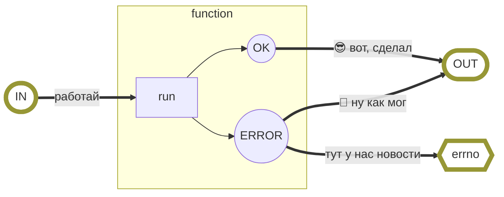
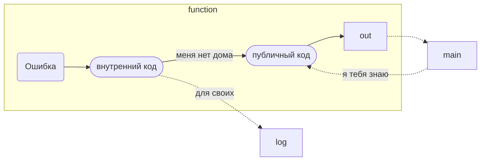
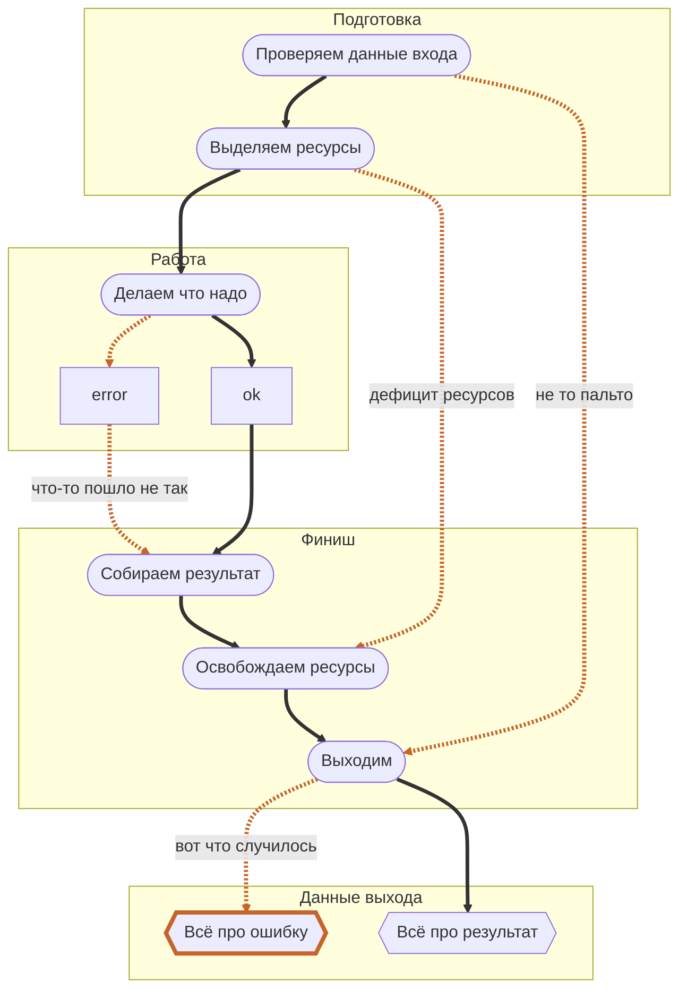
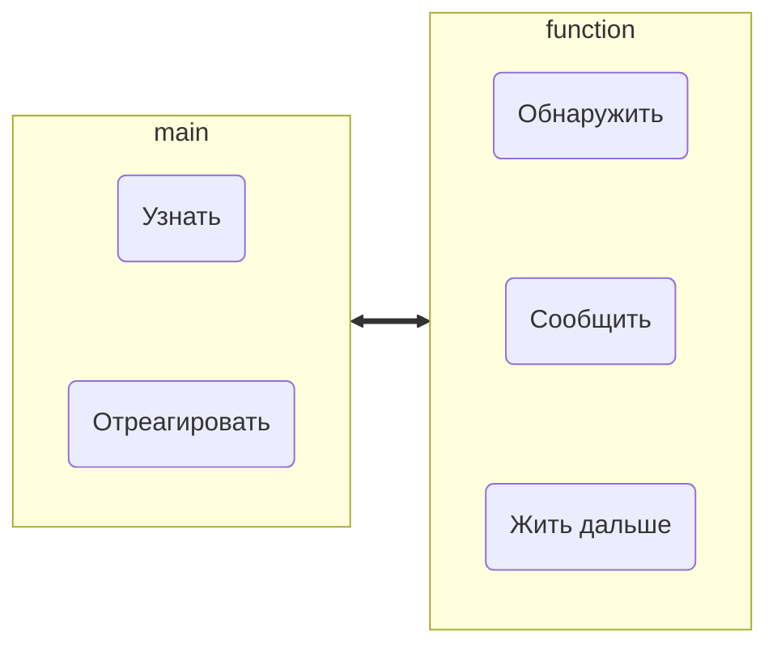

# Ошибки как часть дизайна программы на C
- Будут
- Легализуем
- Мы не первые

## Используем чужое 🧀

### Глобальная переменная — неуютно, но факт

https://www.gnu.org/software/libc/manual/html_node/Error-Reporting.html — GNU-библиотека `<errno.h>`

`errno`
- **Сперва прочтите** ~~инструкцию~~ **документацию.** А то некоторые функции врут. Да-да, врут.

Компиляторы не любят глобальность

- Одна на всю программу
- Знакома не всем, но многим «обычным» функциям
- Не переменная, но всё же `lvalue` — ей можно что-то присваивать *(это упрощение!!! [читать подробности](https://microsin.net/programming/arm/lvalue-rvalue.html))*
- Установка **не** вызывает поведение
- Лучше присваивать макросом
- Ноль — забота человека

```c
#include <errno.h>
...
errno = 0;  // А то мало ли что туда сложили предыдущие вызовы функций
char * s = malloc(1);
if (s == NULL) {
	return errno;  // Значение уже установила функция malloc()
}
```

- Это значит, что у *некоторых* системных и библиотечных функций реализована архитектура *«Если что не так, ставим* `errno`*»*. А у некоторых — не реализована. А у некоторых `errno` вообще для другого. Спасёт документация.



**Вы тоже можете** так делать…

…но лучше с другой переменной

### Да что за коды-то?

`E*` (это соглашение; есть ещё)

`strerror(int)` — превращает код ошибки в **указатель на** текстовое сообщение; может и поменяться при смене кода

`perror(char *)` — выводит сообщение об ошибке в `STDERR`; можно `perror(NULL)`

- Макросы
- А за ними — целые числа
- `<string.h>` про них знает
- Да все знают


**Пример:** выведем все имеющиеся коды ошибок, их названия и описания.


А где коды ошибок? А в коде!

- у каждой функции свои макросы
- ISO и POSIX тоже определяют некоторые коды
- можно пройтись по `<errno.h>`
- `char * strerrorname_np(int)` — даст имя по коду, но не на любой системе

### Как использовать свои и чужие коды

**Не верьте нулевому коду!**

Он ничего не значит.
Совсем ничего.

Ну грустно, конечно.


```c
// Не надо так!
errno = 0;
int result = f(bla);
if (errno != 0) { g(result); }
```


Проверяйте
**конкретное**
выставленное
значение


```c
// Так норм
errno = 0;
int result = f(bla);
if (errno == ETIME) { g(result); }
// А ещё лучше switch
```

- Коды ошибок и возвращаемые значения — это разное: `-1` часто значит «нет ничего»

### **Народ развлекается** 🤔

---

Macro: *int* **ED**“?.” The experienced user will know what is wrong.

Macro: *int* **EGREGIOUS**“You really blew it this time.” You did **what**?

Macro: *int* **EIEIO**“Computer bought the farm.” Go home and have a glass of warm, dairy-fresh milk.

Macro: *int* **EGRATUITOUS**“Gratuitous error.” This error code has no purpose.

---

### А можно по-русски?

`char *strerror_l(int errnum, locale_t locale)` — на Linux (но не на Mac, например)

**Пример:** соберём библиотеку пояснений на русском языке к POSIX-кодам ошибок.


### Давай подробности!

- `__FILE__`, `__LINE__` и `__func__` к нашим услугам
- Прекрасно сочетается с логированием
- Пригодится `program_invocation_short_name` (она же `argv[0]` или `getprogname()`)


**Пример:** напишем лог-библиотеку, использующую `errno`.


### Некоторые советуют `assert()`

- Возможно — просто возможно! — это не очень хорошая идея

### Малышка `atexit()` и её друзья


`int atexit(void (*func)(void))`


- Никаких аргументов
- Стек (он же FIFO)
- 32 штуки, и всё


**Пример:** используем `atexit()` для автоматической очистки динамической памяти


- `abort()` — всё бросить и бежать вотпрямщаз
- `exit(int)` — спокойненько выйти из программы с кодом выхода
- Значения кода выхода: `0`, `EXIT_SUCCESS` или `EXIT_FAILURE`
- `return` вызывает `exit()`

---

## Сделаем своё 🫐

### Самый простой шаблон работы с ошибкой

- База-база-база
- Возвращаемое значение сообщает, чем дело кончилось
- Обратите внимание на несколько `return`

```c
int repeat_string(char * s, int n) {
	if (s == NULL) { return -1; }  // строка не определена
	if (n < 0)     { return -2; }  // отрицательное число повторений
	
	for(int i = 0; i < n; ++i) { printf("%s", s); }
	printf("\n");
	
	return 0;  // «всё хорошо» в C — традиционно ноль; уж так уж
}
```

- Солидное название: возврат специального значения
- Осторожно назовём это *паттерном проектирования*
- Погладь своё ОКР, раздели на три функции

### Когда вас ну оооооочень достала каша в коде

- Воспользуемся ленивыми вычислениями

```c
int ok = 1;
...
ok = ok && !another_function(bla, wow);
ok = ok && !next_function(bla, wow);
...

int another_function(int bla, char * wow) {
	if (bla < 0) { return -1 }
	...
	return 0;  // чтим традиции
}
```


**Как** ~~вообще живым людям~~ **такое придумывать?**
Ключевые слова: «таблица истинности»


**Пример:** упростить через макрос.


### Как ещё можно реагировать

- «Моё дело — доложить» (с этого обычно и начинают)
- «Померла так померла» (это же — принцип самурая)
- Прерывания, они же исключения — всё как у модных ребят

### Ошибка — это информация, кому попало не даём

- Причину ошибки знать хочется
- А вот отдавать во внешний мир — не всегда
- Безопасники тут как тут



### Эмуляция goto, господи (которого нет) прости

- Так пишут — а нам потом читай




**Пример:** функция чтения числа из секретного файла.


### Свой «errno» — толстенький и с бантиками

- Кто мешает переменной быть структурой? Никто!

**Внутренние ошибки**

1. Код
2. Пояснение для человека (+ переводы)
3. Уровень критичности
4. Функция в случае обнаружения
5. Соответствие публичной ошибке

**Публичные ошибки**

1. Код
2. Пояснение для человека (+ переводы)


**Пример:** реализовать внутренний-внешний коды на структуре.


### Рамка, чтобы ~~не~~ запутаться



**Вызываемый**

- Когда искать?
- Кому сказать?
- Что делать?

**Вызывающий**

- Как узнать?
- Как отреагировать?
