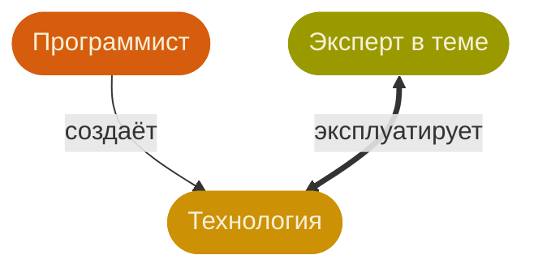

Youtube-запись от `2026-12-26`: https://youtu.be/AIKYXFIRIkI

# Разговор с теми, кто боится программирования

> [!TIP]
> 50+ лет программисты программировали *компьютеры*
> Ну и привыкли, конечно.

## А что мы программируем `сейчас`?
Уж точно не компьютеры. Не железки.

### 1 • Всё уже ~~украдено~~ закодили до нас
Осталось взять чужое и присобачть туда, где вы уже обитаете.

#### Система 3D-моделирования
> [!WARNING]
> FreeCAD — OpenSCAD — Autodesk Fusion 360

> «Создай трёхмерный объект по чертежу и параметрам»
> • Python — *свой язык*

#### Редактор электронных схем
> [!WARNING]
> KiCAD

> «Преврати эскиз в готовый результат по всем правилам»
> • Python

#### Музыкальный плеер
> [!WARNING]
> VLC

> «Учти конкретные потребительские предпочтения пользователя»
> • Lua

#### Медиаредакторы
> [!WARNING]
> OBS — DaVinci

> «Собери и оформи медиаконтент из источников данных»
> • Python — Lua

#### Специализированные базы знаний
> [!WARNING]
> Wolfram Mathematica — Anki

> «Создай среду для экспериментов в предметной области»
> • *внутренний язык*

### 2 • Пощупаем настоящее программирование ~~за вымя~~

#### Виртуальная среда разработки
> [!INFO]
> Sketch — Processing — p5.js

> «Дай возможность привыкнуть к абстрактным моделям и их **традиционному** поведению»
> • *внутренний язык* — — Wired — Java — Python — JavaScript — C

#### Электронный документ
> [!INFO]
> Google \* — Obsidian — Microsoft \* — vim — …

> «Реализуй сложные зависимости внутри данных»
> • *пропиетарные и редкие языки*

#### Оболочка операционной системы
> [!INFO]
> macOS — iOS — Linux

> «Автоматизируй то, что обычно я делаю руками»
> • Automator — bash script

#### Физический мир
> [!INFO]
> Оборудование — yмный дом — сети и связь — голосовые помощники 

> «Преврати физическое поведение в цифры и обратно»
> • Arduino — C — ESP-IDF — MicroPython

### 3 • Очарование универсальных интерфейсов

#### Чат-бот
> [!TIP]
> Telegram

> «Спрячь сложную систему за простым интерфейсом»
> • Python — JavaScript

#### Браузер
> [!TIP]
> Chrome — Safari — Chromium

> «Погоняй данные по сети, оформи их красивенько, дай пощупать»
> • JavaScript — DevTools — Python — Selenium

#### Electron-сборка
> [!TIP]
> Figma — Slack — Notion — VSCode — …

> «Автоматизируй то, у чего не дошли руки у разработчиков сборки»
> • TypeScript — React — JavaScript

## Но как же процессор, C и числа Фибоначчи?
> [!CAUTION]
> Давным-давно, когда мы…
> …не были обвешаны компьютерами с ног до головы,
> …с трудом вообще с ними взаимодействовали,
> …не могли освоить и технологии, и другую профессию…

> [!IMPORTANT]
> …выживание зависело от интереса к компьютерам
> И вот так он проявлялся — в исследовании их возможностей.
> С помощью освоения и создания технологий.
> И задач на вычисления ради вычислений.

> [!INFO]
> А теперь давайте займёмся своими делами
> Автоматизируем своё. Как можем.
> А программисты — своё.
> И все при деле.

## И что нам нужно?
> [!INFO]
> Экспертиза в предметной области

> → **Находить** и формулировать задачи
> → Быстро-быстро-**быстро** итерировать
> → Распознавать **приемлемый** результат
> → Делать только нужное с • :LiEye: эксперта

> [!NOTE]
> Workflow автоматизации

> 90% времени занимает отладка.
> **Теперь** она на эксперте.

> [!TIP]
> Навыки освоения технологий

> [!CAUTION]
> Ну и так, по мелочи

 - Основы написания структурированного кода
 - Основы ООП
 - Основы функционального программирования
 - Работа с API
 - Работа со структурированными данными
 - Command Line Interface (CLI)
 - Ключевые архитектуры (высокоуровнево)
 - …

