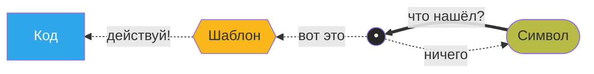
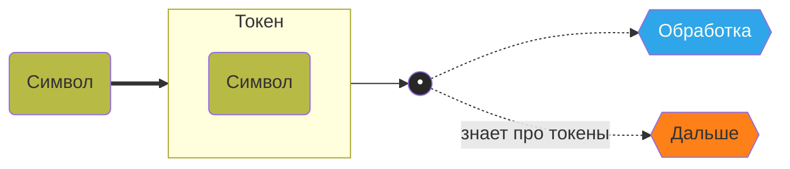

## Чем занят лексический анализатор?

1. Читает текст символ за символом.
2. Ищет в нём регулярные выражения.
3. Реагирует на сработавшие регулярные выражения.

> *Мой дядя самых честных правил,
Когда не в шу**тку зане**мог,
Он уважать себя заставил
И лучше выдумать не мог.*
> 



## Зачем?

1. Так можно превратить поток символов в поток токенов.
2. И либо сразу обработать, либо передать дальше.

 **Токен** — это «кусок контента с пояснением, что это»




А генератор зачем?

Чтобы **не писать код**, конечно!


> [flex](https://github.com/westes/flex) — простой и *старый* генератор лексических анализаторов
> 

    `man flex`

- Жадный: берём самое длинное
- Автомат: шаблоны задают переходы между состояниями

## Как всегда, начнём с Фибоначчи

`«Вначале было 1. Потом опять 1. Затем появилось 2. Дальше — 3. Потом 5. Следующим было 8. А потом 13. И вот перед нами уже 21. А что дальше? Дальше 34. И за ним 55. Что же впереди?»` 

### Что мы можем сделать с этим текстом?

- `00` • Превратить в поток токенов вида «целое число»
    
    ```c
    %{
    #include <stdio.h>
    %}
    
    %%
    [0-9]+   { /* вот мы и нашли число */ }
    .|\n     ;
    %%
    
    int main(void) {
    	yylex();
    	return 0;
    }
    ```
    
    ```makefile
    %:
    	flex -o $*.yy.c $*.l
    	gcc $*.yy.c -lfl -o $*.run
    	./*.run < data.txt
    ```
    
- `01` • Напечатать эти числа
- `02` • Сложить эти числа
- `03` • Убедиться, что перед нами последовательность Фибоначчи
- `04` • Вычислить следующий элемент этой последовательности
- `05` • Напечатать не только числа, но и номера строк, в которых они найдены
    
    ```c
    %option yylineno
    ```
    
- `06` • А теперь ещё и номера символов в строке
    
    ```c
    // это называется «встроенный хук»
    #define YY_USER_ACTION \
    	...
    	// используем yyleng
    ```
    
- `07` • Превратить числа в код, создающий C-массив
    
    ```c
    ...
    printf("#define SIZE %d\n", count);
    ```
    
- `08` • Прогнать простые упражнения вида «A + B = [введи правильный ответ]»
    
    ```c
    %option noyywrap
    
    FILE * fin = fopen("fibonacci.txt", "r");
    yyin = fin;
    ... // пригодится fflush(stdout);
    fclose(fin);
    ```
    


Мы **не можем** создать код, который на этапе компиляции зависит от содержания этого текста


- Из текста нельзя взять типы данных
- Такой enum, от которого зависит код
- Сами правила распознавания токенов

## Полезно заглянуть в lex.yy.c

- Там конечный автомат, пережить можно
- Таблицы — это таблицы переходов в конечном автомате
- yylex(); —
- Читать «в лоб», конечно, не очень хочется

## Теперь пишем полезное

### Из содержимого файла — двумерный массив (матрица) в C

Генерим код как обычный текст


- В самом начале пишем код для инициации статичного двумерного массива
    
    ```c
    printf("double arr[ROWS][COLS] = { ");
    ```
    
- Реагируем на число: дописываем его в вывод
    
    ```c
    printf("%s", yytext);
    ```
    
    - различаем ситуации «первое число в строке» и «число из середины строки»
        
        ```c
        if (ccol == 0) { ... } else { ... }
        ```
        
    - перед первым числом открываем внутренний массив
        
        ```c
        printf(" { ");  // да и сам вывод первого числа отличается от других
        ```
        
- Реагируем на перенос строки: начинаем новый одномерный массив
    
    ```c
    \n   { printf(" }, \n"); }
    ```
    
- Больше ни на что не реагируем
    
    ```c
    [ \t]+    ;
    .         ;
    ```
    
- Когда всё обработали — заканчиваем код инициации
    
    ```c
    yylex();
    printf(" };\n");
    ```
    
- И выводим макросы для количества колонок и строк
    
    ```c
    // чтобы это сделать, по коду размазываем счётчики
    printf("#define ROWS %d\n", rows);
    printf("#define COLS %d\n", cols);
    ```
    

## Фишки

- Первым срабатывает тот шаблон, что выше в коде
- **Есть стек состояний для поиска тоllкенов вида «один объект внутри другого»**
- Опции, хуки, манипуляция с потоком — всего в изобилии
- **Главное** — встроен почти во все Linux-дистрибутивы (не то что [re2c](https://re2c.org))
