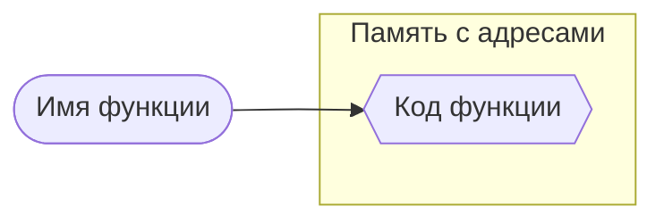
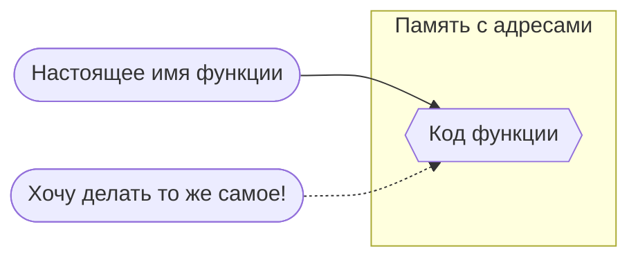
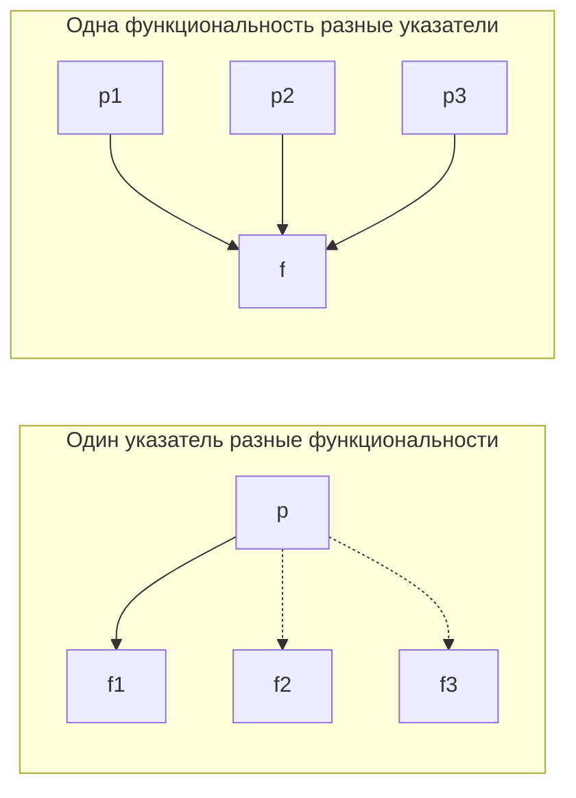

# Приёмы использования указателей на функции
Подкрадываемся к ООП. Начнём с простого: с эксплуатации факта, что в C функции (как и всё остальное) — это указатели. Как нам это поможет прямо сейчас захотеть и сделать что-нибудь объектно-напоминающее? И зачем? Разберёмся.

# Лекция • Теория • Шпаргалка • Короче, не код

### О чём вообще речь?



- `Функция = имя + код`
- Имя функции только *указывает* на её «тело», но не пришито к нему намертво.
- Код хранится где-то в памяти.



- Всё, что хранится в памяти, доступно по какому-то адресу.
- Указатели — специальная штука, чтобы ходить по адресам.
- Давайте их присваивать, *как обычно*.

```c
...
e = printf;
...
e("Код ошибки: %d\n", ERR_STR_TYPE);
```

1. Функция — **не** переменная
2. Указатель на функцию — переменная

### Как создать указатель на функцию

- Указатель должен быть во *всём* похож на функцию:
    - тип результата;
    - аргументы и их типы.
- Так и напишем:
    
    ```c
    int f(char *, int);
    int (*g)(char *, int);
    ```
    
- А если 100? Лениво повторяться. Нужен псевдоним типа «вот такая функция»:
    
    ```c
    typedef int (*ftype)(char *, int);
    
    ftype g = f;
    ```
    
- Там много чудес, связанных с `void`, но сейчас не будем.

### Магия синтаксиса присвоения и вызова

- Можно с &, можно без. Это всё равно.

```c
g = &f;
```

```c
g = f;
```

- Присваивая, получаешь адрес на момент присваивания. То есть нет смысла присваивать до инициации функции — там тупо NULL? Проверим.

```c
// Код без тестирования
...
void n();
void (*d)();
d = n;
printf("%p", d);
```

- Вызывать можно с *, можно без. Это всё равно. А вот скобки важны.

```c
f(c, n);
```

```c
(*f)(c, n);
```

# Танцы • Практика • Эксперименты • Ура, код!

1. Один указатель — разные функциональности
2. Одна функциональность — разные указатели



### Пошатаем устои жёсткого списка аргументов

- Если не указывать список аргументов, он может быть любым:
    
    ```c
    int sum(int, int);
    int square(int);
    int rand();
    
    int (*f)();  // хоба! никаких аргументов
    
    ... // задаём функциональность sum, square, rand
    
    f = sum; printf("%d\n", f(1, 2));
    f = square; printf("%d\n", f(3));
    f = sum; printf("%d\n", f());
    ```
    
- Без макросов подсчёта числа аргументов в этом нет большого смысла?
- Ну или если мы работаем с глобальным указателем — зачем-то.
- А вот тип возвращаемых данных, кажется, прибит намертво?

Какой тут может быть полезный пример?


### Сделаем функцию высшего порядка

То есть функцию, у которой в аргументах тоже функция. Или несколько.

```c
int square(int x) {
    return x * x;
}

int apply(int x, int(*f)(int)) {
    return f(x);
}

int main() {
    printf("%d\n", apply(5, square));
    return 0;
}
```

```c
int square(int x) {
    return x * x;
}

int main() {
    int(*foo)(int) = square;
    printf("%d\n", foo(5));
    return 0;
}
```

https://htmlpreview.github.io/?https://github.com/ParfenovIgor/c-book/blob/main/c-book.html#2.7

Зачем?

- Структуры управления (циклы и т. п.)

```c
void foreach(int * a, int(*g)(int)) {
	while(*a != 0) {
		printf("%d → %d\n", *a, g(*a));
		++a;
	}
}
```

- Сортировка (передача функции сравнения)
- Массовая обработка (map, zip и т. п.)
- Шаблоны функциональности (создание меню, обработка ключей и т. п.)

**Полупример** без указателей — библиотека конвертеров


### Заведём массив указателей на функции

Много указателей на 2–3 статичных функции.

**Пример** — игра с зашифрованными операциями над числами


# Эмулируем в C сущности из других языков и парадигм программирования

### Пишем так, чтобы можно было мок-тестировать

- Концепция уже была на прошлой лекции.
- И теперь понятно, как её сделать.

### Мы близки к объектам как никогда прежде

```c
#include <stdio.h>

typedef int (*fp)(int);
typedef struct chain {
	int n;
	fp next;
} chain; 

int p2(int n) { return n * n; }
int p3(int n) { return n * n * n; }

int main() {
  chain * a = { .n = 7, .next = p2 };
  chain * b = { .n = 49, .next = p3 };

  printf("%d\n", b->next(a->next(a->n));
	return 0;
}
```

- …но нет: функция не знает про вызвавшую её структуру

Динамический выбор функции вместо выбора по условию внутри большой функции.

```c
#include <stdio.h>

// Функции
void say_hello() { printf("Hello!\n"); }
void say_goodbye() { printf("Goodbye!\n"); }

int main() {
    void (*func_ptr)(); // Указатель на функцию без аргументов
    int choice = 1;

    // Динамический выбор функции
    if (choice == 1)
        func_ptr = say_hello;
    else
        func_ptr = say_goodbye;

    func_ptr(); // Вызов выбранной функции
    return 0;
}
```

Это хорошо, например, для функции сортировки. Или обработчика какого (скажем, посимвольного). Или меню.

Привязка функций к ключам — тоже тема. В структуре.

Callback’и можно:

```c
#include <stdio.h>

// Функция обратного вызова
void on_event(const char* message) {
    printf("Event triggered: %s\n", message);
}

// Функция, принимающая обратный вызов
void trigger_event(void (*callback)(const char*)) {
    callback("Button clicked");
}

int main() {
    trigger_event(on_event);
    return 0;
}
```

Можно даже делать таблицы (массивы) функций:

```c
#include <stdio.h>

// Функции
void add(int a, int b) { printf("Add: %d\n", a + b); }
void subtract(int a, int b) { printf("Subtract: %d\n", a - b); }

int main() {
    // Таблица функций
    void (*operations[2])(int, int) = {add, subtract};

    operations[0](5, 3); // Вызов add
    operations[1](5, 3); // Вызов subtract

    return 0;
}
```

Как с помощью указателя на функцию создать вложенную функцию? То есть существующую только внутри другой функции. И зачем 🙂

Можно сделать что-то вроде наследования. Понадобится конструктор:

```c
#include <stdlib.h>

const float pi = 3.14f;

struct Figure;

typedef struct {
    float x;
    float (*square)(struct Figure*);
} Figure;

float circle_square(Figure *f) {
    return pi * f->x * f->x;
}

float square_square(Figure *f) {
    return f->x * f->x;
}

Figure *build_circle(float x) {
    Figure *f = (Figure*)malloc(sizeof(Figure));
    f->x = x;
    f->square = circle_square;
    return f;
}

Figure *build_square(float x) {
    Figure *f = (Figure*)malloc(sizeof(Figure));
    f->x = x;
    f->square = square_square;
    return f;
}

int main() {
    Figure *circle = build_circle(3);
    Figure *square = build_square(3);
    printf("%f %f\n", circle->square(circle), square->square(square));
    
    return 0;
}
```
