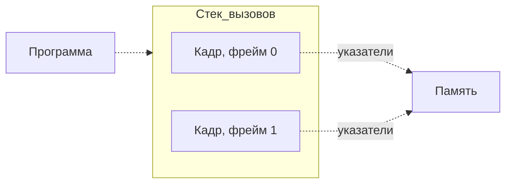

# Отладчики в C • GDB—LLDB—…
Запись стрима на Youtube: https://youtu.be/r6RMf5hXGbU

## Идея в целом

1. Когда программа работает, мы этого не видим.
2. **Обидно!**
3. Давайте смотреть внутрь.

## Что такое «внутрь» для программы?

- **Трассировка** — анализ стека вызовов
- **Останов** — то же самое, что остановка 🙂

## Что мы делаем?

- Удобно держать под рукой код и сверяться с ним
- Особенно полезны номера строчек
- Где хотим сделать `print` — там пора идти в отладчик

> [!NOTE]
> Отладчик — замена диагностическому `printf`

## Шпаргалка команд

### 🔶 Отладочная компиляция

`-g` флаг для `gcc`

`-gdwarf-2` флаг для решения проблемы с DW_FORM_GNU_str_index

`-O0` чтобы компилятор не удалял «лишние» переменные

`gdb ./soft` `lldb ./soft` запуск отладки программы soft

### Поехали • Внутри `gdb` | `lldb`

`file [путь к файлу]` загрузить программу в отладчик

`break set —name main` не хочет без этого ставить точки

`r` стартовать программу

`r arg1 arg2` стартовать с аргументами

### Может быть, пора остановиться?

(gdb)`b get func` в начале функции

`b file.c:123` перед строкой (если уже стоим — `break 123`)

`watch expr` | `watch set var my_var` когда изменится память, на которую указывает выражение или переменная (тяжеловесная команда!)

`dis 7` | `break dis 7` выключить точку останова 7 (есть и вкл, и удаление)

`info break` | `break break` список точек останова

### Дайте оглядеться

`bt` стек кадров

`f` на каком мы кадре (с номером — переход)

(gdb) `info args`, `info vars` значения аргументов функции или переменных стека

(lldb) `v` список переменных и их значений (полностью — `frame var`)

`p expr` значение выражения (выражение, переменная, указатель; полезно для присвоения значения переменной внутри отладчика; в gdb на результаты вычислений можно ссылаться как на константы по номерам строк — `$4` и т. д.)

`p *my_array@10` | `mem read -tint -c10 my_array` вывести массив (`-t` — ключ типа значений)

`disp expr` печатать значение выражения (нпр., переменную) при каждом останове

(gdb) `l` напечатать строку останова ±10 строк

### Едем дальше

`c` до следующей точки останова (или до конца)

`s` следующая строка, входит в функции

`n` следующая строка, не входит в функции

(lldb) `si` следующая машинная инструкция

`j 123` перейти к строке 123 (а назад тоже?)

(gdb) `u` выполнять до конца нынешнего блока (обычно строка)

`up` / `down` вверх / вниз по стеку фреймов (больше — выше — глубже)

(gdb) `ret` вернуться в точку вызова текущего фрейма (на уровень ниже)

`<Enter>` повторить предыдущую команду

### Программируем, чтобы программировать
`.gdbinit` `.lldbinit` тут храним макросы и настройки

(gdb) `set $my_var = struct->inside->program` создать переменную (в lldb так же, как в C; по факту это указатели внутрь программы или на константу)

## Практикуемся на luma

> [!WARNING]
> **Это очень страшный код.**
> Прямо боль.
> Специально сделано.
> Далось с трудом.
> Никогда так не пишите.

[luma — плохая, плохая программа!](src/luma.c) 
- Фу такой быть 👿
