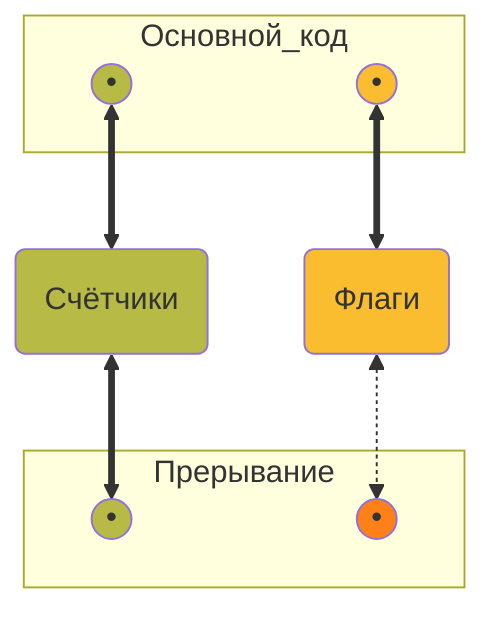

# Чуть больше о коде в прерываниях: варианты архитектуры, рефакторинг, плохие идеи

Youtube-запись от `2025-08-15`: https://youtu.be/_HQXhSQyEck

**Ходят слухи,** что не всякий код можно писать внутри обработчика прерывания

### Код-прототип

```c
...
int tick_g = 0;
int sec_g = 0;
#define TICKS_IN_SEC 8
#define WAIT_TO_ALIGN 300

#define RAND_ARRAY_LEN 100
float * a_g[RAND_ARRAY_LEN] = NULL;

...
// выделили память под a_g
// реализовали float randomize()
...

ISR(TIM0_OVF_vect) {
	delay(WAIT_TO_ALIGN);
	tick_g++;
	
	if (tick_g % TICKS_IN_SEC) {
		sec_g++;
		a_g[sec_g] = malloc(sizeof(float));
		*(a_g[sec_g]) = randomize();
		printf("%d: %f\n", sec_g, a_g[sec_g]);
	}
	
}
```

### Всё лучшее сразу

- `delay()` затягивает любое дело
- Что происходит при переполнении типов?
- Деление — дорогая операция
- Только `malloc()` нам тут и не хватало — да ещё и без проверок
- Динамическая память всегда в зоне риска
- `float` — тяжеловесный тип данных
- `float randomize()` — вряд ли быстрая функция
- `printf()` всегда неспешен (и спасибо, что не в файл пишем)
- Мы так надеемся на актуальность `tick_g` и `sec_g` — а зря
- Вдруг кто-то ещё полезет в массив `a_g`?


Ну и просто **буквы выглядят некрасиво**, а это важно


## Прерывания — портал в параллельную вселенную


Время


Ресурсы


Доступы


Скорость





**Связь есть!**

## Хотя бы зайдём безопасно (а там как повезёт)

### Давайте замерим осциллографом?

### Считаем не переполнение, а достижение уровня

```c
    ISR(TIMER1_COMPA_vect) {...}
    
    ...
    
    OCR1A = ...; // порог срабатывания

    // Включаем прерывание Compare Match A
    TIMSK1 |= _BV(OCIE1A);

    // Старт таймера с делителем 1
    TCCR1B |= _BV(CS10);
```

### Сбрасываем в ноль вне прерывания

```c
ISR() {
	cnt_g++;
}

int main() {

	if(cnt_g > MAX_CT) cnt_g = 0;

}
```

### Оставляем только время

### Если делить, то на степень двойки

Через маски это быстро. Кстати, и флаги тоже.

```c
ISR() {
	if (cnt & 15) {
		another_cnt++;			
	}
	
	flags |= 1 << IMPORTANT_FLAG;

}
```

### Беззнаковое вычитание устойчиво к переполнению

```c
static uint8_t prev;
uint8_t cur = TCNT1;
uint8_t dt  = (uint8_t)(cur - prev);  // корректно через переполнение
prev = cur;
```

### Работаем пореже

```c
ISR() {
	counter++;
	if(!(counter & (0x3))) {...}
}
```

### Структуры для таймеров обратного отсчёта

```c
typedef struct {
    uint8_t count;
    uint8_t reload;
} sw_timer_t;

volatile sw_timer_t timer1 = {0, 50};  // каждые 50 переполнений
volatile sw_timer_t timer2 = {0, 200}; // каждые 200 переполнений

ISR(TIM0_OVF_vect) {
    if (timer1.count) timer1.count--;
    if (timer2.count) timer2.count--;
}

int main(void) {
	if(timer1.count > timer1.reload) timer1.count = timer1.reload;
	if(timer2.count > timer2.reload) timer2.count = timer2.reload;
}
```

### Поменьше прерываний прерываний

```c
ISR() {
	cli();
	...
	sei();
}
```

### Таблица указателей вместо условных операторов


Это только **самая-самая база**. Там море нюансов. *Особенно в ESP32.*

