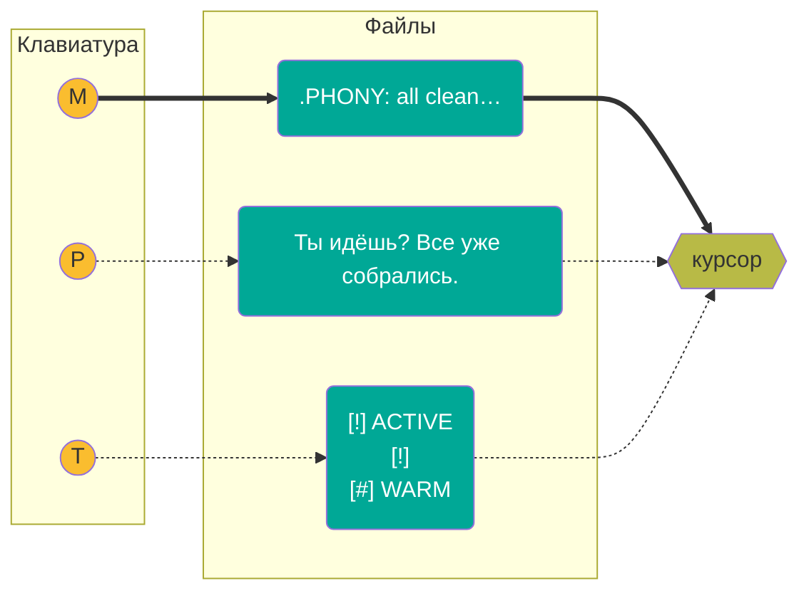
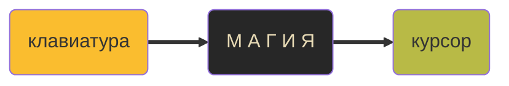
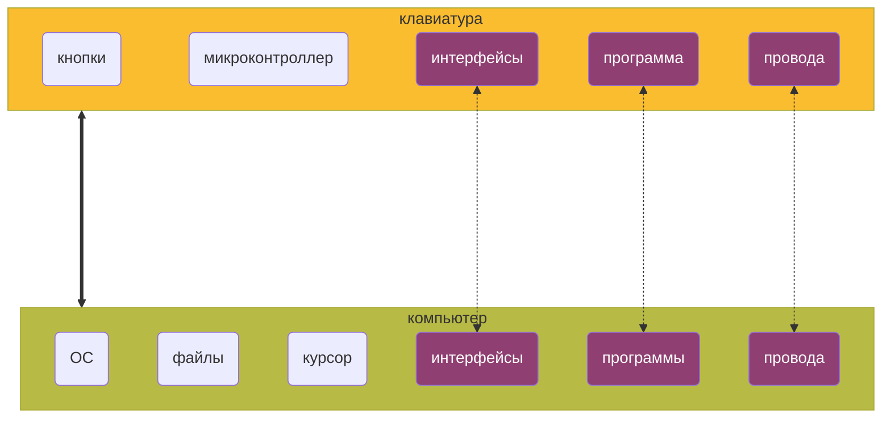
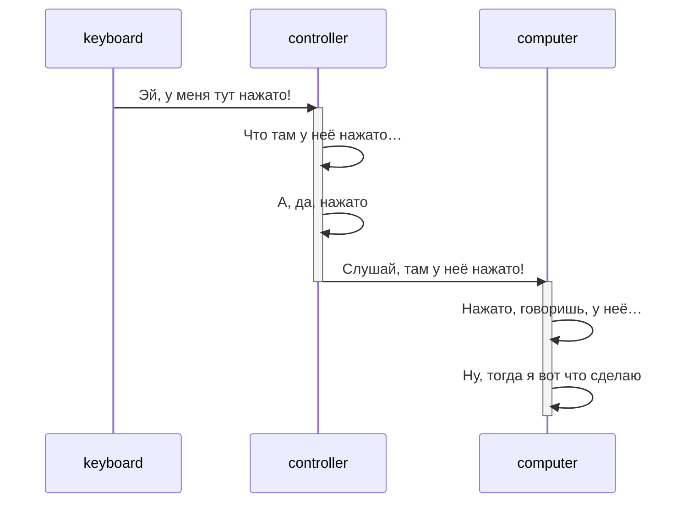

Youtube-запись от `2025-05-09`: https://youtu.be/C8iyBEhyhdM
Код проекта: https://github.com/olgapavlova/oldkeyboard

# Утилизируем с пользой древнюю клавиатуру. Часть 1: порты, протоколы и регистры на нашу голову

**Хотим:** нажимаем кнопку — вводим текст из файла


- Отдельное устройство
- Меняем файлы как хотим
- Никаких особых требований по скорости




**Наша польза** — научиться всему, что попадётся по дороге


# Что нас ждёт?

## Прыжок над пропастью



## Может быть, мы что-то знаем?




Это просто слова, какой от них прок?


## Кое-что точно придётся сделать

- [ ]  Исследовать, как физически устроена клавиатура — что значит «клавиша нажата»
- [ ]  Делать так, чтобы микроконтроллер «чувствовал» нажатую клавишу (а отжатую — не чувствовал)
- [x]  Научиться запускать программы на микроконтроллере
- [ ]  …и отлаживать, кстати, тоже
- [ ]  С помощью программы на микроконтроллере превращать «чувство клавиши» в информацию, полезную для компьютера
- [ ]  Передавать компьютеру информацию о нажатой клавише
    
    ---
    
- [ ]  На стороне компьютера получать эту информацию
- [ ]  Понимать, кто послал эту информацию, и передавать её в обработку программе
- [ ]  В программе превращать знание «нажата такая-то клавиша» в команду системе «выведи такой-то текст туда, где сейчас курсор»
- [ ]  Сделать так, чтобы система выполняла нашу команду


**Ааааааааааа**аааааааааааааа!!!!!!!!


Пометим то, где справимся


## Картинки и диалоги, картинки и диалоги



# Начнём с поведения микроконтроллера

Возьмём какой-нибудь AVR-микроконтроллер.

## Как его вообще программировать?

```bash
sudo apt install -y gcc-avr binutils-avr avr-libc avrdude
```

### Что нам нужно?

1. Стандартная библиотека C в версии для микроконтроллеров [`AVR-LibC`](https://github.com/avrdudes/avr-libc/) (пакет `avr-libc`)
2. Компилятор [`avr-gcc`](https://gcc.gnu.org/wiki/avr-gcc) (пакет `gcc-avr`)
3. Линковщик [`binutils-avr`](https://www.gnu.org/software/binutils/)
4. Система заливки программы на микроконтроллер (прошивки) [`avrdude`](https://github.com/avrdudes/avrdude)

> `ELF` — для Linux и ко
> 

> `HEX` — для микропроцессоров
> 


…а запустится оно само


### Программа-пустышка

```c
int main(void) { return 0; }
```

### Makefile для начала выглядит так

```makefile
MCU = atmega32u4
F_CPU = 16000000UL
CC = avr-gcc
OBJCOPY = avr-objcopy
CFLAGS = -Wall -Os -DF_CPU=$(F_CPU) -mmcu=$(MCU)

TARGET = main

all: $(TARGET).hex

%.elf: %.c
	$(CC) $(CFLAGS) -o $@ $<

%.hex: %.elf
	$(OBJCOPY) -O ihex -R .eeprom $< $@

flash:
	stty -F /dev/ttyACM0 1200
	sleep 2
	avrdude -v -p atmega32u4 -c avr109 -P /dev/ttyACM0 -b 57600 -D -U flash:w:$(TARGET).hex

clean:
	rm -f *.elf *.hex
```

- Нюансы по входу в режим загрузки для ATMega32U4
    - Сначала дважды `RST+GND` (можно кнопкой). И потом есть 8 секунд на загрузку.
    - Команда настройки терминала под загрузку. Специфическая именно для Arduino Pro Micro.
        
        ```bash
        stty -F /dev/ttyACM0 1200
        ```
        
    - Проверка, что загрузчик нормально подключается.
        
        ```bash
        avrdude -v -p atmega32u4 -c avr109 -P /dev/ttyACM0 -b 57600
        ```
        
    

## Куда мы попали?

**AVR** — семейство, **ATMega32U4** — микроконтроллер, **Arduino** — обвязка


## Мигнём светодиодиком


Внимание, **порт**!


— И регистр?
— И **регистр**!


**Datasheet** — слово без пробела


- [ATmega32U4 Datasheet](https://arduino.ru/sites/default/files/Hardware/Leonardo/ATmega32u4.pdf)
- Светодиод на плате Arduino зажигается, если «включить» `RXLED` (а другой — `TXLED`)
- В мире ATmega32U4 это `PB0` и `PD5`
- То есть нам надо **сказать**, что мы будем «давать напряжение» на `PB0` и `PD5`
- Вот это «сказать» делаем через регистры `DDRB` («порт B») и `DDRD` («порт D»)

```c
#include <avr/io.h>
...
DDRB |= (1 << PB0);
DDRD |= (1 << PD5);
```

- Теперь нам надо «включать» и «выключать» электричество на `PB0` и `PD5`
- Для этого используются регистры `PORTB` и `PORTD`

```c
PORTB ^= (1 << PB0);  // |= (1... ВКЛ
PORTD ^= (1 << PD5);
```


**Да C ли это?!**


**Ну…**


Всё «удобное» для микроконтроллеров — это библиотеки к регистрам


- Никто не мешает нам делать и свои библиотеки
