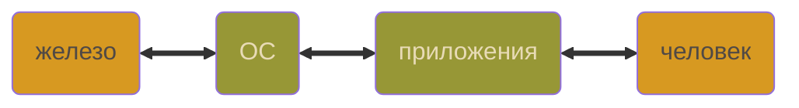
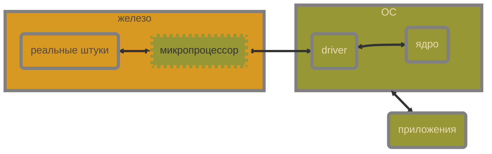

Youtube-запись стрима от ```2025-04-04```: https://youtu.be/hpVPlJ0J2tw

# Первый модуль ядра и инструменты для его разглядывания

Теперь мы программируем **в другом месте** — «в ядре» операционной системы

### 🦄 Фантазии

Как всегда, больше про историю, чем про реальность



### 🐴 Правда

Человеку нужны кнопочки


- Можно *аккуратно* думать как про frontend и backend
- Язык *как бы* тот же, инструменты *как бы* те же, **но нет**

## Что за модули и при чём тут драйверы?

- Приложению хочется общаться с пользователем
- Для этого ему нужно железо
- Значит, ОС должна как-то давать доступ (для приложений!) к железу
- Ядро Linux — ~~непостижимая каша~~ монолит
- Но ему разрешили цеплять к себе «плагины»



## Просто запустим это

```c
#include <linux/init.h>
#include <linux/module.h>

static int __init silent_init(void) { return 0; }
static void __exit silent_exit(void) { }

module_init(silent_init);
module_exit(silent_exit);

MODULE_LICENSE("GPL");
```

- Болванка модуля
- А что если что-нибудь убрать? — **вперёд!**

## Да как запустить-то?!

### Компилируем

```makefile
KREL = $(shell uname -r)  # релиз ядра
KDIR = /lib/modules/$(KREL)/build

PWD = $(shell pwd)  # куда вернуться

TARGET = silent

obj-m := $(TARGET).o

all:
	$(MAKE) -C $(KDIR) M=$(PWD) modules
```

- Заголовки берём «от ядра»
- Компилируем с помощью [Makefile ядра](https://www.kernel.org/doc/html/latest/kbuild/makefiles.html)

- **Не компилится?**
    
    ```bash
    sudo apt install build-essential linux-headers-$(uname -r)
    ```
    
- Компиляторам лучше бы совпадать аб-со-лют-но (но это не точно)
    
    ```makefile
    CC = $(grep CONFIG_CC_VERSION /boot/config-$(uname -r) | cut -d'"' -f2 | awk '{print $$1}')
    ...
    	$(MAKE) CC=$(CC) ...
    ```
    

`silent.ko` — вот наш результат компиляции


- **Объектный файл — как `.o`**
    
    `file silent.ko`
    
    `modinfo silent.ko`
    
    `nm silent.ko`
    
    `objdump -h silent.ko`
    
    `readelf -s silent.ko`
    
    `… | grep FUNC`
    
    `… | grep __UNIQUE`
    

### Подключаем к ядру — Проверяем — Отключаем

`sudo insmod silent.ko`

`lsmod | grep silent`

`sudo rmmod silent`

## Отступление: «сначала база» не выйдет

- Ядру десятки лет, там столько наросло…
- Ядро постоянно меняется, и меняется непредсказуемо
- Документация лаконична, если вообще есть
- Знающих людей мало (ждём в комменты!)
- Всё зависит от всего (ой, всё)


Давайте поверим **действительно опытным** людям. Хоть на минутку

**Пробуем** → натыкаемся → разбираемся → **пробуем** → натыкаемся → …

## Море возможностей [printk()](https://docs.kernel.org/core-api/printk-basics.html)

`tail -f /var/log/kern.log`

`dmesg -w`

Модуль даже не обязательно запускать: `return -2`

```c
printk("Hello, world!\n");
```

Попробуйте без `\n`, будет интересно

```c
printk(KERN_EMERG "Hello, world!\n");
```

- [Уровни логирования](https://docs.kernel.org/core-api/printk-basics.html) — макросы
    
    `cat /proc/sys/kernel/printk`
    
- [Спецификаторы формата](https://www.kernel.org/doc/html/v5.6/core-api/printk-formats.html)

```c
printk("%p", CONFIG_);
```

`cat /boot/config-`uname -r` | wc -l`

`CONFIG_PHYSICAL_START` где начало

`CONFIG_DEBUG_INFO_BTF` для отладки

`CONFIG_SMP` поддержка нескольких ядер

`CONFIG_64BIT` ядро

`CONFIG_X86_64` архитектура
