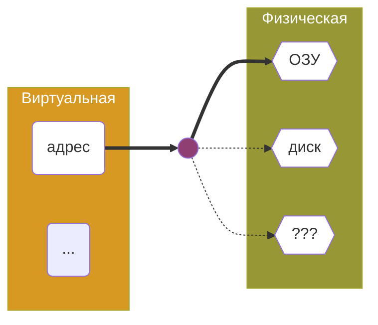
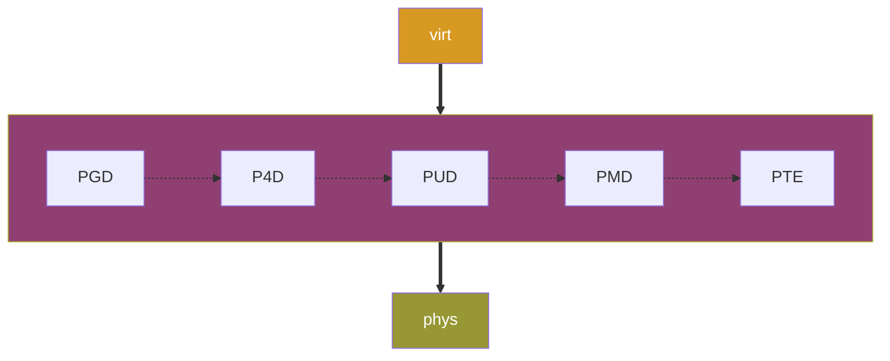

Youtube-запись от `2025-04-25`: https://youtu.be/km0Q6NOJWUY

# Виртуальная и физическая память в ядре Linux • Щупаем средствами C

> Есть смутное подозрение, что в ядре память какая-то **другая**
> 

`kmalloc()` намекает

`cat /proc/meminfo` узнаем параметры памяти

`free -h` сколько занято и сколько свободно

А что за `/proc` ?


> Тут используются «истинные» килобайты из 1024 байт (нынче — [кибибайты](https://ru.wikipedia.org/wiki/Кибибайт)).
Не то чтобы это было важным, о нет.
> 

## Теперь потребуется ещё и физическая память

- А до этого что было?! Виртуальная.



`grep VmallocTotal /proc/meminfo` 

**Paging** (работа со страницами): основа всей работы с памятью. *Ой.*

`grep MemTotal /proc/meminfo` 

**Swapping** (подкачка): сброс на диск из ОЗУ неиспользуемых кусков.

### Как добраться от виртуального адреса к физическому (и наоборот)?

- Виртуальные адреса актуальны внутри процессов (в том числе процессов ядра). Физические — объективны.
- Устройства пишут напрямую в физическую память. Это называется Direct Memory Access (DMA). Поэтому драйвер должен оперировать в том числе адресами в физической памяти.

- Физический адрес подозрительно напоминает виртуальный. Но по смыслу — вообще другое.

Да, они разные

```c
#include <linux/mm.h>
#include <asm/io.h>
...
int * my_data = kmalloc(1, GFP_KERNEL);
if(!my_data)…
...
phys_addr_t phys_addr = virt_to_phys(my_data);
pr_info("Phys: %pa\n", &phys_addr);  // Внимание! %pa нужен указатель!
...
void * virt_addr = phys_to_virt(phys_addr);
pr_info("Virt: %p\n", virt_addr);
...
```

- А если `my_data` поместить в другое место? В стек, например. *Ой.*
- Обратная конвертация работает только для `lowmem`
- Основная (не вся!) часть `lowmem`: `cat /proc/zoneinfo | grep -b10 Normal`

### А подробней про эту магию?

- До байт добираются через систему таблиц адресации
- Таблицами управляет процессор (его MMU)
- От адресов крупных кусков к мелким: PGD → P4D → PUD → PMD → PTE
- Адресация клеток таблиц зашита в виртуальном адресе



```c
#include <asm/pgtable.h>
...
		unsigned long va = (unsigned long)&show_pgd_init;  // Просто взять свой собственный адрес
    pgd_t *pgd;

    pr_info("Virtual address: %lx\n", va);

    pgd = pgd_offset(current->mm, va);
    if (pgd_none(*pgd) || pgd_bad(*pgd)) {
        pr_err("Invalid or missing PGD entry!\n");
        return -1;
    }

    pr_info("PGD entry: %p -> 0x%016llx\n", pgd, (unsigned long long)pgd_val(*pgd));
```

- Интересный `current->mm`, да? Это карта пользовательской области памяти
- Или даже вот так:
    
    
    | **Уровень** | **Адрес** | **Индекс** | **Размер таблицы** |
    | --- | --- | --- | --- |
    | PGD | mm->pgd | (addr >> 39) & 0x1FF | 512 записей |
    | P4D | PGD | (addr >> 39) & 0x1FF | (часто совпадает) |
    | PUD | P4D | (addr >> 30) & 0x1FF | 512 записей |
    | PMD | PUD | (addr >> 21) & 0x1FF | 512 записей |
    | PTE | PMD | (addr >> 12) & 0x1FF | 512 записей |

00000**100011001***010001000***100011001***010001000 → 010100010*
