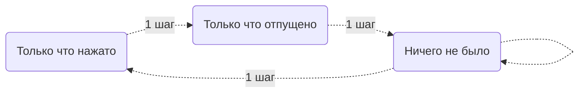

Youtube-запись от `2025-06-06`: https://youtu.be/tRgqUDAeDmo

# Обработка сигналов от специальной клавиатуры

## Возвращаемся на компьютер

### Как реально увидеть, что это клавиатура

- Через терминал по умолчанию не хочет
- Рискнём и подключим к «настоящему» компьютеру

### Как отправлять «правильные» сигналы



 

### Как получать данные с клавиатуры в своём приложении

- Кто кому какие данные как передаёт
    
    ```mermaid
    sequenceDiagram
    	participant device
    	participant mc
    	participant insub
    	participant /dev/input
    	participant user
    	
    	device->>mc: У меня тут нажали
    	mc->>insub: Случилось Одно Событие
    	insub-->>mc: Дальше что?
    	mc->>insub: Случилось Другое Событие
    	insub-->>mc: Дальше что?
    	mc->>insub: События кончились
    	insub->>/dev/input: Там много чего произошло
    	/dev/input->>user: Берите кто хотите
    ```
    
- Используем самый обычный дескриптор
    
    ```c
    #include <fcntl.h>
    #include <linux/input.h>
    #include <stdio.h>
    #include <unistd.h>
    ...
    int fd = open("/dev/input/event5", O_RDONLY);
    if (fd < 0) { perror("open hid"); exit(1); }
    ...
    close(fd)
    ```
    
- Читаем из дескриптора и как угодно реагируем
    
    ```c
    struct input_event ev;
    while (read(fd, &ev, sizeof(ev)) > 0) {
        printf("!");  // тут что угодно
    }
    ```
    

### Как превращать одну клавиатуру в другую?


`uinput` система эмуляции устройств ввода (Linux)

- `sudo modprobe uinput` подключаем модуль к ядру
- `lsmod | grep uinput` проверяем, что всё подключилось

Разберём [демо-код](https://kernel.org/doc/html/v4.12/input/uinput.html) `uinput`

- Читаем код
- Читаем заголовочный файл
`less /usr/include/linux/uinput.h`

Адаптируем демо-код — добавим в него нашу HID-клавиатуру

- Дескриптор ну точь-в-точь такой же
- Прокидываем: читаем и сразу пишем
    
    ```c
    struct input_event ev;
    while (read(hid_fd, &ev, sizeof(ev)) > 0) {
        write(uinput_fd, &ev, sizeof(ev));
    }
    ```
    
- Рискуем при бесконтрольном пробросе, нужно быть аккуратней
- Вообще-то продолжаем делать что хотим, это ведь просто программа

> [!IMPORTANT]
> Не забываем прекращать события

- И нам осталось только заблокировать нашу железную клавиатуру для всех остальных потенциальных читателей.
    
    ```c
        if (ioctl(fd_in, EVIOCGRAB, 1) < 0)
            die("EVIOCGRAB");
    ```
