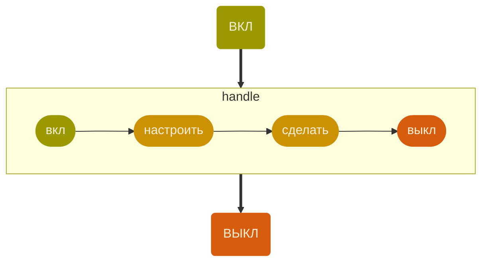
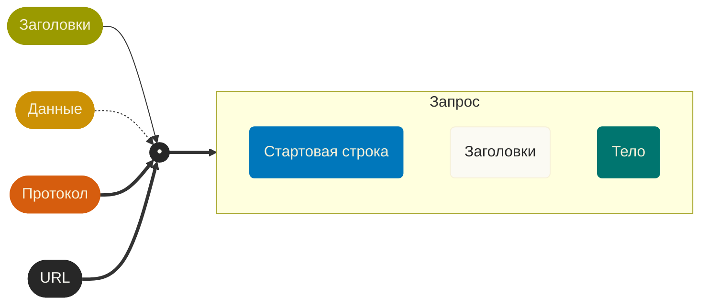

# Осознанно ходим в Интернет

Библиотека [`libcurl`](https://curl.se/libcurl/) — неплохо для начала.

Обычно уже есть в дистрибутиве:
`find / -name "*curl*" -type d 2>/dev/null`

В код вставляется легко: `#include <curl/curl.h>`

Флаг компиляции `-lcurl`, как и ожидаем.

Документации полно, и как раз для C: https://curl.se/libcurl/c/

> [!TIP]
> Торчат объектные уши
> https://curl.se/libcurl/c/allfuncs.html


#### Соберём `Hello, world!` из подручных функций



- [curl_global_init()](https://curl.se/libcurl/c/curl_global_init.html) — завести всю шарманку
- [curl_global_cleanup()](https://curl.se/libcurl/c/curl_global_cleanup.html) — …и не забыть потом выключить
- [curl_version_info()](https://curl.se/libcurl/c/curl_version_info.html) — узнать, что мы можем
- [curl_easy_init()](https://curl.se/libcurl/c/curl_easy_init.html) — наша цель
- [curl_easy_cleanup()](https://curl.se/libcurl/c/curl_easy_cleanup.html) — …тоже не забыть убрать
- [curl_easy_setopt()](https://curl.se/libcurl/c/curl_easy_setopt.html) — куда, как, зачем идём, что делать с результатом и т. п.
- [curl_easy_perform()](https://curl.se/libcurl/c/curl_easy_perform.html) — делай!

> [!WARNING]
> easy — блокирующая работа с сетью. 
> Система работает, мы стоим ждём курим бамбук.

#### Просто вывода в `stdout` нам явно мало

```horizontal


---
> — Куда ставить-то?
> — Да подожди ты!

- [CURLOPT_WRITEDATA](https://curl.se/libcurl/c/CURLOPT_WRITEDATA.html) — указатель хоть куда-нибудь
  
- [CURLOPT_WRITEFUNCTION](https://curl.se/libcurl/c/CURLOPT_WRITEFUNCTION.html) — если мы не кидаем в файл, а сохраняем данные иначе

- [CULROPT_HEADER](https://curl.se/libcurl/c/CURLOPT_HEADER.html) — если нам ценны заголовки

> [!INFO] Теперь это называется callback

- *задача со звёздочкой* — CURLOPT_HEADERFUNCTION и CURLOPT_HEADERDATA отдельно

```
- [ ] Переписать заново пример из документации — полезное упражнение


#### POST — это уже заманчиво

1. Больше данных.
2. Не кэшируется.
3. Может что-то менять на сервере.



> [!NOTE]
> К нашим услугам благоустроенный [httpbin.org](https://httpbin.org/post)

- `curl_slist` — тип списка
- [curl_slist_append()](https://curl.se/libcurl/c/curl_slist_append.html) — добавляем заголовок в список
- [CURLOPT_HTTPHEADER](https://curl.se/libcurl/c/CURLOPT_HTTPHEADER.html) — сюда кидаем список заголовков
- [CURLOPT_POST](https://curl.se/libcurl/c/CURLOPT_POST.html) — включаем протокол POST
- [CURLOPT_POSTFIELDS](https://curl.se/libcurl/c/CURLOPT_POSTFIELDS.html) — это если хотим что-то послать

> [!WARNING]
> И снова JSON, ну что ты будешь делать!

