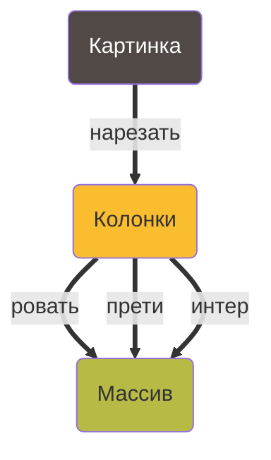
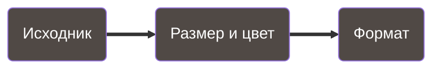
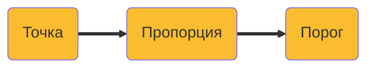

Youtube-запись от `2025-07-25`: https://youtu.be/oaiVhSS8zY4

# Режим Лиссажу, скважность ШИМ из файла и формат изображений PPM/PGM/PBM (PNM)

## Рисовать «простую» картинку на осциллографе ==
### Конвертировать ч/б изображение в массив  пороговых значений для вывода на осциллограф

**Давайте не будем**
искать библиотеки




> **«Рисовать»:** картинка должна полностью помещаться на экран осциллографа и отображаться в двух цветах; пропорции можно не сохранять
> 
> - [ ]  Подготовить картинку

> **~~«Простая»:** картинку можно приблизить функцией на плоскости (т.е. для каждого `x` существует единственное `y`)~~
> 
> - [ ]  Перебрать все `x`…
> - [ ]  …и для каждого найти **все** `y`
> - [ ]  А потом перевести **каждый** `y` в порог для осциллографа

## Как нам обустроить разноцветные ящики и переходы?

### Картинка



**«Подготовить»**

- [ ]  Сжать/растянуть исходник так, чтобы картинка помещалась в размер экрана осциллографа (его знаем)
- [ ]  Конвертировать изображение в ч/б
- [ ]  Обрезать пустые поля

**«Перебрать»**

- [ ]  Переформатировать картинку так, чтобы перебор стал тривиальной задачей

### Колонка



**«Найти y»**

- [ ]  Перебирать точки в колонке
- [ ]  Проверять цвет каждой точки
- [ ]  ~~Остановиться, если встретилась чёрная точка~~

**«Перевести в порог»**

- [ ]  Рассчитать пропорцию `y` относительно всей длины колонки
- [ ]  Рассчитать порог перехода из 0 в 1 (скважность ШИМ) по очевидной формуле
- [ ]  Желательно остаться в целых числах


Кажется, тут **можно** обойтись без C — если получится работать с картинкой как с единым целым


А тут **вряд ли** — цельная картинка распалась на набор данных

Делать мы ничего из этого, конечно же, **не будем**

👎

**y = f(x)** 


А что если `y` сделать независимым от `x`?


Режим Лиссажу


- [Статья в Wikipedia про пакет Netpbm и его форматы](https://ru.wikipedia.org/wiki/Netpbm)
- [Netpbm Home Page](https://netpbm.sourceforge.net) — примечательный дизайн 😊
- Много всяких библиотек и инструментов, это хороший повод поговорить про open source

```bash
jpegtopnm image.jpg | pnmscale -xysize 32 32 | ppmtopgm | pgmtopbm | pnmtoplainpnm > image32.pbm
```
