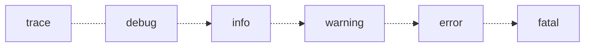

# Логирование в небольших проектах на C
Стрим 2024-12-13.
Youtube-запись: https://youtu.be/Q9rpaDLwE-g?si=SMwA7a0DZnSLeG7w

### Логи как этап проектирования системы

Главное — фиксировать последовательность действий. Что за чем идёт. И хорошее, и плохое.

https://habr.com/ru/articles/135242/ — хороший список уровней логов

https://log4c.sourceforge.net/ — большая библиотека

### Что?

- Где в коде?
- В каком контексте данных?
- Что произошло?
- Когда это случилось?
- Это важно или неважно?
- Это хорошо или плохо?

### Как?

- **Просто и надёжно** ⭐
- Не включать отладочные логи в финальную сборку
- Короче
- Без задержек
- Структурировано
- На разных уровнях
- Для анализа
- С подробностями
- Без интима (пароли!)

### Когда?

- Проектируем структуру
- Тестируем
- Отлаживаем (особенно удалённо)
- Выдаём на компьютер пользователю
- Ищем отличия в версиях
- Синхронизируем

### Удобные константы препроцессора

https://gcc.gnu.org/onlinedocs/cpp/Macros.html

`__TIMESTAMP__` дата и время в системе

`__TIME__` время в системе

`__DATE__` дата в системе

`__FILE__` текущий файл

`__LINE__` текущая строка

`__FUNCTION__` название исполняемой функции

`__STDC_VERSION__` версия C (11, 17, ещё?)

### Темы лекции
- Уровни логирования
- Условная компиляция при логировании
- Константная и переменная части вызова логирования
- `grep` и `tail -f` для работы с логами
- Использование `stderr`
- Логирование как способ спроектировать программу
- `fprintf(stderr, …)` или `write(2, …)`? `stderr` не буферизуется
- `freopen(”file.log”, w, stderr)` для принудительного перенаправления
- Супернастраиваемый лог через двойные скобки макроса
