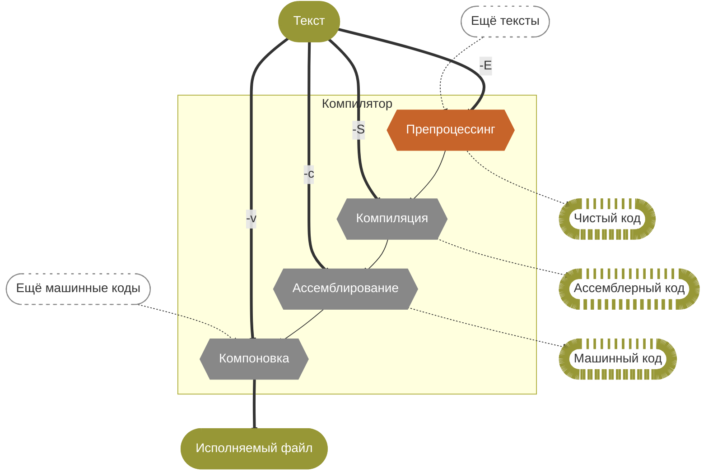
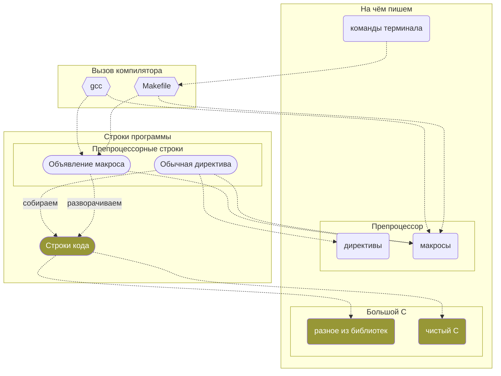

#  Препроцессор и его макросы в С
Запись стрима на Youtube: https://youtu.be/mXRbSESitaI?si=CJSh-2eMbeoNkKr1 ```2025-02-07```

## «А что такое программа?» (c) спрашивай так лиш
**Код — это текст**

> А **из чего** получается текст?
> 
- Черновик
- Болванка
- Шаблон
- Генератор

- Давайте же отнесёмся к нему как к тексту
- Например, сначала сделаем с этим текстом что-то специальное
- Переоформим, отредактируем, подстроим под условия
- А уже потом будем работать с этим текстом по существу

Что если **обобщить** не поведение программы, а **саму программу**?

- Нам нужны разные версии программы: для отладки, для тестирования,…
- Некоторые условия — про контекст работы, а не про время выполнения

## Нам нужен инструмент



Препроцессинг

**Подгоним
текст
под условия**

`*.c`  `*.h` ⇒ `*.i`

Компиляция

Превратим текст в коды ассемблера

`*.i` ⇒ `*.s`

Ассемблирование

Превратим коды ассемблера в машинные коды

`*.s` ⇒ `*.o`

Компоновка

Склеим коды в исполняемый файл

`*.o` ⇒ `*.out`

## Что умеет препроцессор?

Исполнять свои команды — **директивы препроцессора**

```c
#include <stdio.h>
```

Создавать «схемы замены текста» — **макросы**

```c
#define LOL "Вы, конечно, шутите, мистер Фейнман"
```

Менять текст по правилам из макросов

```c
printf("%s", LOL);
```

Удалять **комментарии** 🙂

```c
// Ничего не знаю, починяю примус
```

## Макросы — это отдельный «язык» внутри препроцессора



Aaaaaaaaaaaa!!!!!!!!!!11одинодинодин — или нет?


## Теперь код — это шаблон кода

- Так бывает
- `gcc -E` — код после препроцессора
- `gcc -E -dM` — только макросы (все и отовсюду!)
- Макросы мимикрируют под код (и это многое усложняет)


HTML + JS

PHP

## Что мы можем внутри `#define`?


`(x)` — скобки желательны


`#x` — только для аргументов


`x ## y` — аргументы или другие макросы


 `\`


вызывать другие макросы


`_Generic((x),…)` — делать **статичные** подстановки в зависимости от типов данных (затрудняет рефакторинг!)


**Не можем директивы!** `~~#ifdef~~` `~~#define~~` `~~#undef~~` …


> И макросы невидимы для отладчиков
> 


**Не можем зависеть от смысла** (логика программы, значения переменных и т. п.)


## Полезные

- `__FUNCTION__` (или `__func__`), `__TIME__`, `__DATE__`, `__FILE__`, `__LINE__`, `__MACOSX__`, `__STDC_VERSION__`, `__STDC_NO_VLA__`
- Некоторые из них — это макросы времени выполнения (`#undef` не выйдет)

## Гигиена

- Параметры в месте раскрытия ставим в скобки
    
    ```c
    #define DOUBLE(x) (x)*2 
    ```
    
- Одного раза достаточно — это про параметры
    
    ```c
    #define SQUARE(x) do { int r = (x); r *= r; } while(0);
    ```
    
- Весь раскрывающий текст прячем в блоки
- Следим за `;`
- Следуем традициям именования (`E`, капс, `_`)
- Перед `#define` ставим `#undef`
- Следим за запятыми
    
    ```c
    #define ALERT(x) printf("%s\n", #x);
    ```
    

## Разминка

Пишем мелкий код и заодно обустраиваемся в системе.

- Переопределить `NULL` 🙂 (+ история с `PI`)
- Создать свой мешок макросов — например, `macro.h`
- Научить редактор подсвечивать **ваши** макросы
- Создать разные цели компиляции для тестирования и реальной работы
- Программа «Время компиляции» (+ вариант со вводом из терминала)
- Макрос foreach для строк или статичных массивов
- Макрос подсчёта количества параметров в других макросах

## Типовые ситуации

- Некоторые знакомые нам «функции» библиотек — это на самом деле макросы
- Условная компиляция в зависимости от настроек платформы
- Конструирование имён функций и переменных
- Конструирование кода с типовой функциональностью
- Синтаксис для вызова разных функций в зависимости от типа аргумента
- Макросы или `enum`? Решайте, нужна ли вам типизация и отладка

## Хаки


**Авторы неизвестны**, решения искали **долго** в 2000-х


- Склейка значений двух макросов
    
    ```c
    #define CONCAT(x, y) x ## y
    ```
    
- Превращение макроса в строку
    
    ```c
    #define STR(x) #x
    ```
    
- Подсчёт количества аргументов (`##` даст и 0)
    
    ```c
    #define _COUNT_ARGS(_1, _2, _3, _4, _5, _6, _7, COUNT, ...) COUNT
    #define COUNT_ARGS(...) _COUNT_ARGS(__VA_ARGS__, 7, 6, 5, 4, 3, 2, 1, 0)
    
    ```
    
- Повторялка кода (ну, такое)
    
    ```c
    #define REPEAT_3(macro, data) macro(data) macro(data) macro(data)
    #define PRINT(x) printf("%s\n", x);
    
    REPEAT_3(PRINT, "Hello!")
    ```
    
- Выбрать N-й аргумент макроса
    
    ```c
    #define SELECT_NTH(N, ...) SELECT_NTH_HELPER(N, __VA_ARGS__)
    #define SELECT_NTH_HELPER(N, _1, _2, _3, _4, _5, ...) _##N
    
    printf("%d\n", SELECT_NTH(3, 10, 20, 30, 40, 50)); // 30
    ```
    
- Выбрать последний аргумент макроса
    
    ```c
    #define GET_LAST(...) GET_LAST_HELPER(__VA_ARGS__, dummy)
    #define GET_LAST_HELPER(_1, _2, _3, _4, _5, last, ...) last
    
    printf("%d\n", GET_LAST(10, 20, 30, 40, 50)); // 50
    ```
    
- Применить «нечто» (ну тоже макрос, да) к каждому аргументу макроса
    
    ```c
    #define APPLY(macro, ...) __VA_ARGS__
    #define PRINT(x) printf("%s\n", x);
    
    APPLY(PRINT, "one", "two", "three");
    ```
    
- Проверить и вернуть что сказано (работает и с пустым значением!)
    
    ```c
    #define CHECK(x, y) if(!(x)) { return (y); }
    ```
    
- Показать переменную и её значение
    
    ```c
    #define TRACE(x, y) printf(#x ": %" #y, (x))
    ```
    

## Соображения вразнобой

- Макросы помогают повысить уровень абстракции кода как текста, зафиксировать паттерны в нём
- Макросы в связке с параметрами компиляции (`-D`) — нужно перекомпилировать все зависимые библиотеки, не только главную программу!
- Давайте вытащим все объявления о макросах из кода библиотеки (`#define` + `grep`)
- Давайте найдём все места, где используется этот макрос
- Компиляторы знают про макросы. Можно указать их в момент вызова
- Возможно, вам нужны не макросы, а разные цели в `Makefile` для разных платформ компиляции
- В целом `#ifdef` — скорее инструмент прототипирования. На этапе рефакторинга его нужно изживать
- Упражнение: напишем макросы для работы с массивами? Только тип данных надо заранее определить
- А можно всё посмотреть?
    
    ```bash
    echo "" | gcc -E -dM -xc -
    ```
    
    (для других языков — другой аргумент ключа `-x`; для файлов — путь вместо `-`)
    
- А в модуле?
    
    ```bash
    diff <(echo "" | gcc -E -dM -xc -) <(echo "#include <math.h>" | gcc -E -dM -xc -) | grep "define [^_]"
    ```
    
- Лучше не брать те, что начинаются с подчёркивания. Это по соглашению маркер «внутренности» макроса.
- Можно закомментировать большой кусок кода и не лишиться подсветки:
    
    ```bash
    #if 0
    ...
    #endif
    ```
    
    Но внутри не должно быть начинающихся `#if…` без окончания, иначе перепутаются `#endif`
    
- Написать программу только на макросах. С зависимостью от компиляции. И цели поставить в `Makefile`
- Макросы с параметрами. Параметры здесь — это просто «место для чего-то». По ходу разворачивания макроса параметр заменяется на его значение: «возьми то, что написано тут в вызове, и подставь сюда». К переменным — никакого отношения.
- Легко перепутать обозначение параметра и символ, который хочется использовать, например, в качестве переменной. Как быть? Например, `_` в начале обозначения параметра, или вообще не пользоваться однобуквенными переменными (ну, почти — всё-таки `for` нуждается в `i`).
- Ключевое отличие от функций: при вызове функций аргумент сначала вычисляется, а потом уже передаётся в параметр. При вызове макросов аргумент передаётся «как есть» — вот буквально что написано, просто последовательность символов.

## Директива `#ifdef` и как без неё

Основная проблема: мы пишем для «универсальной машины», но работает-то программа на конкретной. Со своими особенностями железа и нюансами компилятора. Возникает миллион ветвлений реализации.

Выход: как можно дольше жить в парадигме «универсальной машины», а конкретику прятать в функции, занятые *только* реализацией. И выбор вариантов тоже оборачивать в функции.

Не вызываем препроцессор в середине файла. По возможности. Иногда трудно, да. Отсюда эвристика: если видим директиву препроцессора в середине кода — возможно, это повод создать новый файл.

Пусть `#ifdef` оперируют крупными кусками (например, вызовами функции), а не реализуют управляющую логику кода.

Можно прятать `#ifdef` за обобщающий макрос? И в коде вызывать только его?

Один заголовок для разных реализаций — а тут-то при чём `#ifdef`?

Желательно, чтобы все `#ifdef` были на одном уровне абстрации — и чтобы этот уровень можно было описать словами. Например, «выбор оборудования» или «выбор операционки» или «выбор режима отладки/тестирования/…».

Эвристика «Поток важнее реализации». Поток должен считываться из кода легко. В реализации можно уже и каши навертеть.

Общая идея — относиться к вариантам системы как к типам данных. И так же с помощью макросов «доводить» имя вызываемой функции до нужной полноты.

Можно даже создать API к библиотеке полностью из макросов. Чтобы не допускать программиста-пользователя (часто это вы и есть) до деталей реализации.
