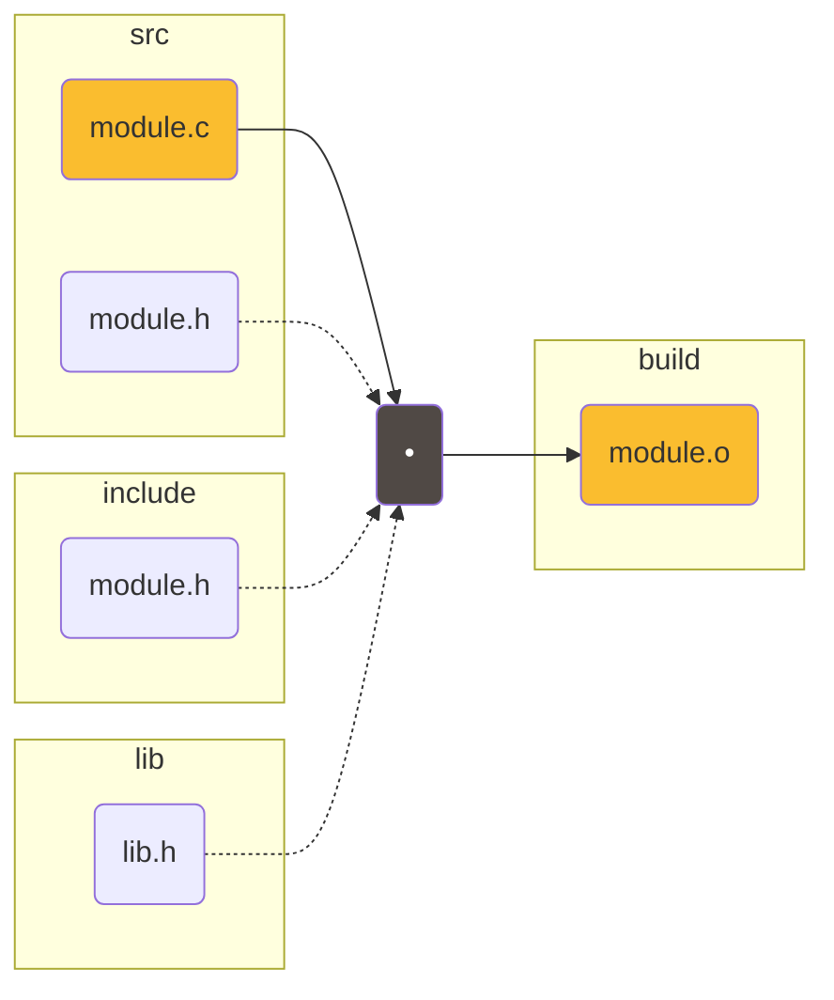
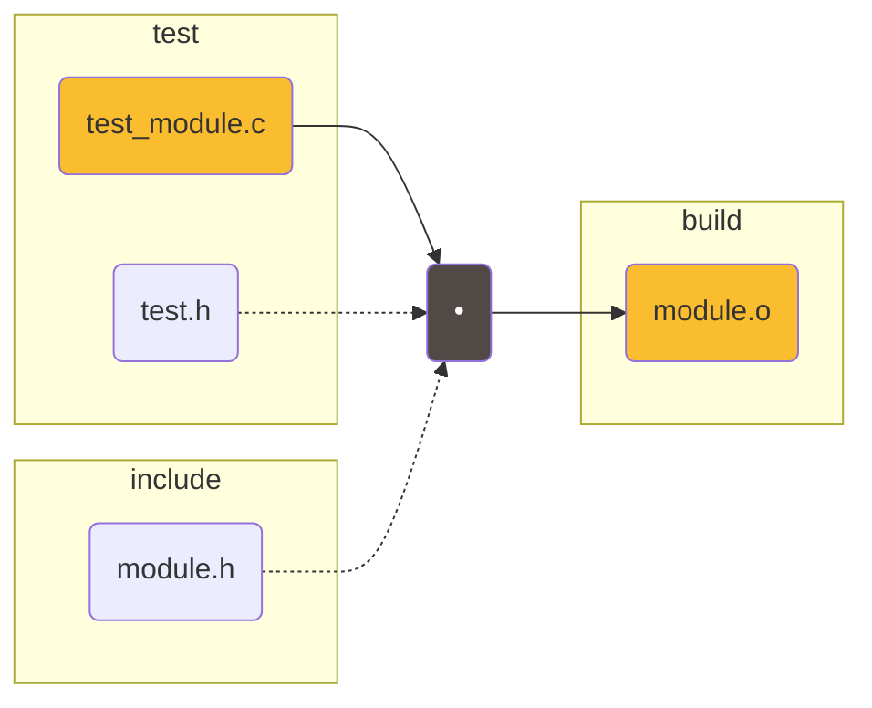
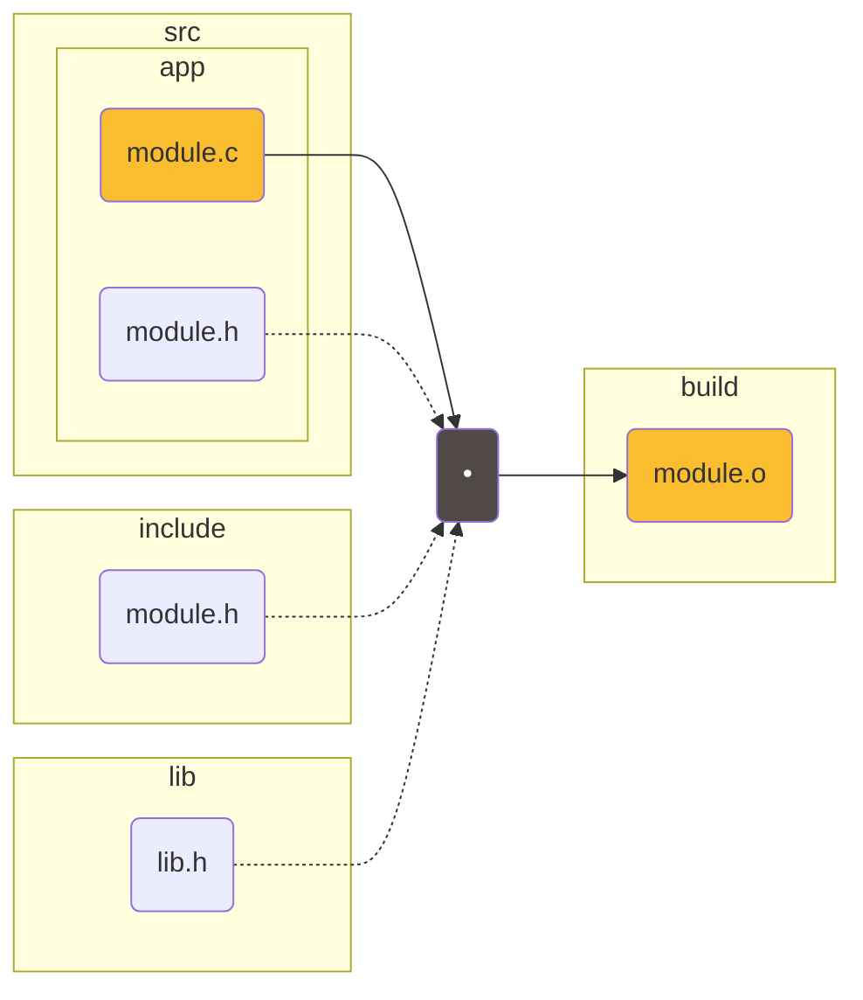
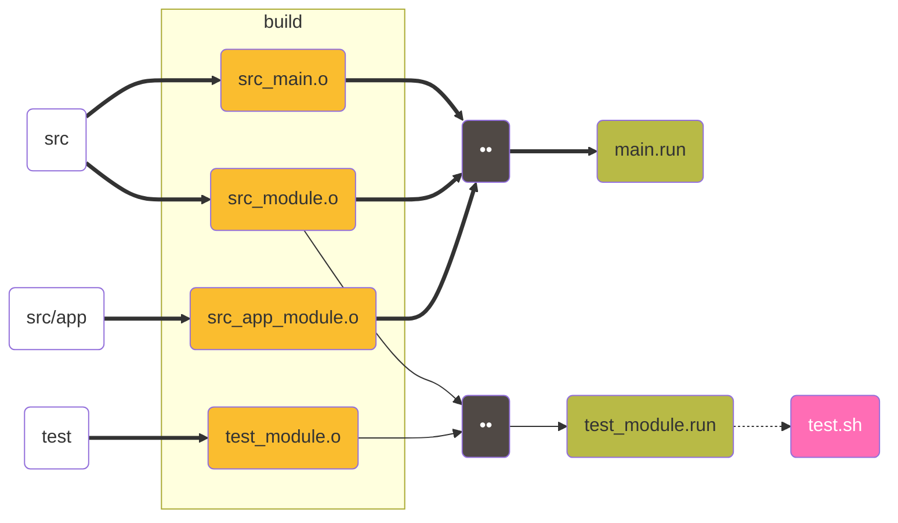
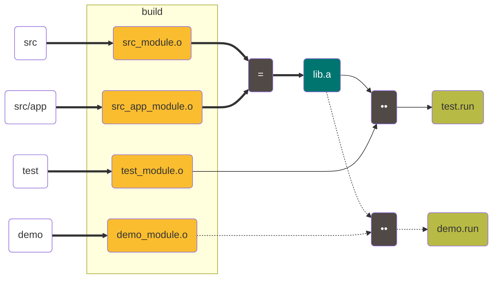

Youtube-запись от `2025-07-04`: https://youtu.be/zUNq2oYcMx4

# Makefile для новичков: пара приёмов и общий настрой использования

## Компилируем разный код с «именем» `module`

### Простой код из `src`



### Код из `test`



### Код из подкаталога `src/app`



Три `build/module.o`?!


Так дело не пойдёт


Придумаем **систему `.o`-имён**


## Теперь можно линковать разные `.o`-файлы

### Обычная программа с точкой входа `main()`



### Библиотека `.a`



## Вернёмся к `make`

Любимый приём: читаем **справа** *налево*


- Превращать `.c`-файлы в **одноимённые** `.o`-файлы (компилировать, конечно)
    
    > Получать `.o`-файлы из одноимённых `.c`-файлов
    > 
    

```makefile
%.o: %.c
	gcc -c $^ -o $@
	
	# Без проверки .c-файла
	gcc -c $*.c -o $@
	
	# То же самое, но сложней
	gcc -c $(basename $@).c -o $@
```

- При компиляции к `.c`-файлу подключать **только один** — одноимённый — `.h`-файл
    
    > Указывать одинаковые basename у `.c`- и `.h`-файлов
    > 

```makefile
%.o: %.c %.h
	...
```

- Использовать для `.o`-файлов имена, в которых «зашиты» пути к их исходным `.c`-файлам
    
    > В списке на компиляцию использовать `.c`-файл, путь к которому зашифрован в имени `.o`-цели (файла)
    > 

```makefile
# .h — так же, как .c
%.o:
	gcc -c $(subst _,/,$(basename $@)).c -o $@
	...
```

- Превращать наборы `.o`-файлов в `.run`- или `.a`-файлы
    
    > Получать `.run`-файлы из наборов `.o`- и `.a`-файлов (зависимостей)
    > 

```makefile
%.run: $(SET_O) $(SET_A)
	gcc $^ -o $@
	
%.a: $(SET_O)
	ar rc $@ $^
```

- Для каждого `.run`-файла использовать свои `.o`- и `.a`-зависимости (для `.a`-файла аналогично, но только `.o`)
    
    > Получать **имена наборов** зависимостей из имён `.run`-файлов
    > 

```makefile
# Так нельзя :(
~~%.run: $(%_SET_O) $(%_SET_A)~~
```

```makefile

~~~~# Зададим наборы вручную
DEMO_SET_O := demo_main demo_module
DEMO_SET_A := lib cbase
TEST_SET_O := test_module test_mock
TEST_SET_A := lib cbase filedata
SETS       := demo test

# Теперь напишем шаблон правила
# Это просто текст
# $(1) — так пометим место вставки имени набора
define run_template
$(1).run: $($(1)_SET_O) $($(1)_SET_A)
	cc $$^ -o $$@
endef
# Пока это просто многострочная переменная

# Похоже на макрос препроцессора
$(foreach s,$(SETS),$(eval $(call run_template,$(s))))
# call подставляет значения параметров и возвращает текст
# eval превращает текст в make-код
```

- Все `.c`-файлы из одного каталога превращать в `.o`-файлы одинаковым способом
- Для каждого `.run`-файла использовать свои флаги линковщика
- Для каждого `.run`-файла задавать каталог, куда класть результат
- …и всё это делать в Docker-контейнере
