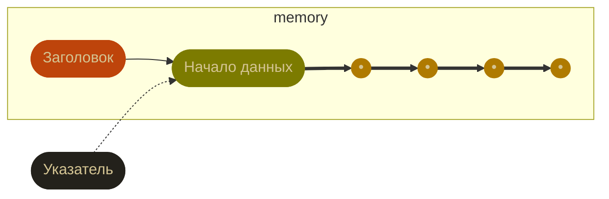

Youtube-запись от `2025-10-31`: https://youtu.be/XaqcEISmLKU

> [!CAUTION]
> Если можно без `malloc()` — нужно без `malloc()`

# Разглядываем динамическую память

> [!TIP]
> А именно — двумерный массив заранее неизвестной длины

> [!CAUTION]
> Заголовок — что за зверь?

> [!TIP]
> Начало данных и указатель — кое-что знаем

>  `free()` откуда-то знает, **сколько** памяти освобождать

## Сначала смотрим с помощью C
`malloc_usable_size(p)` — единственный законный способ (да и то нужен `#define _GNU_SOURCE`)

Прогулки с помощью `(size_t*)p - 2` — OK, но сомнительны:
- первый байт — размер предыдущего блока
- второй байт — сырая память и флаги
	- флаги по маскам: `0x1`, `0x2`, `0x4` — очень экзотичны
	- реальная память — по маске `~(0x7)` (кратна восьми!)

## Теперь `gdb`
#### Общая идея
1. Выделяем память.
2. Заполняем «видимыми» значениями.
3. Следим, правильно ли идёт заполнение.
#### Шпаргалка по `gdb`
`l` вывести код программы

`b N` поставить точку останова

`watch` отследить переменную

`info b` показать все точки и отслеживаемые переменные

`n` выполнить следующую строку

`c` выполнить до следующей точки останова

`r arg1 arg2` запустить программу с аргументами

`x/30gx address` показать содержимое памяти (формат, сколько, размер блока)

`p` вывести значение

