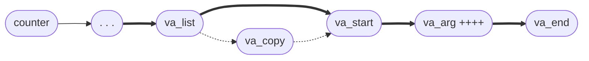

# Как делать функции с произвольным количеством аргументов

Конспект к стриму ```2025-01-17``` ([Youtube-запись](https://youtu.be/ehYWvaGhVmM)).

## Просто тупо сделать как все делают
**Можно**
Вызывать функцию в зависимости от введённой команды

```c
// Хотим, чтобы можно было так
int argument = -17;
char command_code = 'a';
do(command_code, argument);
```

> Вводить в аргументах запуска число и последовательность операций с ним

```c
void func(int counter, ...) {
	va_list args;
	va_start(args, count);
	for(int i = 0; i < count; ++i) {
		double d = va_arg(args, double);
		...
	}
	va_end(args);
}
```

- Система понимает многоточие вместо списка переменных.
- `va_copy(new_list, old_list)` — продублирует список аргументов; до прохода!; закрывать оба
- Если не использовать цикл, то можно варьировать типы аргументов вручную.
- Перед многоточием можно использовать другие аргументы!



## Printf, да не Printf
**Можно**
Проверять аргументы функции на соответствие базовым типам

```c
printf("%d %s", number, string);  // смотрите, printf так умеет
scanf("%d", &number);             // и scanf тоже
```

> Скалярный квадрат вектора произвольной размерности

> Логи (типовая задача)

- Если мы хотим прямо на месте выбирать тип для набора аргументов.
- Особенно хорошо, если ещё и аргументы разные.
- И да, мы можем сами задавать типы этих аргументов и шаблоны для них.
- До формата можно ставить обычные переменные на свой вкус.
- `__attribute__` нам ничего не должен, он только проверяет, а обрабатываем сами.

```c
#include <stdarg.h>
...
double func(const char * type, ...) __attribute__ ((format (printf, 1, 2)));
...
va_list args;
va_start(args, type)
// for ... int n = va_arg(args, int);
va_end(args);
```

- Кстати, можно так: `int unused_variable __attribute__((unused));` — избавляет от предупреждения о неиспользованности переменной
- `1` — строка формата, `2` — откуда начинаются форматные аргументы

## Фокус с измерением количества аргументов
**Можно**

Действовать по-разному в зависимости от количества аргументов

```c
one(a);          // мы же библиотека
two(a, b);       // мало ли что пользователь сделает
three(a, b, c);  // должны быть готовы ко всему
```

> Выводить имя в формате, зависящем от того, указано ли отчество
> 

> Выводить разные колонтитулы для наборов строк разной длины
> 

> Вынести настройку меню в статический массив
> 

> Предлагать бонусы в зависимости от «оптовости» покупки
> 

```c
#define COUNTER(...) REAL_COUNTER(__VA_ARGS__, 4, 3, 2, 1, 0);
#define REAL_COUNTER(_1, _2, _3, _4, N, ...) N
```

## Таблица соответствий названий функций и самих функций
**Можно**
Вызывать функции по имени — ну, почти

```c
char act[] = "printf";
// и вот тут бы написать act();
```

> Вынести настройку меню во внешний файл
> 

> Локализовать вызовы меню (допустим, пока латиница)
> 

```c
#define MENU_SIZE 10

typedef struct str2func {
	char * name;
	void (*func)();
} str2func;

str2func s2f[MENU_SIZE] = {};
// ну и дальше считываем и распознаём
```

## Держать в списке/очереди/стеке данные разных типов

**Хотим**
Держать в массиве данные разных типов


**Проблема**
Данные разных типов по разному устроены в памяти, а массив — это прежде всего движение по памяти


**Выход 1**
Держать в массиве не данные, а ссылки на них

**Выход 2**
Использовать структуру «тип данных + `union`»


Конвертировать объект «Число» и делать разное в зависимости от состояния. Переводить, из числа в строку, на разных языках и т. п.

Типичный пример — массив настроек

NULL хочется всегда держать за (void *)0, не приводя к типу списка.

Как-то ведь надо тестировать функции из предыдущего раздела 🙂

Перебери структуры с претензией на объект.

Алгорифмы типа обратной польской записи.

Когда тип следующего элемента зависит от значения предыдущего — например, ключи и аргументы запуска программы, или самописные шифры и протоколы.

- Структуры можно генерить безымянные на месте макросом под конкретный список
- Если поле инициализируется несколько раз, то предпочтение отдаётся последней инициализации — вообще-то это полезно скорее для создания значений по умолчанию
- Типизированные контейнеры: поле со значением из enum-списка типов + union-поле со значением (всегда только одного типа)

## Получать из функции данные разных типов

Простейший случай — если хотим получать либо один элемент, либо список таких элементов.

Снова структуры.

## Callback — функция, которую надо применить к однородному набору

**Пример:** покупка с зависимостью от типа товара

Каждому типу данных — своя функция. Но каково при этом применяющей функции (обобщающей процедуре)? Ей ведь должно быть всё равно, она просто применяет функцию к данным.

Обмениваемся void’ами — в реализации коллбэка (?) первым делом приводим к нужному типу

Полезно при этом использовать реализацию хэша в GLib

## Родительские объекты разные, но обращение к дочерним у них одинаковое

- Расширение можно делать через `union` — это сохраняет возможность обращаться к исходной структуре по имени
- Осторожней с именами полей — а вдруг совпадают?

## Делать разное в зависимости от участников

**Пример:** «Мам, я пошёл!»

Привязать функции к структурам, как обычно.

Так можно не думать о реализации, а просто вызывать функцию, скажем, `obj.show(&obj)`.

А ещё можно так: `#define Print(in) (in).print(&in)` — т. е. костыльная замена `this`.

Если функция не привязана, делать что-то по умолчанию — но это «что-то» будет привязано к конкретному типу структуры. Обобщить вряд ли получится? Зато можно через функцию диспетчеризации избавиться от повторов — то есть почти реализовать `this`.
