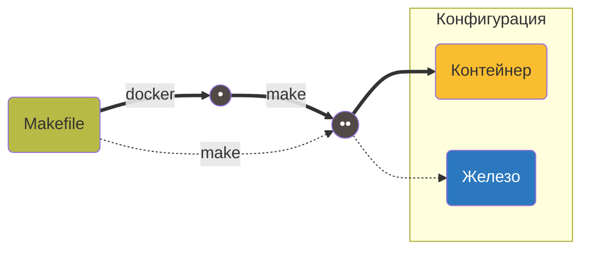

Youtube-запись от `2025-07-04`: https://youtu.be/wA02DPjQhqQ

# C toolchain: мозаика быстрых решений

Некоторые
задачи
возникают
**постоянно**


Решить лучше **один раз**


**Good enough** достаточно


### Универсальный `Makefile` для `Docker` «изнутри и снаружи»


Разработка через Docker-контейнер


Запуск на машине эквивалентной конфигурации


Имена целей фиксированы




- Добавить docker-команду в `Makefile` не так-то просто
    
    ```bash
    PRJ_DIR := $(shell pwd)/../../
    SHELL   := /bin/bash
    ```
    
- Потом что-то вроде…
    
    ```makefile
    %.docker:
    	# Переход в Docker-контейнер
    	docker run --rm -v $(PRJ_DIR):$(DOCKER_PRJ_DIR) $(DOCKER_IMG) make $*
    ```
    
- …и после всех собранных граблей:
    
    ```makefile
    SHELL         := /bin/bash
    MAKEPOSTFLAGS := --no-print-directory
    ...
    DOCKER_IMG := dev
    DOCKER_CNT := env
    DOCKER_PRJ_DIR := /prj
    DOCKER_START := docker run --rm \
    							  --name $(DOCKER_CNT) \
    								-v $(PRJ_DIR):$(DOCKER_PRJ_DIR) \
    								$(DOCKER_IMG)
    ...
    %.:
    	# Переход в Docker-контейнер
    	$(DOCKER_START) $(MAKE) -C $(DOCKER_PRJ_DIR) $* $(MAKEPOSTFLAGS) 2>/dev/null
    ```
    

### Ааа, сколько переменных в `Makefile`!

- Вынести конфиг в отдельный файл
    
    ```makefile
    include config.mk
    ```
    
- Гигиена: добавил переменную — добавь диагностический вывод
    
    ```makefile
    CC         := gcc
    CFLAGS     := -Wall -Wextra -Werror -std=c11 -g \
                  -I. \
                  -Ihelpers \
                  -Is21 \
                  -Ilib\
                  -DLOGDEF
    LDFLAGS    := -lm -lpthread
    __desc_config_cc:
        @echo
        # Настройки компилятора
        @echo " Компилятор:        " $(CC)
        @echo " Флаги компиляции:  " $(CFLAGS)
        @echo " Флаги линковки:    " $(LDFLAGS)
    
    ```
    
    
    **Вопрос для быстро читающих код:** что бы тут такого ещё вынести в переменную?
    
    
    
- Группировка служебных целей диагностического вывода
    
    ```makefile
    desc_config: __desc_config_make \
                 __desc_config_dir \
                 __desc_config_docker \
                 __desc_config_cc
        @echo
    ```
