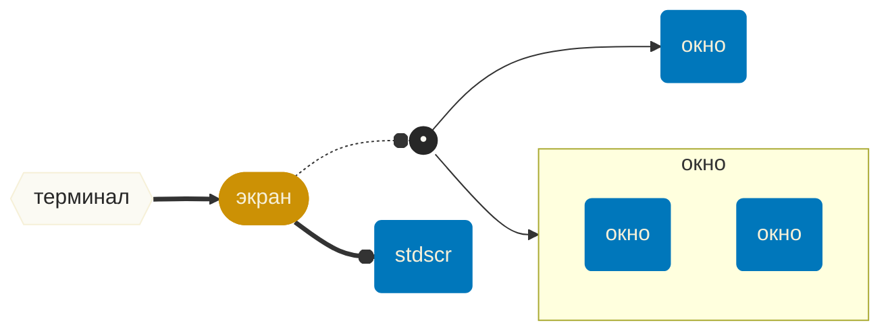
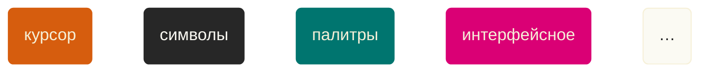

# Нам бы интерфейсика в терминал капельку, а, а?…

Youtube-запись от `2026-02-13`: https://youtu.be/O3mq37yPjqQ

> [!WARNING]
> CLI
> Command Line **Interface**

> [!NOTE]
> GUI
> Graphical User **Interface**


> [!INFO]
> CLI + GUI → TUI
> Text User **Interface**
> &nbsp;
> `gdb -tui` — и в `gdb`можно жить с комфортом
> Их вы тоже знаете: `mc`— `nano` — `tmux` — `htop` — `lynx`

## Что нам нужно?
1. Показывать на терминале пёстрые **двумерные** штуки
2. «Слышать» клавиатуру и мышь 
3. *(в идеале)* Связать п. 1 и п. 2 — то есть реагировать на «услышанное» в зависимости от того, где «пользователь» в момент нажатия «находится»

### Теоретически можно и «в лоб»
Терминал — это место, где работают [управляющие последовательности ANSI](https://ru.wikipedia.org/wiki/Управляющие_последовательности_ANSI):
- `echo $PS1` — легко настроить префикс командной строки
- `gtl` — для красивых логов тоже достаточно ANSI

### …но!
> [!CAUTION]
> Быстро нарастают абстракции
> Окна, курсоры, фокусы, меню, поля ввода, рамки,…

## Библиотечку бы…
- Обычно используют [`ncurses`](https://invisible-island.net/ncurses/)
- Просто не будет:
```c
#include <curses.h>
#include <locale.h>

int main(void) {
	// если хотим кириллицу
	setlocale(LC_ALL, "ru_RU.UTF-8");
	
	// терминал с окном по умолчанию
	initscr();
	
	// всё содержательное будет тут
	
    // всегда заканчиваем
    endwin();
	return 0;
}
```
- Библиотек несколько: [ncurses](https://invisible-island.net/ncurses/man/ncurses.3x.html) — [panel](https://invisible-island.net/ncurses/man/panel.3x.html) — [form](https://invisible-island.net/ncurses/man/form.3x.html) — [menu](https://invisible-island.net/ncurses/man/menu.3x.html)

### Как запустить?
- Управляем конфигурацией через `ncursesw6-config`
- Ключ `--cflags` объяснит, как компилировать
- Ключ `--libs` расскажет про линковку библиотек
- Ну и просто про `-lncurses` не забываем
- А если у вас есть нелатинские буквы — `-lncursesw` (код тот же)

### Источников информации не очень много
1. [How To](https://tldp.org/HOWTO/NCURSES-Programming-HOWTO/) — очень старый документ.
2. [Четыре книжки на Amazon](https://www.amazon.com/s?k=ncurses&dc&crid=22PGVLQZV5G28&sprefix=ncurse%2Caps%2C471&ref=a9_asc_1) — две легко найти на Github.
3. Официальный [manual](https://invisible-island.net/ncurses/man/index.html).

> [!INFO] Дальше — погружаемся в `man`
> https://invisible-island.net/ncurses/man/index.html

### Главное — понять, что у нас есть

> [!INFO]
> Ну а объект — он и в Африке с полями и методами



> [!WARNING]
> Ключевой вопрос
> Штуки со «знакомыми» названиями ведут себя как мы ожидаем?

- Основное коварство: **терминал — прадедушка браузера**
- UTF-8 доставляет много радости — взять хотя бы [рамки](https://www.w3.org/TR/xml-entity-names/025.html)
- Весь учебный код — это демонстрация функциональности (а не архитектуры)

## Как организовать код TUI-программы?

> [!CAUTION]
> Уйма поводов посоздавать абстракции
> Инициализация, обработка сигналов, отрисовка, работа с цветом, обработчики ввода, состояние программы, интерфейсные компоненты,…

- Архитектура Model—View—Controller (да, MVC, а что делать)
- Механика touch — пометить для перерисовки (есть вложенность)
- Игровой цикл (упрощённо): слушаем → пересчитываем → рисуем
- Можно сделать свою (!) систему событий

> [!TIP]
> И к тому же `ncurses` использует ОС на всю катушку
> Один терминал чего стоит.
> А ещё там сигналы, дисциплина линии *(впрочем, это часть терминала)* и чего только нет.

Бонус: в [CDK](https://invisible-island.net/cdk/manpage/cdk.3.html) уже созданы все разумные интерфейсные контролы.
