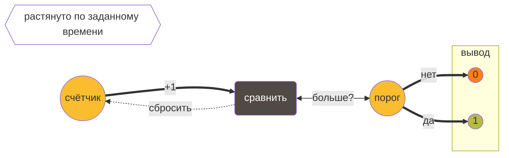

Youtube-запись от `2025-07-18`: https://youtu.be/j6P9VzOvUic


# Рисуем на осциллографе

Зачем?

- Скучно изучать осциллограф по инструкции
- В любой непонятной ситуации — рисуй


…и заодно посмотрим, как сделать интересный **pet-проект** буквально из ничего


## Превратим blink в что-нибудь на осциллографе

```c
#include <avr/io.h>
#include <util/delay.h>

int main(void) {
    DDRB |= (1 << PB3);      // выход на пин D11
    while (1) {
        PORTB ^= (1 << PB3);  // мигаем
        _delay_ms(500);       // задержка в лоб
    }
}
```

- Так-то мы это уже делали
- Только мигали на другом пине
- Datasheet на микроконтроллер всё помнит!

## Воспользуемся ШИМ-возможностями контроллера

- Мы не можем менять высоту ступеньки
- Но можем менять её ширину
- Термин «скважность» — «обратный» к ширине

```c
…
    // Настраиваем таймер 2 и канал
    TCCR2A = (1 << COM2A1) | (1 << WGM21) | (1 << WGM20);  // несмещённый PWM, Fast PWM
    TCCR2B = (1 << CS21);  // делитель на 8

    while (1) {
        for (uint8_t i = 0; i < 255; i++) {
            OCR2A = i;         // установить скважность (яркость)
            _delay_ms(100);
        }

        for (int i = 255; i >= 0; i--) {
            OCR2A = i;
            _delay_ms(100);
        }
    }
…
```

- Таймеры работают сами по себе — **не нужно писать циклы**
- На некотором временном интервале — `TCCR2B` …
- … таймер растёт от нуля до максимума.
- А тем временем на привязанном к таймеру выводе `PB3` (ну, почти так) …
- … напряжение меняется с 0 на 1 по отсечке `OCR2A`




Зачем?


**Получить «порцию» электричества**
Потом придумаем, как растянуть в линию


## Получим горизонтальную линию


- «Порция» — это интеграл под графиком
- Проводим новую линию так, чтобы интеграл не изменился
- И так на каждом отрезке
- **Ура**, у нас прямая!


Это называется RC-цепочка


Засады в ассортименте


## А теперь — под углом

```c
…
    OCR2A = 64;  // установить порог

    while (1) {
        for(int i = 0; i <= 255; i++) {
            OCR2A = i;
            _delay_ms(1);
        }

        for(int i = 255; i >= 0; i--) {
            OCR2A = i;
            _delay_ms(2);
        }
    }
…
```

- Углы разные
- Чуете, как пахнет библиотекой?
- Это экран? А какой размерности?

## Можно рисовать слона, он же удав


```c
OCR2A = elefant[i];
```

- «Просто» возьмём значения из массива
- А какую брать размерность?
- Осторожно, микроконтроллер!


## Закрасим слоника?

```c
OCR2A = elefant[i];
_delay_ms(32);
int y = ((boa[i] == 0) ? 0 : 126 - (boa[i] - 240));
OCR2A = y;
_delay_ms(32);
```


- И снова влияет качество RC-цепочки?


**Но где взять данные** для слоно-удаво-массива? Об этом в следующий раз
