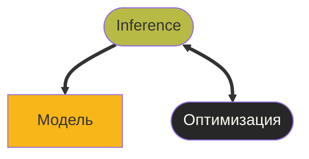

Youtube-запись от `2025-09-26`: https://youtu.be/3FuW380dCFQ

# Плата «Мир» с двумя микроконтроллерами

[mir.dev](https://mir.dev/) — два ESP32 + обещают что-то про TinyML
https://github.com/MIR-LLC — Github-репозиторий проекта
### Смотрим, что подключилось
```bash
lsusb
Bus 004 Device 109: ID 303a:1001 Espressif USB JTAG/serial debug unit
Bus 004 Device 112: ID 10c4:ea60 Silicon Labs CP210x UART Bridge
Bus 004 Device 116: ID 303a:1001 Espressif USB JTAG/serial debug unit
```

### Выясняем tty
Запускаем ls -l /dev/serial/by-id:
```bash
ls -l /dev/serial/by-id
total 0
lrwxrwxrwx 1 root root 13 Sep 26 15:58 usb-Espressif_USB_JTAG_serial_debug_unit_70:04:1D:3A:67:18-if00 -> ../../ttyACM1
lrwxrwxrwx 1 root root 13 Sep 26 15:57 usb-Silicon_Labs_CP2102N_USB_to_UART_Bridge_Controller_0ea2f41f478bee1193e5fe018acbdcd8-if00-port0 -> ../../ttyUSB0
```


### Активируем ESP
```bash
edf
```

### Создаём проект
```bash
idf create-project peace
cd peace
```

### Указываем микроконтроллер
```bash
idf set-target esp32s3
```

### Пишем Hello, world!
```c
#include <stdio.h>
#include "freertos/FreeRTOS.h"
#include "freertos/task.h"

void app_main(void)
{
    while (1) {
        printf("Hello from ESP32!\n");
        vTaskDelay(pdMS_TO_TICKS(1000));
    }
}
```

### Компилируем
```bash
idf build
```

### Загружаем в контроллер (прошиваем)
```bash
idf flash
```

### Мониторим
```bash
idf monitor
```

Выход из монитора — Ctrl + ]

### Теперь второй
```bash
idf flash
```

### Опа, а он и не s3 вовсе!

### Переключаем цель
```bash
idf set-target esp32c3
```

### Компилируем заново
```bash
idf build
```

### Прошиваем (другой порт!)
```bash
idf -p /dev/ttyACM1 flash
```

### И снова мониторим
```bash
idf.py -p /dev/ttyACM1 monitor
```

### Как организовать код для двух контроллеров?
Два подкаталога, конечно.
```bash
idf create-project c3
cd c3
idf set-target esp32c3
cd ..

idf create-project s3
cd s3
idf set-target esp32s3
cd ..
```

### Есть и другие важные настройки
```bash
idf menuconfig
```

### Итого конфигурация
**c3** — нужен для связи с внешним миром
**s3** — нужен для обработки данных (ML + экран + возможно, главная «считалка»)

### А где ML?
Важно: это не железо, это **компонент**.
Что-то вроде библиотеки, которая будет автоматически подключаться в ваш код.
Ну надо ставить. В проект. С компьютера idf потом зальёт.

### И что нам ждать в TinyML?




1. **Модель.** Хранит «знания по теме». Уже кто-то где-то её обучил. Это данные.
2. **Inference.** Движок. Умеет пользоваться моделью. Много считает. API к данным.
3. **Оптимизация.** Ускорялка движка для конкретного железа.

### Как связаны микроконтроллеры?


Ну, наверное, как-то связаны, но это уже не сегодня.
