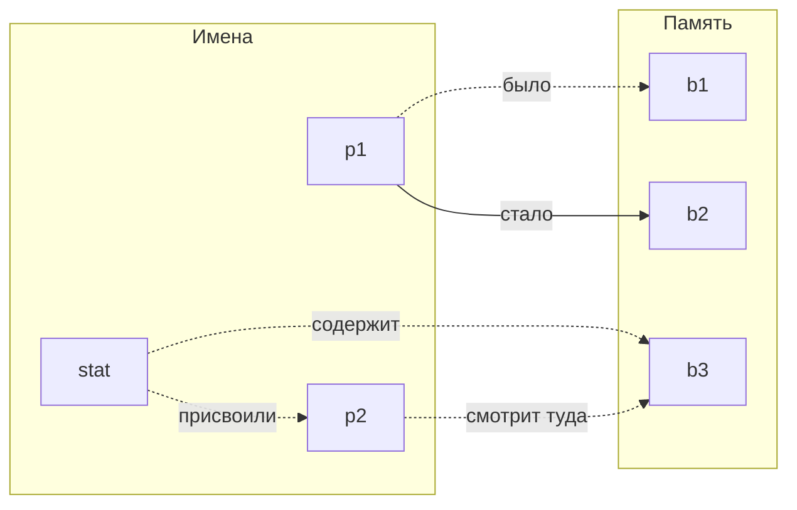

Youtube-запись лекции: https://youtu.be/jPyvR80eX-M ```2025-01-24```

# Практикуем мышление указателями

### Как принято думать про указатели



> Это всё про данные.

А где же  **поведение**?
> 

### Что нам нужно ~~от жизни~~ на самом деле

Делать всё время новые штуки, а не повторять старые.
Сколько можно писать `for()` и `malloc()`, ну!

Больше свободы действий!

#### Работать с памятью
- Брать под «имя» столько памяти, сколько хотим вотпрямщаз
- Сдвигаться по памяти вперёд-назад
- Сравнивать положения в памяти (раньше-позже)
- Выгрызать куски памяти (от и до)
- Не тратить память на одинаковые данные

#### Повышать уровень абстракции
- Передавать управление данными от функции к функции
- Организовывать данные под желаемое поведение
- Обобщать поведение, не привязанное к типу данных (то есть не делать одно и то же тыщу раз, а спрятать — инкапсулировать — куда-то реализацию)
- Превращать содержательную часть поведения функции в ещё один её аргумент

### А давайте…
- Сделаем нежные действия безопасными для старых данных
- Будем нормально очищать память, а не как уже всех достало
- Вообще не будем очищать память, пусть оно само
- Создадим структуры (например, массивы), отвязанные от типов данных
- Будем менять размеры памяти под данные и их расположение в памяти, но не менять указатели на эти данные (паттерны с дескриптором или даже обработчиком)
- Посчитаем метаданные один раз, а не при каждом обращении

### Феномены указателей, которые всегда пригодятся в хозяйстве
- Указатель-вездеход (для данных `void *`, для функций *иногда* `void (*)()`)
- Приведение типов данных через указатели (сейчас обычно `void *`)
- Одинаковый объём памяти для указателей на все типы данных
- Указатели на указатели на указатели…
- Обращение к `static`-переменным
- Указатель-неудачник `NULL` (но иногда он не указатель!)
- Указатели делают границы проходимыми
- Выделенную через `malloc()` память можно использовать для разных типов (данных)
- А ещё бывают указатели на функции, и — вы понимаете, это другое (или нет)

**Фоновая мысль 24x7**
«Как можно сделать [подставить нужное] с помощью указателей?»
