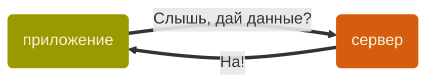
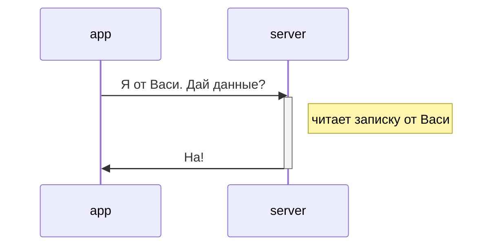
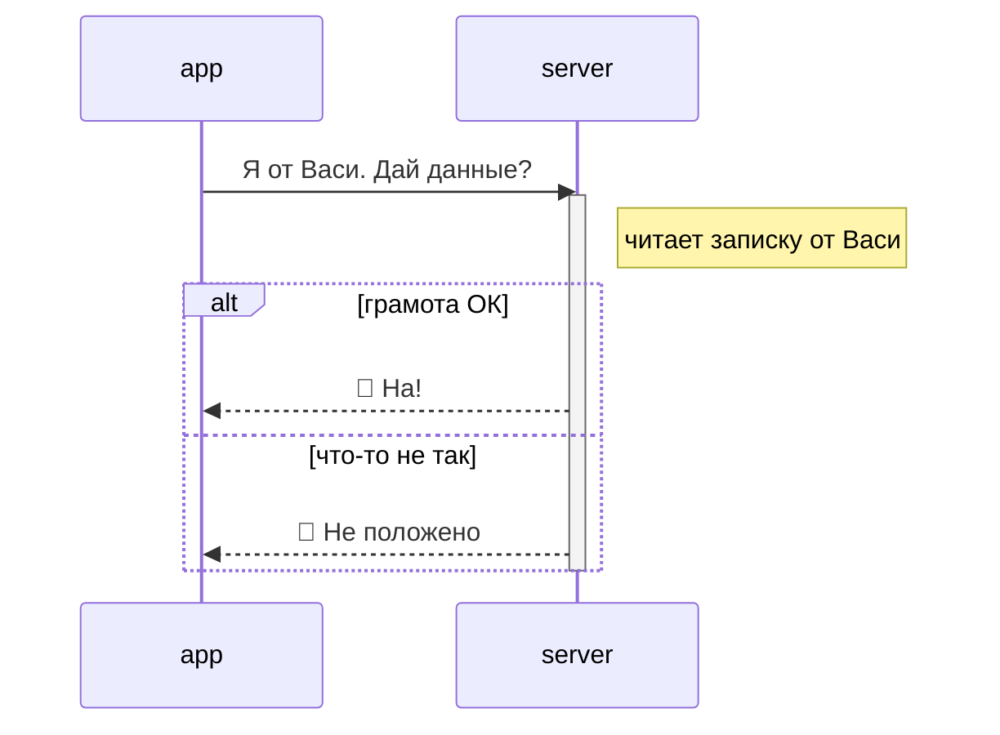
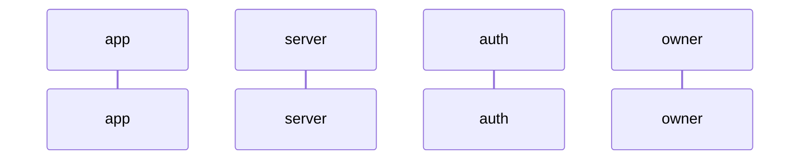
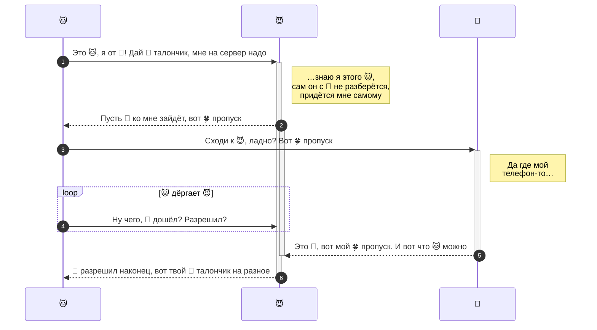
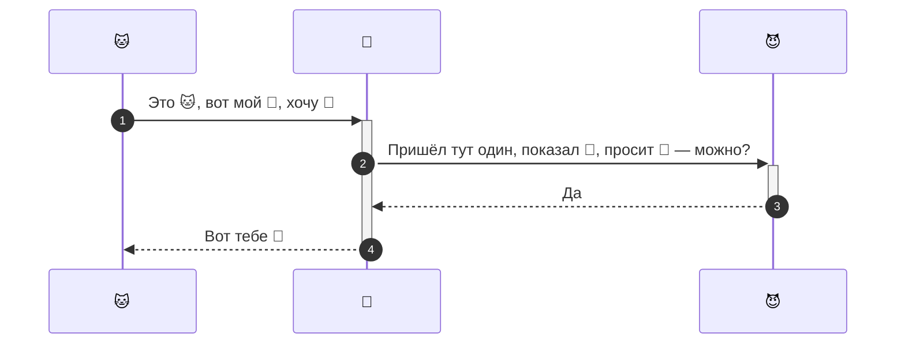

Youtube-запись от `2026-02-27`: https://youtu.be/FeAi2kqFKAk

# OAuth 2.0 — путь к dashboard'у
> [!WARNING]
> Хватит делать метеостанции
> Пора ходить в Интернет за своими данными

## Как пройти через кордоны?
### Сначала все были равны

### Потом появились верительные грамоты

### А с ними — и отказы

### Какие проблемы?

##### У приложения
1. Где взять верительную грамоту простому рабочему ~~парню~~ приложению с окраины?
	1. Честно получить у Васи.
	2. Сфабриковать из подручных материалов.
	3. Украсть.

##### У сервера
1. Откуда мне знать, что грамота от Васи?
2. Я что, всех Вась должен помнить?
3. Мало ли что Вася им понаразрешал пять лет назад…
4. Вот пустишь их в сарай переночевать, а они корову уведут.
5. Почему вообще я?!

> [!TIP]
> Ааааа, милицияааааа!!!

### И тут приходит Главный Проверяльщик Документов и всех строит

- Я буду за вас *проверять* документы.
- И *выдавать* тоже.
- И *знать*, кому что положено, буду тоже я.
- С **владельцем** данных я тоже договорюсь.
- *Защита* от злодеев — моё дело, не беспокойтесь.
- И всем придётся общаться по моим **[правилам](https://datatracker.ietf.org/doc/html/rfc8628)**.

### Что ж, начинаем договариваться вчетвером

> [!INFO]
> Четыре — это уже много
> - Это интроверты, не надо их сразу мучительно нетворкать
> - У всех свои дела, особенно у владельца
> - Злодеи так и рыщут, надо осторожней

> [!NOTE]
> Проблеме не первое столетие
> Задолго до компьютеров были: *общие знакомые — верительные грамоты — подорожные — доверенности — векселя — ордера — мандаты — паспорта — визы — пропуска — талоны — …*

## Пьеса «Авторизация маленькой железки»
- Вольный перевод спецификации [Device Authorisation Grant](https://datatracker.ietf.org/doc/html/rfc8628)
- Как эту пьесу ставит Google: [OAuth 2.0 для телевизоров и приложений с ограниченным вводом данных](https://developers.google.com/identity/protocols/oauth2/limited-input-device?hl=ru)

### Сцена первая: 🐱 app, 😈 auth и 🐰 owner

### Сцена вторая: 🐱 app, 👻 server и 😈 auth

### [Диктатушки-диктата](https://youtu.be/z0Y_Pw-pCYw?si=JyP-Ix9fTqhb38VM), мы играем за 🐱 ~~кота~~ app

#### Узнаем, куда нам отправлять 🐰 owner'а
POST-запрос на параметры авторизации силами клиента — серверу авторизации.
URL: `https://oauth2.googleapis.com/device/code`
Параметры: `client_id` — `scope`
`client_id` берём из переменной среды `GOOGLE_CLIENT_ID`

- [CURLOPT_POST](https://curl.se/libcurl/c/CURLOPT_POST.html) — включаем протокол POST
- [CURLOPT_POSTFIELDS](https://curl.se/libcurl/c/CURLOPT_POSTFIELDS.html) — это если хотим что-то послать

`tail -4 params.txt` — посмотрим на хвост ответа (ключ не увидим)
> [!CAUTION] Складывать ключ в незашифрованный файл — плохая идея
> Разговор о том, куда его девать после получения — впереди

> Возвращается всегда JSON

#### Отправляем 🐰 owner'а куда надо

- Выберем JSON-библиотеку из [целого мешка](https://www.json.org/json-en.html)
- Прочтём файл и покажем из него то, что нужно показать

#### А потом?
1. В цикле POST-запрос уже на токен — серверу авторизации
2. И дальше GET-запросы серверу ресурсов — с ключом в заголовке и параметрами собственно запроса

- `curl_slist` — тип списка
- [curl_slist_append()](https://curl.se/libcurl/c/curl_slist_append.html) — добавляем заголовок в список
- [CURLOPT_HTTPHEADER](https://curl.se/libcurl/c/CURLOPT_HTTPHEADER.html) — сюда кидаем список заголовков

> [!INFO] Пригодятся для Google и не только
> - [Настройки доступа в Google ваших приложений](https://console.cloud.google.com/auth/overview?hl=ru&project=lectures-488014)
> - [OAuth-песочница](https://developers.google.com/oauthplayground/?hl=ru)
> - [OAuth-документация](https://developers.google.com/identity/protocols/oauth2/limited-input-device?hl=ru#allowedscopes)
> - [API reference](https://developers.google.com/youtube/v3/docs?hl=ru)
> - [Yakk](https://yaak.app)
> - [Postman](https://www.postman.com)

