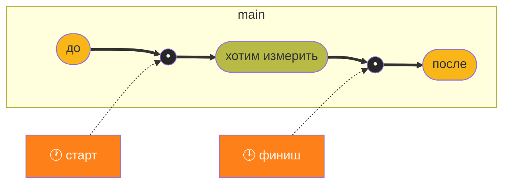

Youtube-запись от `2025-10-17`: https://youtu.be/FrgEhxLC2cg

# Измеряем скорость C-кода

> [!TIP]
> Это называется profiling (профилирование)

## Давайте поумножаем матрицы

Эскиз кода (без обвязки):
```c
for (int i = 0; i < height; i++) {
	for (int j = 0; j < width; j++) {
		for (int k = 0; k < width; k++) {
			result[i][j] += a[i][k] * b[k][j]
		}
	}
}
```

> [!TIP]
> Знание vs наблюдение
> Мы понимаем, что *какая-то* зависимость есть. Но как её **увидеть**?

## Изменяем скорость реального кода
Функция умножения (как и остальные) — чёрный ящик.
Мы не можем менять код, можем только пользоваться им.
**Задача — узнать скорость имеющегося решения.**

> [!INFO]
> Только прикладной код
> Для функций ядра другие трассировщики (хотя и их можно приспособить к прикладным программам)

## Идея проста, как валенок: засекаем время


- Делаем «штампы времени» — timestamp
- Потом считаем что хотим

### Примитивный timestamp

```c
#include <time.h>
...
clock_t start = clock();
function_to_measure();
clock_t finish = clock();
double time = (double)(finish - start) / CLOCKS_PER_SEC;  // секунды 
```

### Timestamp с наносекундами
```c
#define _POSIX_C_SOURCE 199309L
...
struct timespec start, finish;
...
clock_gettime(CLOCK_MONOTONIC_RAW, &start);
function_to_measure();
clock_gettime(CLOCK_MONOTONIC_RAW, &finish);
double time = (finish.tv_sec - start.tv_sec) +
	          (finish.tv_nsec - start.tv_nsec) / 1e9;
```
- `CLOCK_PROCESS_CPUTIME_ID` — измерять только процессорное время

> [!TIP]
> Самое время поменять флаги компиляции
> `-O0` и `-O1` уже дают разное время — а ведь ещё есть `-O2` и `-O3`

### Профилировщики

#### gprof — простой анализ меток компиляции gcc

```bash
gcc -pg main.c
./a.out                # создаёт файл gmon.out
gprof a.out gmon.out
```

- Метки вставляет `gcc`
- `gprof` только анализирует
- Для уровня оптимизации `-O3` не работает (там меняется граф вызовов)
- ==Меняет время выполнения== (точнее, его меняет флаг компиляции `-pg`)

#### perf — уже покруче и даже стандарт

> [!WARNING]
> Хочет много разных прав

Посмотреть на статистику программы в целом:
```bash
sudo perf stat ./a.out
```

Собрать и проанализировать отчёт:
```bash
sudo perf record -g ./a.out  # создаёт файл perf.data
sudo perf report
```

- Высокая точность — аж на уровне железа
- Шикарный отчёт (особенно если откомпилировано с `-g`)
- Надо всерьёз разбираться в том, как работает
- Может работать с любым исполняемым файлом без спец. компиляции
- Есть много куда более затейливых способов использования

#### valgrind — всеобщий любимец

```bash
valgring --tool=callgrind ./a.out  # создаёт файл callgrind.out.[pid]
callgrind_annotate callgrind.out.[pid]
```

- Очень медленный. Очень!
- Только относительное время
- Можно сравнивать профили до/после внесения изменений:
```bash
callgrind_annotate callgrind.out.before callgrind.out.after
```

### Возможности ассемблера

> [!WARNING]
> Полная зависимость от процессора
> Ну, может, и не от процессора, но от системы команд точно

> [!INFO]
> Смотрим для ARMv8 (другого у меня и нет)
> Код для RISC-V заметно проще. Код для x86 примерно такой же.

```c
#include <stdio.h>
#include <stdint.h>
...
static inline uint64_t read_cntvct(void) {
    uint64_t val;
    __asm__ volatile("mrs %0, cntvct_el0" : "=r" (val));
    return val;
}

static inline uint64_t read_cntfrq(void) {
    uint64_t val;
    __asm__ volatile("mrs %0, cntfrq_el0" : "=r" (val));
    return val;
}
...
uint64_t freq = read_cntfrq();
...
uint64_t start = read_cntvct();
function_to_measure();
uint64_t finish = read_cntvct();
double time = (double) (finish - start) / freq);
```

- `static` убирает конфликты линковки (нет линковки — нет конфликтов)
- `inline` избавляет от вызова функции (а это нагрузка)
- `volatile` запрещает оптимизацию

## Стабилизация измерений

### Привязка к одному ядру

```bash
taskset -c 0 [команда]
```

- `nproc` — узнать, сколько ядер
- `lscpu` — больше всякого интересного про процессор

### Стабилизация частоты

Сначала узнаем доступные способы выделения частоты:
```bash
cat /sys/devices/system/cpu/cpu0/cpufreq/scaling_available_governors
```

Потом устанавливаем максимальную частоту постоянно:
```bash
sudo cpupower frequency-set -g performance
```

И проверяем, что всё встало удачно:
```bash
cat /sys/devices/system/cpu/cpu0/cpufreq/scaling_governor
```

Чтобы покопаться в интересном:
```bash
sudo cpupower frequency-info
```

После тестов возвращаем частоту в «обычный» режим:
```bash
sudo cpupower frequency-set -g schedutil
```

### Усреднение результатов

- Тут всё очевидно — N запусков и вычисление среднего
- Можно сделать N входящим параметром

### Прогрев кэша

> [!WARNING]
> Без понимания похоже на магию
> Возможно, это повод разобраться

- **Суть — «научить» систему коду**
- Для этого прогнать несколько раз вхолостую
- Желательно настраивать объёмы кэша + иметь возможность гонять без него

## 2025-10-17 → 2025-10-24
### Что можно ещё?
- замеры в промежуточных точках;
- разные опции компилятора;
- эксперименты со сложными алгорифмами умножения матриц;
- поиск неочевидных «точек перехода» при изменении размерности матриц;
- нормализация на один «юнит» (единицу).

> [!TIP]
> Оптимизация — в следующий раз


