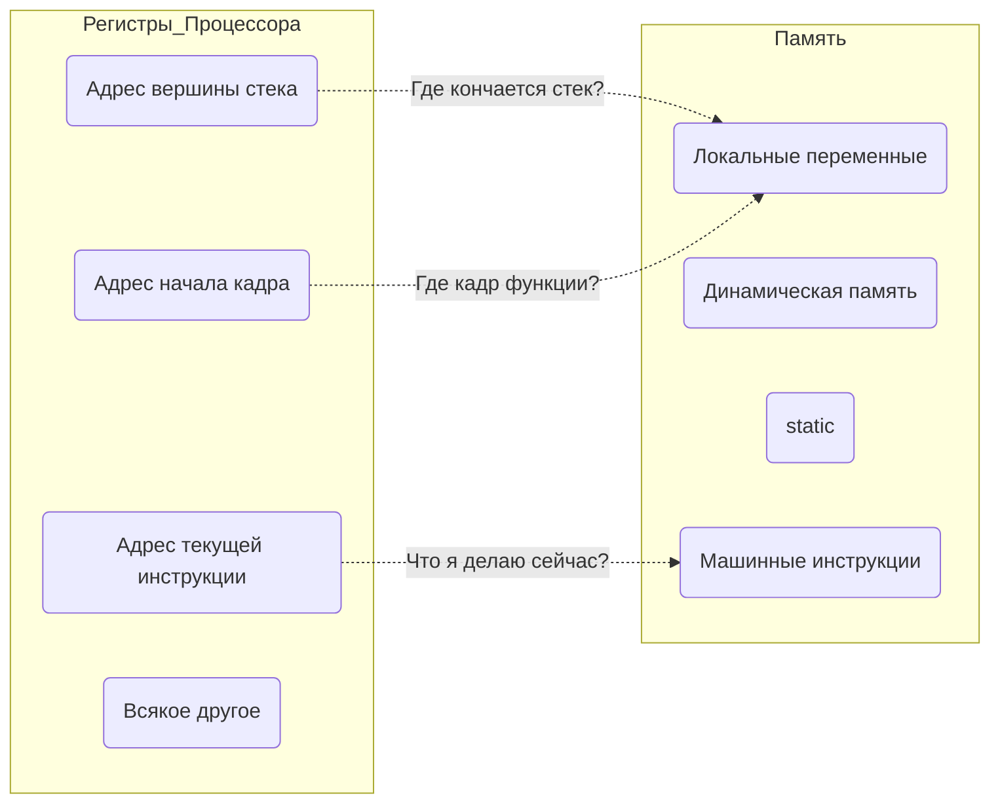
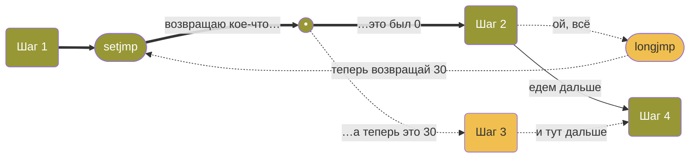
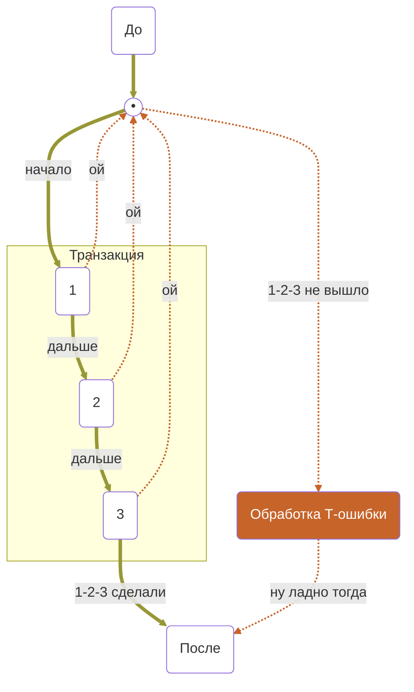
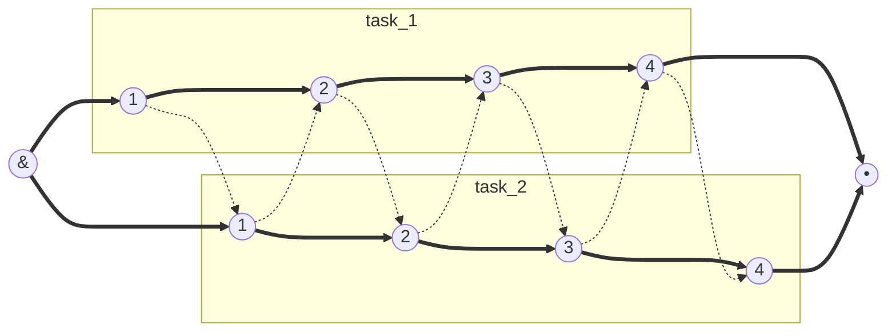

Youtube-запись лекции от ```2025-03-07```: https://youtu.be/dYg2zZPXJTE

# Механизм setjmp()/longjmp()

## …но сначала про системное программирование

## Ух ты, программа!

> Структурное программирование
> 
- Один компьютер — одна программа
- Фокус на структуре кода

## Вас много, я одна(ин)

> Системное программирование
> 
- Много программ в одном компьютере
- Фокус на ресурсах компьютера
- Прикладные программы отдельно

<aside>


**1950+**

</aside>

<aside>


**1960+**

</aside>

<aside>


**Кто-то должен сделать** то, чем другие программисты пользуются

</aside>

- Меньше абстракций и прочих фреймворков
- Ближе к ~~земле~~ железу
- Производительность — наше всё
- Оптимизация под процессор
- Ассемблер за углом
- Безопасность, доступы, потоки, память напрямую
- Драйвера и микропроцессоры (будет отдельно)

> Забудьте всё то, чему вас учили в школе — вот оно!
> 

<aside>


**Да как забыть-то?!**

</aside>

<aside>


**Почувствуй боль перехода.** Особенно если ты из 2020-х с AI и зоопарком железа

</aside>

# Первая жертва  — безусловный переход

<aside>


**А вот бы нам уметь сохраняться!** Респауниться. Возрождаться. Как в играх.

</aside>

- Да-да, это `goto()`, и это серьёзно
- Сохраняться **где**? Респауниться **куда**? Восстанавливать **что**?
- Как вообще устроена выполняющаяся программа?

https://en.cppreference.com/w/c/program/setjmp

https://en.cppreference.com/w/c/program/longjmp



<aside>


**Разобраться стоит.** Но потом.

</aside>

## Управляем поведением

- `setjmp()` — сохраняем точку возврата
- `longjmp()` — возвращаемся в эту точку
- туда-сюда передаём код выхода из точки возврата

> Точек возврата и кодов может быть **несколько**
> 

## Ничего не обещаем про данные

- глобальные сохраняются
- динамическая память остаётся как была
- 👾 **локальные непредсказуемы** 👾 👾 👾
    - тут поможет `volatile` — жёсткая привязка к памяти, никаких регистров и прочих оптимизаций
- файлы и т. п. остаются как были

<aside>


**Прыгну** «назад» куда хочу + **передам** туда **информацию** к размышлению

</aside>



# Конечно, придумали типовые трюки

### Транзакции и обработка исключений (аналог try/catch)



```c
#include <stdio.h>
#include <setjmp.h>

jmp_buf env;

void critical_error() {
    printf("Ошибка! Немедленный выход.\n");
    longjmp(env, 1);  // Вернёт выполнение в setjmp()
}

int main() {
    if (setjmp(env) == 0) { // Сразу и создали точку возврата 
        printf("Запуск программы\n");
        critical_error();  // Вместо return используем longjmp()
    } else {
        printf("Обработали ошибку!\n");
    }
    return 0;
}
```

### Эмуляция многозадачности (планировщик задач)



```c
#include <stdio.h>
#include <setjmp.h>
#include <unistd.h>

jmp_buf task_a, task_b;
int current = 1;
int i = 0;

void switch_task() {
    if (current == 1) {
        current = 2;
        longjmp(task_b, 1);
    } else {
        current = 1;
        longjmp(task_a, 1);
    }
    sleep(1);
}

void task_A() {
    if (setjmp(task_a) == 0) {} else {
        printf("Задача A, шаг %d\n", i);
        switch_task();
    }
}

void task_B() {
    if (setjmp(task_b) == 0) {} else {
        printf("Задача B, шаг %d\n", i++);
        switch_task();
    }
}

int main() {
    task_A();  // запуски с нулями, сохранение состояний
    task_B();  // или, что тоже, инициация точек входа (возврата)
    switch_task();
    return 0;
}
```

### Обработка сигналов

```c
#include <stdio.h>
#include <setjmp.h>
#include <signal.h>

jmp_buf env;

void handler(int sig) {
    printf("Пойман сигнал %d! Возвращаемся в main()\n", sig);
    longjmp(env, 1);
}

int main() {
    signal(SIGINT, handler);  // настраиваем мониторинг сигнала SIGINT
    
    if (setjmp(env) == 0) {
        while (1) {
            printf("Работаем... (нажми Ctrl+C для теста)\n");
            sleep(1);
        }
    } else {
        printf("Программа продолжает работу после сигнала\n");
    }
    return 0;
}
```

`SIGSEGV` — сигнал обращения к недопустимой памяти (интересно обработать)

`SIGFPE` — ошибка деления (например, делим на ноль)

`SIGINT` — нажатие Ctrl+C
