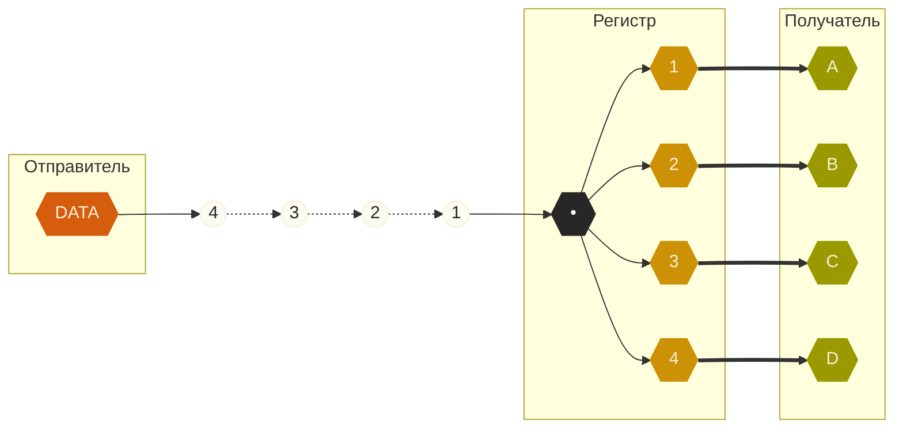
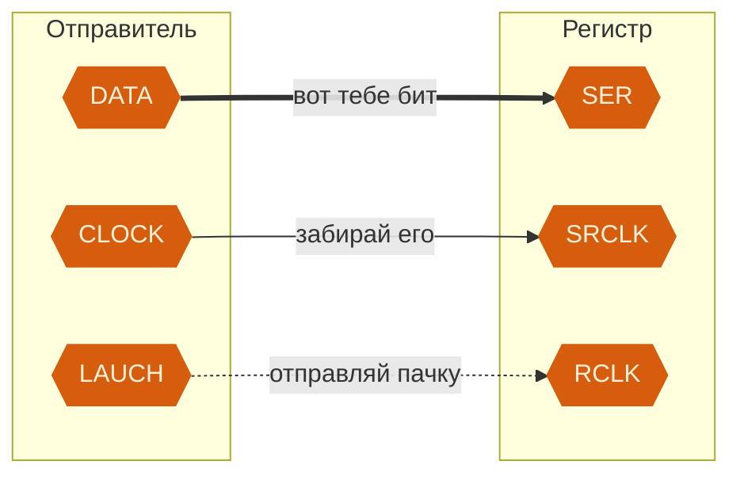
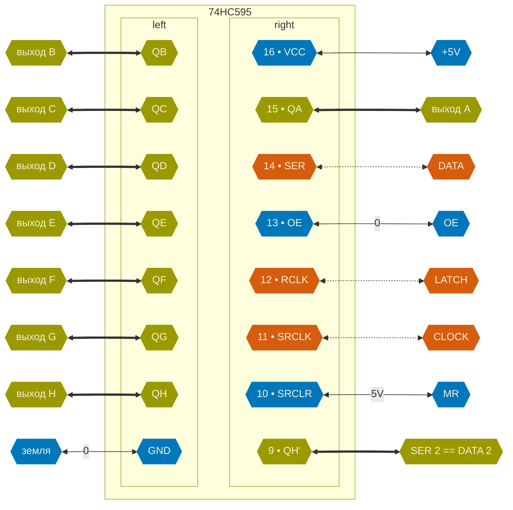
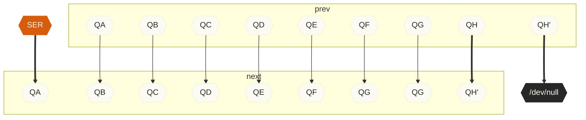

# Сдвиговый регистр
**Конкретные железки:** [[74HC595]] (золотой стандарт, дальше всё про него) — 74HCT595 — [[74HC164]] (без `LATCH`) — 74HC165 — TPIC6B595 / TPIC6C595 (высоковольтные) — MAX7219 / MAX7221 (скорее драйвер светодиодной матрицы) —  MCP23S17 (фактически уже GPIO-микроконтроллер)

**Что такое сдвиговый регистр?** Это микросхема. Она раскидывает сигналы из одного входа на разные выходы.

> Принимает **один за другим** сигналы с одного своего входящего пина — и **одновременно** выставляет значение этой последовательности на всех своих исходящих пинах.

Если коротко, это такая «анти-шина[^3]»: на вход сигналы поступают по одному проводу, а на выходе уходят уже по нескольким. Или, если угодно, «анти-[[UART]]»: был провод — стала шина.

**Зачем нужно такое устройство?** Чтобы экономить пины отправителя. Ведь так один пин (`DATA`) может отправлять данные на несколько устройств. И, значит, управлять ими.

**Один?! Нет, конечно.** Ещё нужны как минимум два служебных пина: *«Считай очередной бит»* (`CLOCK`) и *«Всё, набор готов, отправляй»* (`LATCH`).

> [!CAUTION]
> `LATCH` есть не на всех сдвиговых регистрах
> Есть модели попроще, и там «защёлки» вообще нет. Это то же самое, что нет внутреннего регистра, только внешний. Используются редко.

> [!WARNING]
> В документации по регистрам нет названий `DATA`, `CLOCK` и `LATCH`.
> Там — `SER`, `SRCLK` и `RCLK` соответственно.

Тогда **использование сдвигового регистра** выглядит так.
1. Решаем, какие `0` и `1` должны быть выставлены на пинах устройств-получателей.
2. Собираем из этих `0` и `1` последовательность, которую регистр должен разложить по своим пинам выхода. Длина последовательности == количество пинов выхода регистра (иначе в каких-то пинах будет мусор, а нам такое не нужно). Где-то всегда будет одно и то же значение — например, ноль.
3. Отправляем первый бит последовательности в свой регистр `DATA`.
4. И как выставили один — поднимаем[^1] `CLOCK` — мол, забирай значение бита в `DATA`. Как только регистр видит подъём `CLOCK` — он забирает `DATA`. Это называется «срабатывать по фронту[^2]».
5. Потом сбрасываем `CLOCK` — всё, не забирай, жди новое значение. Точнее, жди появления нового фронта, чтобы сработать.
6. П. 3 и следующие — для следующих бит последовательности. Проходим полный цикл по последовательности.
7. Когда вся последовательность отправлена в регистр — поднимаем `LAUCH`. И снова срабатывание по фронту. Так регистр отправит последовательность дальше. Сразу всю. Не по очереди.
8. Потом не забываем сбросить `LAUCH` — чтобы позже можно было снова его поднять для «срабатывания по фронту».
9. И всё по новой.

> [!TIP]
> Выглядит длинным и непонятным
> На самом деле просто: **«Забирай, забирай, забирай… Отправляй!»**.

**Как часто запускать такой цикл?** Зависит от того, как часто мы хотим обновлять значения пинов на принимающих устройствах. Конечно, это будет медленней, чем можно было бы сделать, используя связку «Один пин выхода — один пин входа». Но если скорости не так уж важны — схема работает.

> Так мы можем на отправляющем устройстве использовать 3 пина вместо, например, 8 (если в регистре восемь исходящих пинов). **Экономия!**

**Для упрощения работы** есть ещё два входящих пина регистра.
1. *«Ничего не отправляй на выход»* (`OE`, output enable). Заставляет регистр игнорировать `LAUCH`. По умолчанию равен нулю — то есть ничего не блокируется, данные проходят.
2. *«Очисти регистр»* (`MR`, master reset). Пин обнуляется — весь регистр обнуляется. В стандартных сборках всегда устанавливают[^4] в 1 — то есть ничего никогда не обнуляется.

**И для сложных ситуацией с выстраиванием цепочки регистров** есть пин `QH'` (QH-prime). Он содержит предыдущее значение старшего регистра. То есть это как бы «регистр переполнения» Если подключить его как `DATA` к следующему регистру, а команды фиксации отдавать синхронно — очевидно, получим шину шире. Но это уже реально следующий уровень, не сейчас.

**Как подключаться?** Вот стандартная распиновка стандартной микросхемы сдвигового регистра [[74HC595]]:

Как видно, у нас 8 «нормальных» исходящих пинов и один для того, чтобы сделать регистр подлинней. Ну или его ещё как-то можно использовать, но это уже вопрос фантазии.

**Главное, что происходит в регистре — это сдвиг.** Вот как он устроен.

Из схемы сдвига очевидно, что отправлять последовательность бит нужно, начиная с того бита, который в итоге должен попасть в `QH` (или в `QH'` и дальше, если у нас цепочка регистров). А заканчивать — тем, который должен в итоге попасть в `QA`). То есть «чем дальше идти, тем раньше выходим».

**Важно: сначала сдвигается так называемый «внутренний регистр».** То есть то, что мы не видим. На выходах микросхемы ничего не меняется до особого распоряжения — команды `LATCH`. Если команды не было — сколько угодно двигай внутренний регистр, снаружи не поменяется ничего.

## Кое-что про электричество

Сдвиговый регистр нужен, чтобы управлять логикой. То есть электричество в нём работает только как логическое электричество. Да, его можно использовать как силовое в некоторых очень слабых схемах, но — лучше не надо.

> [!CAUTION]
> Существуют силовые сдвиговые регистры
> И они вполне поставляют рабочий ток на своих выводах. То есть к ним всё, что ниже, вообще не относится.

> [!CAUTION]
> Для управления светодиодами — своё семейство
> И там свои особенности и возможности. 

Подключать к выходам сдвигового регистра напрямую можно **только слаботочные устройства**. Ток одного выхода должен быть меньше 5 мА, при том что суммарный ток по всем выходам тоже ограничен — обычно не больше 20 мА.

Если этого мало — включать **через транзистор**. Так сигнал становится чисто логическим, а не силовым — для того транзисторы и нужны.

И даже если по току укладываемся в ограничения — **лучше использовать регистр как землю.** То есть питание подавать «с другой стороны». И устройство в этом случае будет включаться, если выход регистра установлен в ноль. Почему лучше? Так силовой ток устройства не течёт через внутренности регистра, просто уходит в землю сразу. Да и ноль, в отличие от единицы, редко бывает «шумным»: он же просто ноль, его удерживать не нужно. Ну и микросхема не нагревается, тоже хорошо.

## Где часто применяют?
1. **Управление шаговыми двигателями.** Например, для биполярного шагового двигателя нужны четыре логических сигнала — чтобы менять в определённой последовательности напряжения на четырёх контактах обмотки. Если вот это вот «менять в определённой последовательности» не удастся организовать — мотор не закрутится. Но тратить на логику мотора четыре пина — слишком расточительно: ведь обычно мотор нужен не один. Используют 8-битовый сдвиговый регистр — и через него управляют сразу двумя моторами (каждому достаётся по 4 бита, как раз хватит на 4 логических сигнала). Сигналы потом уходят в драйвер мотора, но это совсем другая история.
2. **Крохотные микроконтроллеры.** Например, ATtiny. У них очень мало пинов. А вычислительной дури много. Почему бы не подключить малютку к большому количеству устройств вывода — зуммеры, светодиоды, моторы и т. п. — через сдвиговый регистр?

## Задачи для первого знакомства
Скорее всего, лучше собрать какой-то демо-стенд — и уже дальше его программировать.

1. Модуль на C для управления регистром.
2. Какой-нибудь эксперимент для сравнения регистров с/без `LATCH`.
3. Железка для лабы: сдвоенный регистр + два цвета светодиодов + кнопка. Случайные числа (одно по факту, два видны из-за двух цветов). Задача — либо кто быстрей назовёт числа, либо кто быстрей сложит. Вариант для одного регистра — умножение. Кнопка перезапускает игру.
4. Бегущий огонёк.
5. Бросаем кубик (вывод регистра в момент нажатия кнопки, а так он там фоном пусть ползёт-сдвигается сколько угодно).
6. Демо-стенд «Число и его двоичное представление» (нужен экран?).
7. Тренажёр чтения двоичных чисел.
8. Порядок зажжения ханукальных свечей (следующий день по кнопке).
9. Запуск шагового двигателя.
10. Сдвоенный регистр.
11. Наглядное умножение двоичного числа на -1.
12. Бегущая строка (нужны доп. железки?).

## 

[^1]: «Поднимать» пин — это значит поднимать напряжение на нём. То есть в случае с микроконтроллером — отправлять туда значение 1.

[^2]: Термин из электричества. Суть простая: график сигнала на осциллографе «поднимается» от 0 к 1 — это и есть фронт. Схема срабатывает, когда обнаруживает такой подъём.

[^3]: Так обычно называют несколько параллельных проводов. Ожидается, что имеет смысл сигнал, принятый со всех проводов одновременно. То есть, например, 8 проводов передадут нам аж целый байт сразу. И работают все провода сразу — то есть отдельный провод шины ценности не представляет. Да даже и механизма «Передай значение по одному проводу, а остальные не трогай» часто не существует.

[^4]: Устанавливают без логики, просто подачей питания +5 вольт (или какое на конкретной схеме питание считается за логическую единицу). Если сами собираете схему, а не используете готовую плату — не забудьте подать сюда +5 вольт. Иначе ничего не заработает вообще.

