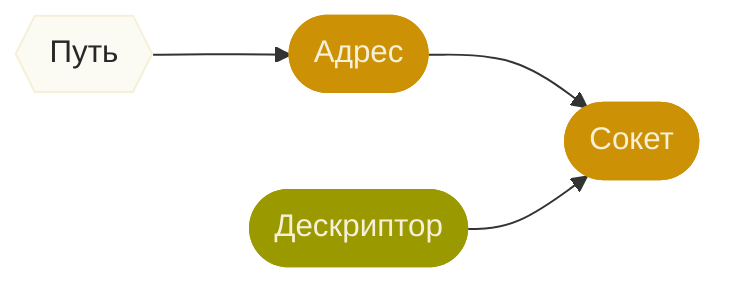

Youtube-запись от `2026-02-06`: https://youtu.be/yVVkvWhylA4

# Сокет? Это ещё зачем?!

> *Опять страшное слово, да сколько можно!*

Есть у нас одна семейка операционных систем, в которой…
> [!WARNING]
> Всё — файл

## Подумаем как ООП-программисты
Файл?
То есть абстракция для объединения в одной точке разных действий?
**А каких?**

1. Читать.
2. Писать.
3. Эээ… Хранить?
4. Всякое служебное: открывать-закрывать, создавать-удалять,…

## Читать и писать — это передавать информацию
Очевидно, с помощью файла мы можем организовать передачу информации.

```bash
tail -f
```

> [!CAUTION]
> Внимание, вопросЫ
> 1. Пишут и читают — одновременно или по очереди?
> 2. Где находятся Первый, Второй и Файл?
> 3. Если информацию уже прочли — она остаётся в файле?
> 4. Первый и Второй — это вообще кто?

> [!INFO]
> Желательные ответы
> 1. Неважно. Главное — **независимо**.
> 2. **Где угодно**. То есть либо на одном компьютере, либо на разных.
> 3. Нет, пусть **исчезает**.
> 4. А кто у вас есть? **Процессы**? Ну ладно.

## Хотим «файл», заточенный под передачу информации

### Вроде как бы и файл
1. Открываем.
2. Получаем дескриптор.
3. Узнаём про него разное.
4. Пишем/читаем.
5. Закрываем.

### Но есть нюансы
1. Нет курсора.
2. Прочли — стираем.
3. FIFO.
4. Не живёт, когда никому не нужен.
5. Может «работать в команде».
6. Может «отвечать».
7. Может иметь сетевой адрес.
8. …

> [!TIP]
> Подозрительно похоже на буфер
> Да, так тоже можно думать.
> Или конвейер.
> Или любая другая понятная вам метафора **в первом приближении**.

## Да честный файл — сосунок по сравнению с *этим*!
> Потому в народе так и повелось: сокет да socket…

### Давайте посмотрим на те сокеты, что уже есть
Утилитой `netstat`:
```bash
netstat --inet
netstat -l | grep tmp
netstat --inet -n
netstat --udp
netstat -e
```
Прямо через файловую систему `proc`:
```bash

sudo ls -la /proc/self/net
sudo cat /proc/self/net/unix
```
Утилитой-слушалкой `socat` :
```bash
socat - UNIX-CONNECT:/tmp/meshtastic_pos.sock
```
> [!CAUTION]
> Последнее, что осталось понять
> Сокет — это не очередь.
> Некому слушать? Некуда послать!
> Иначе говоря, **в начале было ухо**.

### Через системные утилиты
Начинаем слушать:
```bash
socat -u UNIX-RECV:/tmp/hi.sock -
```

И только теперь что-нибудь отправляем:
```bash
dmesg 2>1 | socat -u - UNIX-SENDTO:/tmp/hi.sock
```

> [!TIP]
> Хорошая утилита `socat`.
> А `man` у неё — ещё лучше!

### Почта, …, телефон
Поток: вас много, я одна.
Датаграмма: подписывайтесь на журнал «Мурзилка!»

> [!WARNING]
> Осторожно, коварство.
> Получатель имеет право прочесть данные из сокета не сразу.
> Но это приводит к проблемам. **Разным** для потоков и датаграмм.

Лучше всего экспериментировать, пока не освоишься с паттернами.

### Читаем из сокета кодом на C

Самое затейливое — инициация:


…а пользуемся — дескриптором!
Сокет как структура нам не то чтобы нужен.

> [!NOTE]
> Дальше см. код. 
