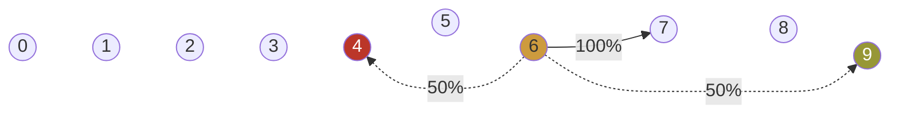
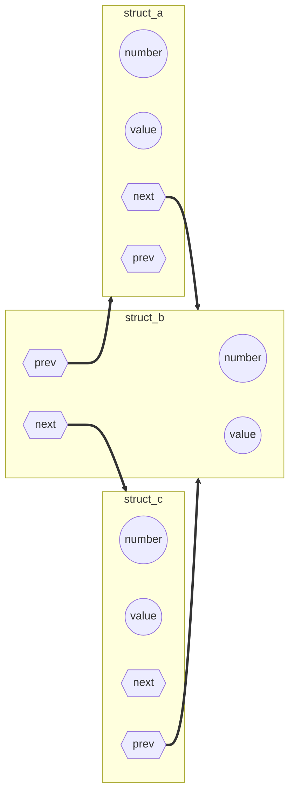

Youtube-запись лекции от ```2025-02-28```: https://youtu.be/s84SIS6sWA0

# Структуры данных для себя, любимых

Начнём сразу с примера

<aside>


И с очень страшного кода

</aside>

## Дойди за 7 шагов

- Можно с гарантией сделать шаг вперёд на одну клетку…
- или с равной вероятностью либо прыгнуть вперёд, либо отскочить назад



## Что нам нужно?

- Упорядоченный список клеток
- В каждой клетке — длины шагов вперёд и назад

```c
game[i] = forward * 10 + back;
```

## А что если…

- Хотим задавать произвольное число шагов

> динамический массив
> 

- Хотим, чтобы в некоторых клетках лежали сокровища

```c
g * 100 + f * 10 + b
```

- Хотим гулять по кругу, пока не соберём все сокровища

```c
if(i == PATH_LEN) { i = 0; }
```

- Хотим двумерную карту… нет, трёхмерную… нет,…

```c
game[x][y][a] // и так далее
```

- Хотим открывать новые куски карты по мере продвижения

> динамический массив
> 

- Хотим в некоторых точках проваливаться в специальную игру

```c
s * 1000 + g * 100 + f * 10 + b
```

<aside>


Кошмар какой-то

</aside>

## Нас спасут структуры с указателями

- Хотим задавать произвольное число шагов —— динамический массив
- Хотим, чтобы в некоторых клетках лежали сокровища

```c
struct cell {
	int x;
	int forward;
	int back;
	int treasure;
};
```

- Хотим гулять по кругу, пока не соберём все сокровища

```c
typedef struct cell {} cell;

struct cell {
	int forward;
	int back;
	int treasure;
	cell * next;
};
```

- Хотим двумерную карту… нет, трёхмерную… нет,…

```c
typedef ...
struct cell {
...
	cell ** directions;
};
```

- Хотим открывать новые куски карты по мере продвижения
- Хотим в некоторых точках проваливаться в специальную игру



- Перейти к следующему элементу
- Понять, что мы дошли до конца
- Обратиться к элементу напрямую по номеру — получаем список
- Находить значение по имени структуры — получаем словарь

1. Структура «элемент».
2. Дополнить указателями для связываний и переходов.
3. Остаться в статике — поштучная динамика — массивы всех видов.
