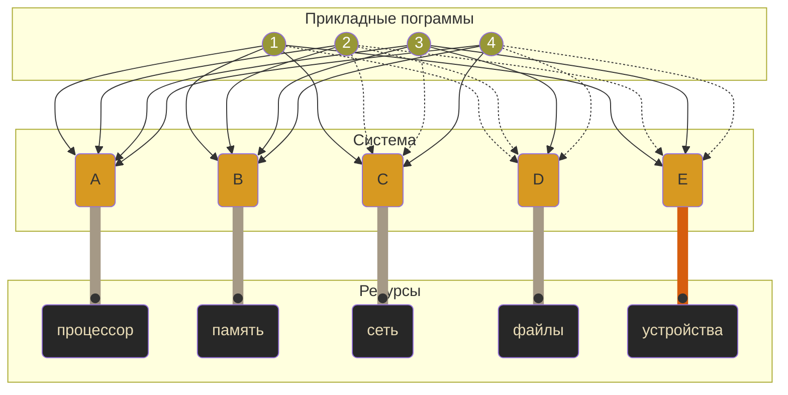
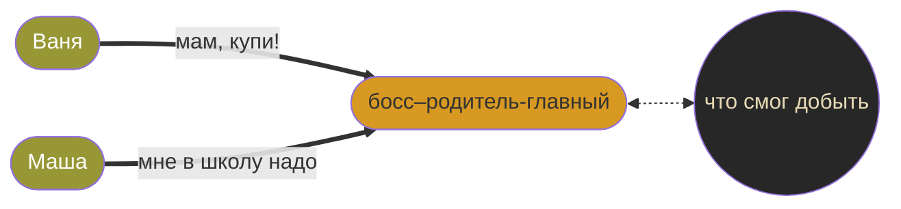

Youtube-запись лекции от ```2025-03-21```: https://youtu.be/DetO0YF-DqE

# Самое-самое начало многопоточности

## Мы на базаре!
👾 Или даже где похуже

- Программ много, это мы уже знаем.
- Постоянная **битва за ресурсы**: время процессора, доступы, данные, память, да что угодно.
- Как ни странно, это игра по правилам. **Правилам операционной системы.**



Но что если ты и есть операционная система?!

**Будь как все.** Как все прикладные программы.

## Как все — это как? Что там за порядки?

очереди — буферы — **потоки** — семафоры — мьютексы — балансировщики — …


**Это не про язык программирования.**
Это про операционную систему и архитектурные приёмы.


## Коллективам действовать проще, чем одиночкам


«Я позабочусь о **ресурсах**, а вы **действуйте**»




- **Много что в семье общее** — но есть и своё.
- При добыче и удержании ресурсов есть феномены, о которых **детям лучше не знать**.

```bash
# Сколько у нас логических ядер?
nproc

# Сколько у нас оперативной памяти?
free -h
```

## Пора кодить


«Отселяем» функцию в отдельный поток


`-lpthread`

`pthread.h`

`pthread_t`

`int pthread_create (pthread_t * THREAD_ID, void * ATTR, void *(*THREAD_FUNC*) (*void*), void * ARG)`


А вот и утечки памяти — ой


Получаем значения из потоков


…или просто ждём


`void pthread_exit(void *return_value)`

`int pthread_join (pthread_t THREAD_ID, void ** DATA)`

`int pthread_detach(pthread_t *thread)`


Работаем с общей памятью


`pthread_mutex_t lock = PTHREAD_MUTEX_INITIALIZER;`

`pthread_mutex_lock(&lock)`

`pthread_mutex_unlock(&lock)`

## Ошибки валятся со всех сторон

- Функции стандартных библиотек далеко не всегда потокобезопасны (`static` — ой).
- Потоки запросто могут испортить общие данные («гонка»).
- Умер родитель — умрут и потомки (если специально кое-что не предпринять).
