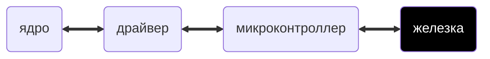
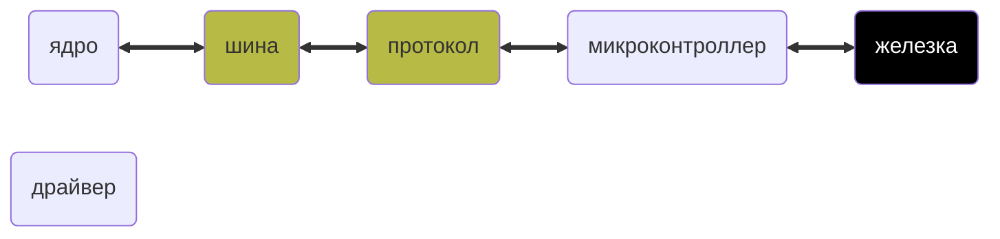

Youtube-запись от `2025-04-18`: https://youtu.be/J0HMeGvl6ew

# Шина, протокол, микроконтроллер — наглядное первое знакомство



- Автоматизируют подключение устройств
- Протокол + шина



### Практика 0

- Получить `Hello World!` с устройства в компьютер
- …стандартными POSIX-средствами

### Практика 1

`Serial` `RX/TX` `GPIO` `UART`

```bash
echo ON | sudo tee /dev/... # пусть там будет лампочка
```

### Практика 2

- Вращаем настоящим моторчиком
