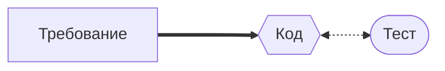
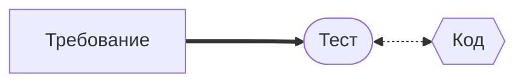
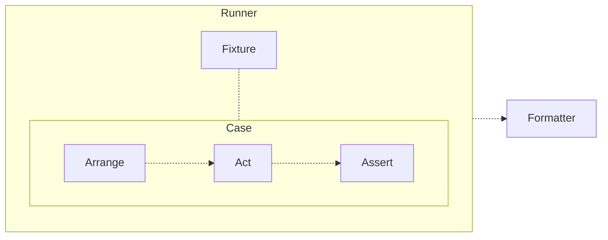
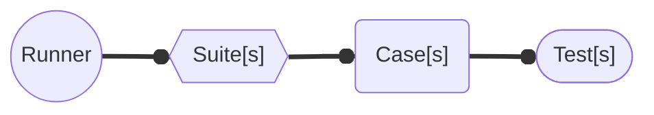
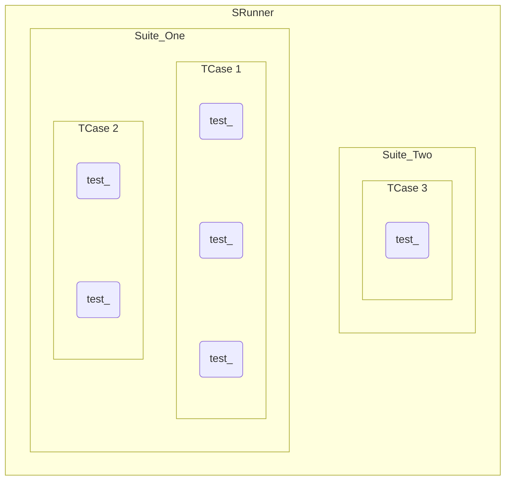
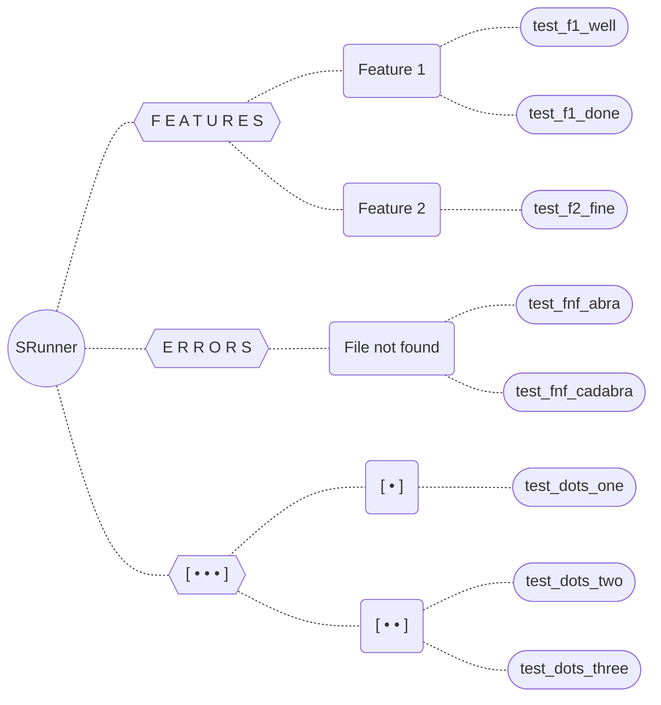

# Основы модульного тестирования на C • Check framework
Материалы к стриму 2024-11-22.
> [Запись на Youtube](https://youtu.be/BtfshpYmdTg?si=r-IJgWdnELGKizur) (1,5 часа; можно включать ускоренную).
> 
> Ветка ```main``` — более-менее образцовый код.
> 
> Ветка ```demo-2024-11-22``` — то, что происходило на стриме.

Ниже — конспект планов на стрим (успели чуть меньше).

---
## Слишком много требований…
- Уже сразу много и разные
- И будут расти…
- …непредсказуемо!
- А старые-то должны продолжать работать

> Ой-ой-**ой**

## … давайте с них и начнём!

### Как мы привыкли?


### **А что если?**


> Behavior Driven Development — сначала **пишем** требования

Конечно, упрощаем до нашего масштаба. В мегакорпорациях всё занудней.

Совсем просто — TDD: сначала пишем тесты. Но работает хуже.

## Пусть тестированием занимается тоже программа

> **Тест — это программа.** Или часть программы.

- Все успешные наборы тестов похожи друг на друга



> [**xUnit**](https://ru.ruwiki.ru/wiki/XUnit) — типовая архитектура фреймворка для тестирования

## Возьмём фреймворк для сборки такой программы на C
* [Check Tutorial](https://libcheck.github.io/check/doc/check_html/check_3.html#Tutorial) — документация
* [Check File Reference](https://libcheck.github.io/check/doc/doxygen/html/check_8h.html) — интерфейс

### **Как инсталлировать?**
```bash
# Mac
brew install check
# Linux
sudo apt-get install check
```

### **Как положить в основу тестирующей программы?**
```c
#include <check.h>
```

### **Как откомпилировать?**
```bash
gcc -o test_program test_program.c program.c -lcheck -lpthread -lm
```

> **Для программ с `main()` необходима условная компиляция**

```c
#ifndef TEST
#define TEST
int main() { /* ... */ return 0; }
#endif
```

```bash
gcc -c program.c -o program.o -DTEST
gcc -o test_program -c test_program.c program.o -lcheck -lpthread -lm
```

## Полочки, по которым всё раскладываем

### Совсем короткий вариант



### Вся картинка вложенности



## Давайте напишем что-нибудь

### Требования

```c
// = Тестирование среды запуска
//   (не требует внешнего модуля)
// : Тест запущен в оболочке zsh                $SHELL
// : Глубина вызовов оболочки больше двух       $SHLVL
// : Версия оболочки больше 5                   $ZSH_VERSION
// : Тест запущен в русской локали              $LANG
// : На компьютере работает операционка darwin  $OSTYPE
```

### Тесты

```c
START_TEST(test_???) {
// : Требование из списка, которое мы собираемся здесь проверить
	ck_assert_???
} END_TEST
```

### Программа

```c
...
SRunner * create_runner() {
	SRunner * result;

	Suite * s = suite_create("FEATURES");
	TCase * tc = tcase_create("Feature");
	suite_add_tcase(s, tc);
	tcase_add_test(tc, test_function_here);
	
	result = srunner_create(s);
	return result;
}

...

int main() {
	SRunner * sr = create_runner();
	srunner_run_all(sr, CK_VERBOSE);
	
	int failed_quantity = srunner_ntests_failed(sr);
	return (failed_quantity == 0) ? EXIT_SUCCESS : EXIT_FAILURE;
}
```

## И ещё

```c
//   - Black-сумма двух чисел больше их реальной суммы
//   - Black-сумма двух чисел не равна сама себе
```

## Что куда как когда?

### Структура одного теста
- Основной Suite — все верхнеуровневые требования программы (`FEATURES`)
- Один кейс — одно требование
- В один кейс входит столько тест-функций, сколько нужно
- Шаблон названия тест-функции: `test_[код требования]_[суть теста]`
- Отдельный Suite для ожидаемых ошибок (`ERRORS`)
- Дополнительные Suite — по обстоятельствам
- Один Runner



### Файлы и папки
```bash
.
├── build
│   ├── black
│   └── black.o
├── src
│   ├── black.c
│   └── black.h
└── test
    ├── Makefile
    └── test_black.c
```

## Конфигурации (Fixtures)

### **Предустановка для кейса (unchecked)**
```c
Config * global_config_for_test;

void setup(void) {
	global_config_for_test = create_config("blablabla", 12345);
}

void teardown(void) {
	free_config(global_config_for_test);
}

...
	tcase_add_checked_fixture(tc, setup, teardown);
// ИЛИ
	tcase_add_unchecked_fixture(tc, setup, teardown);
...
```

### **Параметризация (через цикл)**
```c
static const int global_a[3] = [7, -14, 25];

START_TEST(test_add_param) {
	...
	int a = global_a[_i];
	ck_assert_int_ne(funct(a), 0);
	...
} END_TEST

...
	tcase_add_loop_test(tc, test_add_param, 0, 2);
...
```

## Для расширения кругозора

> [«Принципы юнит-тестирования»](https://www.ozon.ru/product/printsipy-yunit-testirovaniya-horikov-vladimir-211424826/), Владимир Хориков

- Разные уровни детализации вывода
- Типовые проверки
- Пропускать через `grep`
- Свой скрипт реформатирования логов
- Перевод кода на всплывание ошибок
- Частичный запуск (в т. ч. теги)
- Покрытие — утечки — логирование
