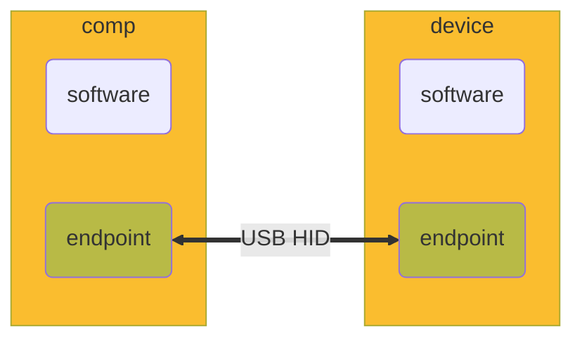
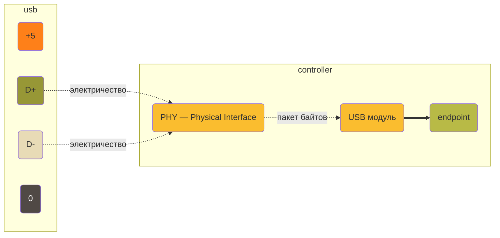
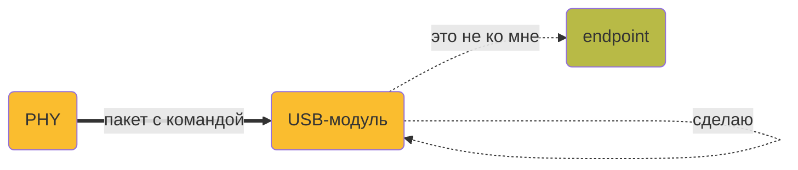

Youtube-запись от `2025-05-23`: https://youtu.be/r0vElts5pb0?si=86Cy-_o2rLQ0i6cF

# USB HID + запуск хоть чего-то на разных микроконтроллерах
# План прежний: прикинуться клавиатурой

## Пока ничего страшного

## Где обмен данными, там и буфер

## Разоблачим магию стрелочки

## Богатая внутренняя жизнь USB-модуля

### В любом случае

1. Распознавать, отфильтровывать и проверять пакеты.
2. Сообщать, что произошло с пакетом.

### По команде вида «Сделай для контроллера»

1. Класть/забирать **данные** из пакета в память (endpoint).
2. Ставить **флаг**.
3. Вызывать **прерывание**.

### По команде вида «Сделай для себя»

1. Выделить внутри себя адрес для устройства.
2. Поменять состояние USB.
3. Сбросить себя.
4. Изменить свою внутреннюю настройку.

**Итог:** всем этим не надо грузить микропроцессор

## Есть наши, а есть не наши дела

### Наши

1. **Настроить** USB-модуль.
2. **Настроить** endpoint’ы (размер, тип).
3. **Понять**, какая команда дошла до нас: обработать SETUP-запросы на `EP0`.
4. **Представиться** компьютеру: сформировать и вернуть дескрипторы.
5. **Отправлять** данные: заполнять IN-endpoint’ы.
6. (по желанию) реагировать на RESET/SUSPEND/RESUME.

### Не наши

1. ~~Распознавание PID, CRC.~~
2. ~~Отбор пакетов по адресу.~~
3. ~~Маршрутизация по endpoint’ам.~~
4. ~~Ответы ACK/NAK/STALL.~~
5. ~~Перехват RESET, SUSPEND.~~
6. ~~Переключение между IN/OUT буферами.~~

**Как узнаем?** Мониторинг, флаг, прерывание

## Пора вспомнить про HID

### USB-модуль

- [ ]  Тактирование
- [ ]  USB-периферия
- [ ]  Разрешение на USB

### Endpoint’ы

- [ ]  endpoint 0 = control • SETUP • 8 байт
- [ ]  endpoint N = interrupt • IN • 8+ байт
- [ ]  

### SETUP-запросы

- [ ]  **GET_DESCRIPTOR**
- [ ]  SET_CONFIGURATION
- [ ]  SET_IDLE (бывает)
- [ ]  GET_REPORT (не обязательно)
- [ ]  SET_REPORT (не обязательно)

### Отправка данных (HID-отчёты)

- [ ]  Содержание
- [ ]  Структура пакета

USB тут постольку поскольку

## Сами или библиотека? Both

LUFA, libopencm3, STM32 HAL, TinyUSB и даже V-USB

Не только HID

# А можно всех посмотреть?

У всех разное, но всем надо

- [ ]  Кросс-компилятор
- [ ]  Стандартные для контроллера библиотеки
- [ ]  Загрузчик (если нет своего)

**Больше** возможностей *vs* **Легче** кодить

**ATmega32U4 + ATtiny85**

- [ ]  avr-gcc
- [ ]  avr-objcopy
- [ ]  avr-libc
- [ ]  avrdude / micronucleus

**RP2040**

- [ ]  arm-none-eabi-gcc
- [ ]  pico-sdk
- [ ]  picotool

**ESP32-S3**

- [ ]  ESP-IDF

**STM32F1**

- [ ]  arm-none-eabi-gcc
- [ ]  arm-none-eabi-objcopy
- [ ]  libopencm3
- [ ]  st-flash

Reference Manual

USB-стек

Примеры
