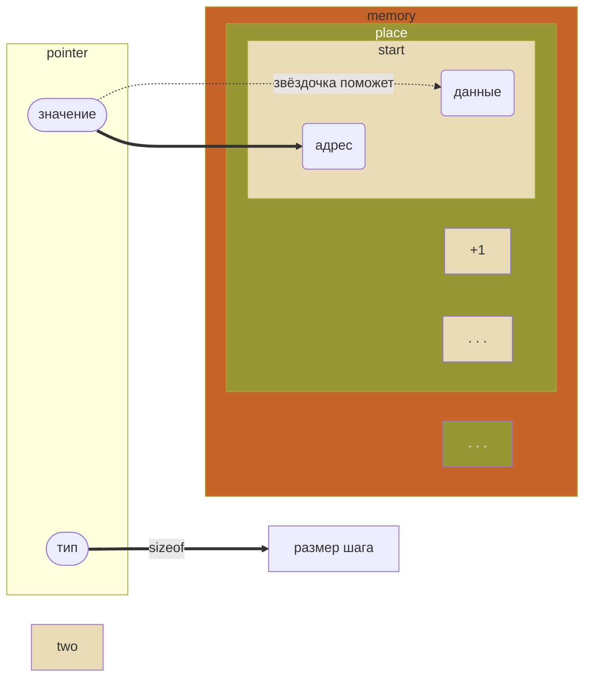
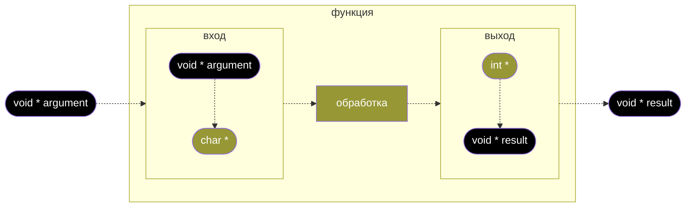
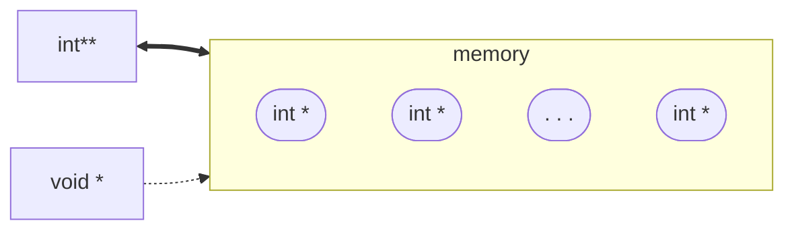

Youtube-запись прямого эфира: https://youtu.be/uakAypiG7Zo ```2025-01-31```

# Как работает и не работает обобщённый указатель void * в языке C (Си)

## Что для нас значит «обобщать»?

Мы знаем как минимум один инструмент для того, чтобы использовать…

> Произвольные
**типы данных**
> 
- конструкция `_Generic`
- `typeof()` (gcc/clang)

> Произвольное
**количество** (чего-то)
> 
- массив
- `<stdarg.h>`
- `__VA_ARGS__`

> Произвольное **действие**
> 
- `if` / `switch`
- ссылка на функцию


Больше инструментов богу инструментов


## Что мы знаем и не знаем, глядя на переменную-указатель?


Указатель — **не на данные**, а только на **начало места** в памяти!


> Для `char *` есть **договорённость** про конец этого места: `\0`  

> Придумывайте такие договорённости для своих типов

### Знаем

1. Есть ли место в памяти
2. Если место есть — адрес его начала
3. Размер единицы хранения

### Можем  #зона риска

1. Получить значение шага арифметики указателей (единицы хранения)
2. Подвинуться вперёд-назад
3. Передать информацию за границы области видимости

### Не знаем

1. Тип памяти
2. **Где заканчивается выделенное место**
3. Лежат ли там вообще осмысленные данные
4. **Когда и кто освободит эту память**
5. Когда и кто уничтожит переменную-указатель на эту память



## А что если «забыть» про тип данных? Получим `void *`

- Плюс: указывает на начало куска памяти, в котором лежит «что угодно» — что **нам** угодно (из данных, не функция)

- Минус: мы не знаем размер единицы хранения. Ведь там «что угодно». А значит, не можем это «что угодно» получить. И взять следующее «что угодно» тоже не можем


Теперь место для хранения — это одно, а его содержание — совсем другое


## В чём проблема или задача?

- В объявлении **настоящей** функции должны быть зашиты типы аргументов и значения

```c
char * convert(int, char *);
```

- Мы можем сделать «функции-макросы» без типизации указателей — но на них нельзя создать указатель и пользоваться им

```c
#define len(x, y) _Generic((y), \
	int: len_int, \
	char: len_char \
	)((x), (y))
...
printf("%d %d", len('a', 'c'), len(74, 89));    // эту функцию не обобщить
```

- Меж тем функции высшего порядка (особенно в функциональном программировании) запросто могут использовать другие функции — ничего не зная про типы их аргументов


Хотим передавать одни функции в другие,
**не глядя на типы** обрабатываемых данных и возвращаемых значений


## Тут-то нам и пригодится обобщённый указатель `void *`


`void *` — **указатель на «что угодно»** (обобщённый)


`void` (без звёздочки) — не «что угодно», а наоборот, «ничто»

- Прощайте, аргументы с передачей по значению?
- Зато мы можем передать такой указатель в любую функцию, готовую его принять
- Это не сильно упрощает создание функций. Зато упрощает их типизацию
- Типизация функций нам нужна для создания функций высшего порядка

## Как записать? Как прочитать?

- Почему бы не создать указатель туда же, но с типом? Назовём его типизирующим
- Типизирующий указатель уже ничего не помнит про обобщённый — и через него с данными по адресу можно делать что угодно

```c
void * dv = NULL;
...                    // что бы ни происходило, мы не можем написать *dv
int * d = (int*)dv;
if(d != NULL) {printf("%c\n", (*d) / 128); }  // …а *d — уже можем
```

## Для перемещения по памяти нужен указатель-проводник

- Обобщённый указатель `void*` не трогаем — мы не знаем, какой размер у значения за ним
- Перемещаемся арифметикой указателей через `++` или `[]` к **типизированному** указателю
- Для побайтового перебора годятся `char` и `unsigned char` — но лучше проверять

```c
void * cv = NULL;
...
int buffer[100] = {0};
cv = buffer;
char * p = (char *)cv;
int sum = 0;
do { sum += *(int *)p; } while(++p != buffer[99]);
```

## Что можно делать с памятью по обобщённому указателю?

- Освобождать. Магия: операция `free()` не зависит от типа указателя

```c
int * a = malloc(sizeof(int));
*a = 124;
...
void * av = (void *)a;
...
free(av);
```

- Копировать. Нужен размер блока памяти. Операция довольно-таки низкоуровневая

```c
int a = 342;
void * a_copy = malloc(sizeof(int));
memcpy(a_copy, &a, sizeof(int));
printf("%d\n", *(int*)a_copy);
```

Вот тут нужно ооооочень аккуратно

## Обобщённым указателям — обобщённые функции

- Схема «Принял — привёл — обработал — отдал»



```c
void * func(void * cv) {
	char * c = (char *)cv;
	
	int * result_i = malloc(sizeof(int));
	*result_i = c + 0;                         // неявно привели к int
	
	void * result = (void*)result_i;           // сомнительно, нужно ли это
	return result;
}
```

- Передача аргументов в обобщённую функцию не требует явного приведения типов
    
    ```c
    void general_function(void *);
    ...
    int a = 17;
    general_function(&a);
    ```
    
- А передача значений из функции?
    
    ```c
    // Надо проверить
    void * func() { ... }
    char * c = func();
    ```
    
- Но функцию нельзя произвольно назначить обобщённой в момент вызова, передав ей `void *` вместо типизированного указателя (при этом передать-то вроде можно?)
    
    ```c
    // Надо проверить
    void func(char *) { ... }
    ...
    char a = '7';
    void * p_a = (void*)(&a);
    func(p_a);
    ```
    
- Равно как и нельзя объявить функцию как обобщённую, а реализацию записать уже для типизированных аргументов
    
    ```c
    // Не будет работать
    void func(void *);
    ...
    void func(char * s) {
    	...
    }
    // Не будет работать
    ```
    

## Как насчёт произвольного количества обобщённых аргументов функции обратного вызова?

Обобщённый указатель на что угодно обобщает это что угодно



```c
int a = 4;
int b = 17;
int ** ab = malloc(sizeof(int*) * 2);  // все указатели на данные одного размера
ab[0] = &a; ab[1] = &b;
void * abv = ab;
```

- Применим эту эвристику к списку (массиву) обобщённых указателей
    
    ```mermaid
    flowchart LR
    subgraph void**
    v1(void *)
    v2(void *)
    v3(. . .)
    v4(void *)
    end
    
    void[void **]
    void_[void *]
    
    void <==> void**
    void_ -.-> void**
    
    ```
    
    ```c
    void * a = malloc(sizeof(int));
    void * b = malloc(sizeof(int));
    void ** ab = malloc(sizeof(void*) * 2);  // размер void* — как у всех
    ab[0] = &a; ab[1] = &b;
    ```
    
- `void **` даёт шанс на игры с позиционированием в массиве
    
    ```c
    void call_grandma(void **);
    ...
    char name[] = "Tamar";
    int age = 87;
    void ** grandma = malloc(sizeof(void*)*2);
    grandma[0] = &name;
    grandma[1] = &age;
    ```
    
- `**` разыменовывает сразу в значение
    
    ```c
    void ** r = ...
    int r_int = (int **)r;
    ```
    
- И осталось научиться превращать последовательность из произвольного количества `void *` в `void **`

### Умеем

```c
void * cb(void **);
```

### Хотим

```c
void iterate(void * set,
						 next_t next_item,
						 callback_t cb,
						 int arg_quantity);
```

### Как

```c
void iterate(void * set, next_t next_item, callback_t cb, int quantity) {
	char buffer[100] = {0};
	while((void * p = next_item(set)) != END_OF_SET) {
		callback_run(cb, quantity, p, &buffer);
	}
}

void callback_run(callback_t cb, int quantity, ...) {
	va_list args;                            // произвольное число аргументов
	void * arg_array[quantity];              // длина задаётся в момент компиляции
	
	va_start(args, quantity);               // начинаем перебор аргументов
	for(int i = 0; i < quantity; ++i) {
		arg_array[i] = va_arg(args, void *);  // аргументы все — void * (так хотим)
	}
	va_end(args);
	
	cb(quantity, arg_array);                // запускаем функцию обратного вызова
}
```

- Задача со звёздочкой — сделать так же для `next_t`
