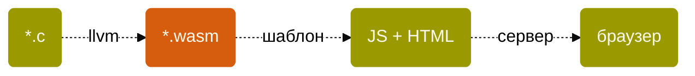
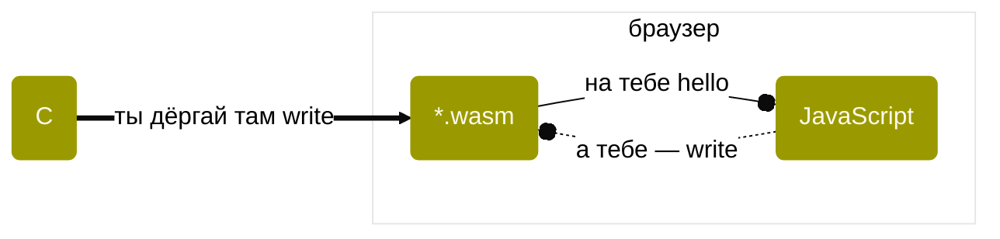

Youtube-запись от `2026-04-24`: https://youtu.be/kgxmYLbicHs

**Никогда вопросов глупых\
Сам себе не задавай,**\
А не то еще глупее\
Ты найдешь на них ответ.\
Если глупые вопросы\
Появились в голове,\
Задавай их сразу взрослым.\
Пусть у них трещат мозги.

---

Руками никогда нигде\
Не трогай ничего.\
**Не впутывайся ни во что\
И никуда не лезь.**\
В сторонку молча отойди,\
Стань скромно в уголке\
И тихо стой, не шевелясь,\
До старости своей.

*Григорий Остер, «[Вредные советы](https://ru.wikipedia.org/wiki/Вредные_советы)», 1983 год*

# А можно запустить C-программу в браузере?
> [!CAUTION]
> Никому такое не говорите! Но я вам скажу.
> - **[WebAssembly](https://webassembly.org)** — формат бинарника **\*.wasm** для запуска внутри браузера
> - **JavaScript** — вы его знаете; он умеет подключаться к таким бинарникам как к своим объектам **(нооооо…)**



## Первым делом получим годный бинарник
Возьмём [LLVM](https://llvm.org) — набор инструментов для разработки (и на **C** тоже).
Проверим, что его компилятор `clang` готов нам помочь:
```bash
clang --print-targets
```

- Нам более чем достаточно `wasm32` — это сейчас стандарт.

Возможно, потребуется установить линковщик `lld` [через Homebrew](https://formulae.brew.sh/formula/lld) и проверить его готовность выдавать \*.wasm-файлы:
```bash
brew install lld
which clang
which wasm-ld
```

- `wasm-ld` — версия линкер `lld` [специально для работы с WebAssembly](https://lld.llvm.org/WebAssembly.html).

> [!TIP]
> Шансы есть. Давайте компилировать.


### Важные ключи компиляции

#### Для компилятора `clang`
`--target=wasm32` — всё делать под WebAssembly
`-nostdlib` — не включать стандартную библиотеку
`-Wl,<…>` — передать ключ линкеру

#### Для линкера `wasm-ld`
`--no-entry` — не нужна точка входа
`--export-all` — все функции (и вообще символы) внутри кода **C** доступны из **JavaScript**

Напишем заведомо тяжёлое:
```c
int fib(int n) {
    if (n <= 1) {
        return n;
    }
    return fib(n - 1) + fib(n - 2);
}
```

Получим wasm-файл:
```bash
clang \
	--target=wasm32 \
	-nostdlib \
	-Wl,--no-entry \
	-Wl,--export-all \
	-o fib.wasm \
	fib.c
```

## Теперь пора и в браузер
Встроим в HTML-файл **index.html** вызов **fib.wasm** через `JavaScript`:
```html
<!DOCTYPE html>
<script type="module">
	WebAssembly.instantiateStreaming(fetch("./fib.wasm"))
		.then(({ instance }) => {
			const rnd = Math.floor(Math.random() * 30 + 1);
			console.log(
						"Число Фибоначчи № %d: %d",
						rnd,
						instance.exports.fib(rnd)
						);
		    });
</script>
```

Работать с диска не будет, только через сервер:
```bash
python -m http.server
```

И дальше в браузере с консолью:
```bash
http://localhost:8000/
```

- Обратите внимание, это **не** честный `Hello, world!`
- …потому что тут **печатает не C**
- …потому что C для печати использует `printf` из `<stdio.h>`
- …а он **во многих реализациях** использует  интерфейс `write`
- …а это **обычно для нас** часть `POSIX`
- …а в браузере его нет — он же не операционная система!

> [!TIP]
> Интересный момент, если вы не верили в POSIX.\
> А он есть. Просто мы к нему привыкли.\
> Тут нельзя воспользоваться [POSIX](https://ru.wikipedia.org/wiki/POSIX)-интерфейсом к ОС.\
> Горько плачем.

> [!IMPORTANT]
> Короче, тут стандартная библиотека C не связана с внешним миром

- Конечно, функции из стандартной библиотеки C, которые **не** используют интерфейсы к реальному миру, применять можно.

## Что-то мы недостаточно запутались
- А давайте посмотрим на код WebAssembly?
- А давайте!

Текст покажет `wasm2wat`:
```bash
wasm2wat fib.wasm
```

- Полно и других полезных инструментов в [WebAssembly Binary Toolkit](https://github.com/WebAssembly/wabt).

## Можно всё-таки `Hello, World!` сделать?
- Да.
- Но нужен хотя бы **write**'озаменитель.
- И чтобы его можно было дёргать из **C**, а исполнять — в браузере.



### Сначала всё сами
Берём простой ~~советский~~ Hello, World!
```c
#include <stdio.h>

int hello(void) {
    printf("Hello, World!\n");
    return 0;
}
```

> [!CAUTION]
> Look Ma, no `main`!\
> Можно вставить. А можно и не вставлять. Немного непривычно.

Компилируем старой игрушкой без `-nostdlib`, чтобы 🩸 нарваться:
```bash
clang \
	--target=wasm32 \
	-Wl,--no-entry \
	-Wl,--export-all \
	-o hello.wasm \
	hello.c
```

> Оказывается, у нас нет стандартной библиотеки **C** для браузера!
> Кто бы мог подумать.

- Создатели [Emscripten](https://emscripten.org) как раз и подумали.
- ~~Вы не поверите, что они сделали. Шок, видео.~~

Компилируем новой игрушкой:
```bash
emcc \
  -O0 \
  -s STANDALONE_WASM=1 \
  -s ERROR_ON_UNDEFINED_SYMBOLS=0 \
  -Wl,--export=hello \
  -o hello.wasm \
  hello.c
```

- Легко догадаться, что внутри спрятались **clang** и **wasm-ld**.
- Но `-s` — это уже настройки сборки для emcc.
- Весело сравнить размерчики **fib.wasm** и **hello.wasm**.

Что нужно от внешнего мира нашему новому **hello.wasm**?
```bash
wasm-objdump -x hello.wasm | grep Import -A10
```

Смотрите, смотрите, он просит **write**!
```bash
 - func[4] sig=7 <wasi_snapshot_preview1.fd_write> <- wasi_snapshot_preview1.fd_write
```
 - И, честно говоря, далеко не только его.

> [!WARNING]
А у кого он это просит?

> [!TIP]
> Кажется, у `JavaScript` 🤪 🤪 🤪

#### Ну дадим [fd_write](https://wasix.org/docs/api-reference/wasi/fd_write) и другие функции, раз просит-то
```javascript
export function createHelloWasi() {
  let memory = null;
  const decoder = new TextDecoder("utf-8");

  function setMemory(wasmMemory) { memory = wasmMemory; }  

  function view() {
    if (!memory) {
      throw new Error("WASM memory is not initialized");
    }
    return new DataView(memory.buffer);
  }

  function fd_write(fd, iovs, iovs_len, nwritten) {
    const mem = view();
    let text = "";
    let written = 0;
    
    for (let i = 0; i < iovs_len; i++) {
      const ptr = mem.getUint32(iovs + i * 8, true);
      const len = mem.getUint32(iovs + i * 8 + 4, true);
      const bytes = new Uint8Array(memory.buffer, ptr, len);

      text += decoder.decode(bytes);
      written += len;
    }

    if (fd === 1) {
      console.log(text.trimEnd());
    } else if (fd === 2) {
      console.error(text.trimEnd());
    }

    mem.setUint32(nwritten, written, true);
    return 0;
  }

  function args_sizes_get(argcPtr, argvBufSizePtr) {
    const mem = view();
    mem.setUint32(argcPtr, 0, true);
    mem.setUint32(argvBufSizePtr, 0, true);
    return 0;
  }

  function args_get(argvPtr, argvBufPtr) { return 0; }

  function environ_sizes_get(environCountPtr, environBufSizePtr) {
    const mem = view();
    mem.setUint32(environCountPtr, 0, true);
    mem.setUint32(environBufSizePtr, 0, true);
    return 0;
  }

  function environ_get(environPtr, environBufPtr) { return 0; }

  function proc_exit(code) {
	  throw new Error(`WASI proc_exit(${code})`);
  }

  // опытным путём установлено, что бывает нужно
  function random_get(bufPtr, bufLen) {
    const bytes = new Uint8Array(memory.buffer, bufPtr, bufLen);
    crypto.getRandomValues(bytes);
    return 0;
  }

  // и тут снова — опытным путём
  function clock_time_get(clockId, precision, timePtr) {
    const mem = view();
    const nowNs = BigInt(Date.now()) * 1000000n;
    mem.setBigUint64(timePtr, nowNs, true);
    return 0;
  }

  function fd_close(fd) { return 0; }
  
  function fd_seek(fd, offsetLow, offsetHigh, whence, newOffsetPtr) {
    const mem = new DataView(memory.buffer);
    mem.setUint32(newOffsetPtr, 0, true);
    mem.setUint32(newOffsetPtr + 4, 0, true);
    return 0;
  }

  return {
    imports : {
      wasi_snapshot_preview1 : {
        fd_write,
        fd_close,
        fd_seek,
        args_sizes_get,
        args_get,
        environ_sizes_get,
        environ_get,
        proc_exit,
        random_get,
        clock_time_get,
      },

      env : {
        __main_argc_argv : () => 0,
      },
    },

    setMemory,
  };

}
```
#### И снова подключим через JavaScript в HTML
```html
<!DOCTYPE html>
<script type="module">
import { createHelloWasi } from "./hello.js";

const wasi = createHelloWasi();
const { instance } = await WebAssembly
				.instantiateStreaming(
					fetch("./hello.wasm"),
					wasi.imports
					);

wasi.setMemory(instance.exports.memory);
instance.exports.wasm_call_ctors?.();
instance.exports.hello();
</script>
```


 - [WASI](https://wasi.dev) — **W**eb**A**ssembly **S**ystem **I**nterface.
 - Аналог `POSIX` для WebAssembly.
 - Но это стандарт, а не реализация. Надо делать.
 - И вот мы его сделали-вид-что-сделали для нашего **hello**.
 - Но это лишнее.

### Потом берём готовенькое

- Для простоты всё же вернём **main** (без него можно, но это уже нюансы)

Сборка всего необходимого JavaScript-кода одним махом:
```bash
emcc -o main.js main.c
```

И подключение в HTML:
```html
<!DOCTYPE html>
<script src="./main.js"></script>
```

- Размеры файлов впечатляют. Порадуйтесь.

> [!CAUTION]
> У идеи освоить `JavaScript` появляется смысл?!
