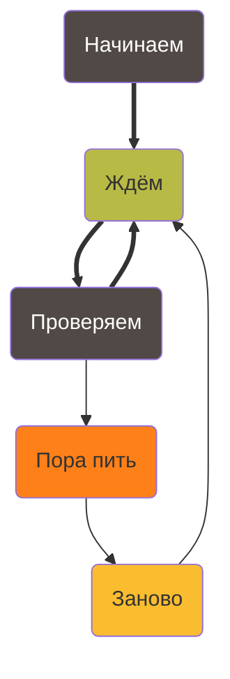
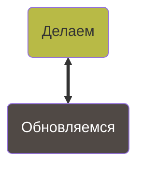
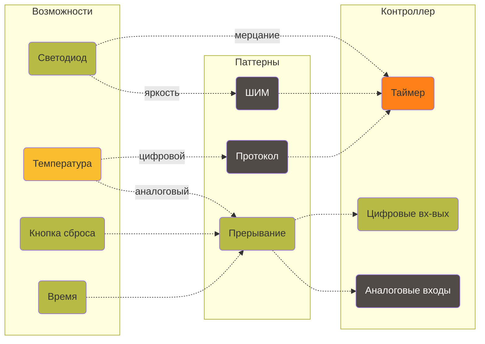

# Крохотный конечный автомат на ATtiny13A и C

Youtube-запись от `2025-08-01`: https://youtu.be/EJmQKRU_cpw

## Напоминает, когда пора пить

- [x]  Просто таймер
- [ ]  Зависимость от температуры
- [ ]  Зависимость от веса человека
- [ ]  Симпатичные светоэффекты
- [ ]  Звук
- [ ]  Портативность
- [ ]  SMD-вариант
- [ ]  Гироскоп на кружку
- [ ]  …


## Состояния и связь между ними



<aside>


**Ищем только выходы**
Потому что всякий вход — это выход откуда-то.

</aside>

<aside>


**Внутри блока — свои дела**
Что-то вроде игры по станциям, или карты с квестами, или разных уроков/пар/объектов

</aside>

<aside>


**Дела-то разные!**
Дела зависят от результатов проверки. Эти результаты и есть «состояния».

</aside>

## Здравствуй, машина состояний

> Способ ~~разложить всё по полочкам~~ структурировать поведение системы.
> 



<aside>


**Туда-сюда без остановки**
Как закончили делать — сразу обновляем. Как закончили проверять — сразу делаем.

</aside>

<aside>


**Впервые или снова?**
Мы не знаем, когда дело будет сделано в последний раз. Но знаем, когда в первый (или даже в N-й).

</aside>

<aside>


**Одно обновление на все дела?!**
Да. Не усложняем пока что.

</aside>

```c
int main(void) {
	while(1) {
		state_do();
		state_update();
	}
	return 0;
}
```

- Порядок важен
- Как `state_do();` узнает, что там наизменял `state_update();`?
- И как `state_update();` изменит состояние, о котором должен знать `state_do();`?

> Глобальная переменная?! 😑
Или передавать по ссылке.
> 

## Желания и возможности



<aside>


Таймер — узкое место

</aside>

<aside>


Грубо можно сделать программно

</aside>

<aside>


Протокол капризен ко времени

</aside>

## Код на регистрах

### Базовые библиотеки

```c
#include <avr/io.h>
#include <avr/interrupt.h>
```

### Пины

```c
#define LED_PIN PB4
#define BUTTON_PIN PB3
```

```c
    DDRB  |= (1 << LED_PIN);      // настроить LED_PIN как выход
    DDRB  &= ~(1 << BUTTON_PIN);  // настроить BUTTON_PIN как вход
    PORTB &= ~(1 << BUTTON_PIN);  // отключить внутреннюю подтяжку (есть внешняя)
```

### Инициация счётчика времени

```c
int main(void) {
	...
	timer_init();
  sei();
  while(1) {
	  ...
  }
}
```

```c
void timer_init() {
    TCCR0A = 0;                          // normal mode
    TCCR0B |= (1 << CS02) | (1 << CS00); // делитель /1024
    TIMSK0 |= (1 << TOIE0);              // разрешить прерывание по переполнению
    TCNT0 = 0;                           // стартовое значение счётчика
}
```

### Прерывание по переполнению счётчика времени

```c
ISR(TIM0_OVF_vect) {
    ticks_g++;                             // volatile!
    check_g = ticks_g % CHECK_EVERY_TICK;  // фокус с периодичностью
    if (ticks_g >= TICKS_IN_TIME_UNIT) {   // считаем в юнитах
        ticks_g = 0;
        units_g++;
    }
}
```

### Операции с volatile-переменными

```c
void func() {
    cli(); // временно отключим прерывания
		...
    sei(); // включим обратно
}
```

### Нажата ли кнопка

```c
((PINB & (1 << BUTTON_PIN)) == 0)
```

### Вкл/выкл/перекл светодиод

```c
PORTB |= (1 << LED_PIN);
PORTB &= ~(1 << LED_PIN);
PORTB ^= (1 << LED_PIN);
```
